# Agent-Visible Data Pipeline

Use this page to trace the exact data the agent sees and the exact data each runtime carries. The goal is not only to find the owning file. The goal is to ask, at every boundary: is this shape the canonical contract, a necessary adapter, or an unnecessary layer that can be removed?

## Pipeline Map

```mermaid
flowchart LR
  User["User goal + attachments"] --> Renderer["Renderer optimistic UI + transcript queue"]
  Renderer --> Main["Electron main query payload"]
  Main --> BackendWS["Backend websocket incoming message"]
  BackendWS --> Prompt["Prompt + model-visible tool schemas"]
  Prompt --> Model["LLM provider request"]
  Model --> ToolCall["Provider tool call / assistant text"]
  ToolCall --> BackendNorm["Backend normalization + preparation"]
  BackendNorm --> ToolEvent["tool-call / tool-bundle event"]
  ToolEvent --> SdkRuntime["SDK tool coordinator"]
  SdkRuntime --> IPC["Electron main SDK local-runtime client"]
  IPC --> LocalRuntimeRpc["Local-runtime JSON-RPC"]
  LocalRuntimeRpc --> LocalTool["Local-runtime Python tool implementation"]
  LocalTool --> ToolResult["ToolResult"]
  ToolResult --> BackendResult["tool-result websocket message"]
  BackendResult --> History["Backend result transform + history commit"]
  History --> Prompt
  BackendNorm --> Stream["streaming-response / tool-output / complete events"]
  Stream --> Renderer
```

## Agent-Visible Invariant

The model-visible surface is owned by the backend and should be treated as the highest-risk contract:

- system prompt text
- full user message content
- memory and repo-instruction context
- image/artifact context
- model-visible tool schemas
- provider-specific tool projection
- tool-output rows returned into model history

Renderer, Electron main, and local-runtime payloads are allowed to differ from this shape only when they cross a real runtime boundary. If a second shape exists only because an older helper expected different names, remove it and move tests to the canonical field.

## Shape Trace

| Stage | What the agent/model sees | Transport or runtime shape | Canonical owner | Drift and layer checks |
| --- | --- | --- | --- | --- |
| User goal entry | Natural-language objective plus optional attachment context after backend prompt assembly | Renderer message text, selected files, pasted images, screenshot refs, readable-file context | `frontend/src/renderer/features/chat`, `frontend/src/main/ipc/ipc_query_runtime.cjs`, private backend implementation | Do not hide attachment context in UI-only state if it must reach the model. Do not duplicate dashboard vs pill attachment parsing. |
| Electron query relay | None directly; this is before prompt construction | `windie:invoke` command `conversation.send`, websocket `query` message with user/session/conversation/workspace/context fields | `frontend/src/main/ipc.cjs`, `frontend/src/main/ipc/ipc_query_runtime.cjs`, backend websocket schemas | If renderer and main build overlapping query fields, pick one canonical builder and make consumers read that shape. |
| Prompt construction | System prompt, user message, history, memory, repo instructions, artifacts, selected tools | Backend prompt messages plus prompt metadata and filtered tool schemas | private backend implementation | Prompt transparency must reflect backend-prepared data, not renderer reconstruction. Generated snapshots should come from live paths. |
| Tool visibility | Function/tool schemas and descriptions available to the model for this session | Backend registry output filtered by policy, client agent definition, provider health, and provider projection | private backend implementation | Client/local-runtime Python code must not import backend schema code. If a local-runtime executable cannot execute a visible tool, add parity tests or hide it. |
| Provider request | Provider-specific message/tool request sent to the model | LiteLLM/OpenAI-style messages, provider-native tool declarations, multimodal payloads | private backend implementation | Provider adapters may project shape, but parser/recovery must still preserve the model-origin intent. |
| Model output | Assistant text or tool call chosen by the model | Provider stream chunks, native tool-call payloads, parsed `ParsedToolCall` entries | private backend implementation | Do not patch renderer execution to compensate for dropped provider-native tool calls. Fix parser/provider normalization. |
| Tool preparation | Model intent plus any model-visible failure/recovery guidance | Resolved request IDs, coordinate/OCR/screenshot preparation data, executable args | private backend implementation | Keep model-facing args separate from executable local-runtime args. If OCR resolves `click_ocr` to coordinates, document both shapes. |
| Backend-to-frontend event | Tool call visible in stream/transparency UI | `tool-call`, `tool-bundle`, `tool-output`, `streaming-response`, `complete` websocket event payloads | private backend implementation | Formatter payload shape is a contract. Do not add renderer-only field guessing when the producer can emit the field correctly. |
| SDK local execution | None directly; SDK executes on behalf of backend tool event | Normalized `tool_call` / `tool_bundle_call` events, request IDs, bundle IDs, tool-call IDs, local-runtime result envelopes | `packages/windie-sdk-js/src/runtime/ConversationRuntime.ts`, `packages/windie-sdk-js/src/runtime/LocalRuntime.ts`, `packages/windie-sdk-js/src/tools/ToolExecutionCoordinator.ts` | Correlation IDs must survive event, execution, result relay, and transcript persistence. Late/stale turns should fail explicitly. |
| Electron IPC | None directly; IPC is local transport | scoped host-capability, artifact, permission, and local-runtime invoke payloads | `frontend/src/shared/ipcChannels.json`, `frontend/src/preload.js`, `frontend/src/main/sidecar/local_runtime*.cjs` | If IPC shape only renames fields before JSON-RPC, prefer SDK local-runtime ownership over a direct renderer IPC adapter. |
| Local-runtime JSON-RPC | None directly; local-runtime Python is executor | JSON-RPC method params, snake_case Python fields, timeout/error envelopes | SDK local-runtime store/client code, local-runtime Python JSON-RPC dispatcher in `frontend/src/main/python/local_backend.py`, protocol helpers in `frontend/src/main/python/core/ipc_protocol.py` | SDK local-runtime callers should centralize camelCase/snake_case and canonicalization. Avoid spreading fallback key logic into renderer callers. |
| Local tool result | Eventually: model-facing tool output after backend transforms it | local-runtime Python `ToolResult` dict with `success`, `data`, `error`, screenshot/file/artifact fields | `frontend/src/main/python/tools/result.py`, local-runtime Python implementation modules, Electron bridge helpers | Large or binary data should become artifact/file refs where possible, not repeated inline payloads through every transport. |
| Tool result return | Tool output row that the next model turn can consume | SDK runtime sends `tool-result` or `tool-bundle-result` over websocket with request/bundle IDs | `packages/windie-sdk-js/src/tools/ToolExecutionCoordinator.ts`, `packages/windie-sdk-js/src/transport/AgentSession.ts`, private backend implementation | Request IDs and tool-call IDs are not decoration. Missing IDs create history and wait-state corruption. |
| Backend history commit | Provider-replay-safe assistant/tool rows in conversation history | Result transformer output, history committer rows, token cache updates | private backend implementation | The visible transcript can differ from backend history, but both must preserve enough structure for replay and rehydrate. |
| Transcript and replay | The agent may later see replay/rehydrate context derived from transcript rows | Renderer transcript rows, local-runtime transcript storage, backend rehydrate payloads | `frontend/src/renderer/infrastructure/transcript`, `frontend/src/main/python/memory`, backend rehydrate inputs | Transcript rows must not be lossy display-only copies when future prompt context depends on them. |

## Layer Classification

Use this classification before adding another helper, mapper, envelope, or fallback:

| Layer type | Keep it when | Remove or collapse it when |
| --- | --- | --- |
| Runtime boundary adapter | It crosses backend, SDK/main, renderer, local-runtime Python, trusted/untrusted, or JS/Python boundaries. | It only moves fields between two helpers in the same runtime without validation or ownership change. |
| Provider projection | A model provider requires a different schema/message dialect. | It rewrites canonical tool semantics to work around a local bug. |
| Diagnostic transparency copy | It proves what the backend actually sent to the model. | It reconstructs prompt/tool data from renderer state and can disagree with backend truth. |
| Display projection | It intentionally turns structured data into UI rows. | It becomes the only source for later model/context reconstruction. |
| Retry/fallback wrapper | It turns a transient failure into explicit, bounded recovery. | It hides producer errors or makes wrong payloads appear valid. |

## Red Flags

Question the design when you see any of these:

- the same field exists as `conversationRef`, `conversation_ref`, and `session_id` after the boundary where it should be canonical
- renderer logic knows backend-only prompt/tool-policy rules
- local-runtime Python code knows provider-specific model-facing schema rules
- formatter output is fixed by renderer fallback parsing instead of backend schema tests
- a wrapper envelope exists only to unwrap into a nearly identical object one function later
- a transcript row stores display text but loses request IDs, tool-call IDs, artifact refs, or structured payload
- a non-canonical alias is accepted in three places instead of being removed
- a local execution failure is silently dropped instead of returning a model-visible tool output
- an event payload can be inferred only by reading UI components instead of a contract doc

## Debug By Symptom

| Symptom | Ask this first | Start docs |
| --- | --- | --- |
| The agent did not use a tool | Did the backend expose the tool schema to the model? | [Prompt and Tool Context](../concepts/prompt_and_tool_context.md), [Tool Schema and Policy Change Workflow](../tools/tool_schema_policy_change_workflow.md) |
| The agent called a tool with odd args | Did the model see one shape but local execution ran another? | Backend Tool Turn Change Workflow (private backend docs), [Tool Execution Lifecycle](../tools/tool_execution_lifecycle.md) |
| Renderer showed a tool call but nothing executed | Did the backend event normalize into the SDK tool coordinator with live request/bundle IDs? | [Tool Execution Lifecycle](../tools/tool_execution_lifecycle.md), [Windie Client Runtime](../sdk/windie_client_runtime.md) |
| Local execution succeeded but model never continued | Did `tool-result` return with the original request or bundle ID? | [Tool Execution Lifecycle](../tools/tool_execution_lifecycle.md), Tool Result Ingress (private backend docs) |
| Replay is wrong | Did transcript rows preserve structured payloads and identity fields? | [Transcript Replay Change Workflow](../memory/transcript_replay_change_workflow.md), [Session and Transcript Reference](../reference/session_and_transcript_reference.md) |
| Prompt transparency disagrees with behavior | Is transparency sourced from backend prompt metadata or reconstructed downstream? | Backend Prompt Context Change Workflow (private backend docs), [Prompt and Tool Context](../concepts/prompt_and_tool_context.md) |
| A layer looks unnecessary | Does it cross runtime, trust, language, provider, storage, or display boundaries? | [Runtime Boundary Matrix](runtime_boundary_matrix.md), [Data Flow and State Ownership](data_flow_and_state_ownership.md) |

## Validation Matrix

| Changed surface | Focused validation |
| --- | --- |
| Prompt/tool visibility | backend prompt, tool policy, registry, provider projection, and transparency tests |
| Websocket event shape | backend formatter/schema tests plus renderer backend-event guard/consumer tests |
| IPC or JSON-RPC mapper | preload/channel parity tests, main bridge tests, local-runtime Python protocol tests |
| Tool execution path | backend tool-turn tests, SDK coordinator/runtime tests, main IPC tool-router tests, and local-runtime executable tests backed by local-runtime Python pytest |
| Tool result/history shape | backend result ingress/transform/history tests plus transcript replay tests |
| Transcript/replay shape | renderer transcript queue tests, local-runtime transcript storage tests, backend rehydrate tests |
| Docs-only pipeline change | `<windie> docs list`, `git diff --check`, and focused Markdown link checks |

## Related Docs

- [Data Flow and State Ownership](data_flow_and_state_ownership.md)
- [Runtime Boundary Matrix](runtime_boundary_matrix.md)
- [Session and Transcript Reference](../reference/session_and_transcript_reference.md)
- [Prompt and Tool Context](../concepts/prompt_and_tool_context.md)
- [Tool Execution Lifecycle](../tools/tool_execution_lifecycle.md)
- Backend Tool Turn Change Workflow (private backend docs)
- [Chat Stream and Tool Execution Reference](../frontend/renderer/chat_stream_and_tool_execution_reference.md)
- [IPC Change Workflow](../frontend/ipc_change_workflow.md)
- [Local Runtime JSON-RPC Change Workflow](../frontend/sidecar/local_backend_jsonrpc_change_workflow.md)
- [Transcript Replay Change Workflow](../memory/transcript_replay_change_workflow.md)
