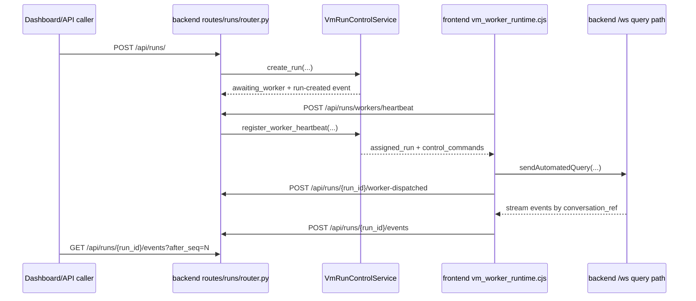

# VM Run Control Change Workflow

Use this workflow when a request touches WindieOS hosted VM runs, worker polling, run timelines, or operator controls. It is deliberately more prescriptive than the lifecycle/runbook pages: it tells an agent where to edit, which boundaries not to cross, and which tests/docs must move with the behavior.

Current VM run control is not a cron scheduler, webhook engine, durable job queue, or separate agent loop. The implemented surface is a hosted HTTP control plane that creates an in-memory run, lets an Electron VM worker poll and dispatch it through the normal backend websocket query path, then stores a per-run timeline for dashboard or operator inspection.

## Non-Negotiable Boundaries

- `/api/runs/*` is a control plane for hosted VM runs. It must not become the normal desktop chat transport.
- The backend owns run ids, run status, active-run caps, assignment queues, worker records, pending controls, and event sequence numbers.
- The Electron VM worker owns polling cadence, backend endpoint selection, dispatching assigned runs through `sendAutomatedQuery(...)`, relaying backend stream events, and applying live stop controls to the websocket query path.
- Runs state is process memory in `VmRunControlService`. It is not durable across backend restarts unless a storage layer is explicitly designed and implemented.
- The `/api/runs/*` route dependency owns lazy app-state service publication and must keep first-request initialization synchronized.
- The runs API key uses `x-windie-runs-key` and is separate from install-token bearer auth.
- Worker-dispatched runs must enter the same backend query path as desktop chat via Electron main. Do not create a parallel model/tool loop in `vm_worker_runtime.cjs`.
- Electron main, renderer, and local-runtime Python code must not import backend code for schema parity. Keep route payload parity in docs and tests.

## Fast Owner Map

| Change or symptom | First owner | Code roots | Focused docs | Focused tests |
| --- | --- | --- | --- | --- |
| Add, remove, or rename a run route | Backend runs router | `backend/src/api/routes/runs/router.py`, `backend/src/api/routes/__init__.py` | [Runs API Runbook](runs_api_runbook.md), [API Route Change Workflow](../backend/api/api_route_change_workflow.md) | `tests/backend/test_run_control_routes.py` |
| Add/change request or response fields | Backend route models and response projection | `backend/src/api/routes/runs/models.py`, `backend/src/api/routes/runs/response_builders.py`, `backend/src/api/routes/runs/support.py` | [Runs API Runbook](runs_api_runbook.md), backend runs route model references | route model/response builder tests |
| Change control action validation | Backend route helper | `backend/src/api/routes/runs/route_helpers.py` | [Runs API Runbook](runs_api_runbook.md) | `tests/backend/test_run_control_route_helpers.py` |
| Change event polling projection | Backend route helper and event log | `backend/src/api/routes/runs/route_helpers.py`, `backend/src/services/vm_run_control_support/vm_run_control_event_log.py` | [VM Runs and Workers](vm_runs_and_workers.md) | `tests/backend/test_run_control_response_builders.py`, event-log tests |
| Change active-run cap or status set | Backend service | `backend/src/services/vm_run_control.py`, `backend/src/services/vm_run_control_support/vm_run_control_transitions.py` | [Automation Boundaries](automation_boundaries.md), [Backend Service Change Workflow](../backend/services/backend_service_change_workflow.md) | `tests/backend/test_run_control_routes.py`, transition tests |
| Change worker assignment or heartbeat behavior | Backend assignment helpers and Electron worker | `backend/src/services/vm_run_control_support/vm_run_control_assignment.py`, `backend/src/services/vm_run_control_support/vm_run_control_worker_state.py`, `frontend/src/main/app/vm_worker_runtime.cjs` | [VM Worker Node](../nodes/vm_worker_node.md) | `tests/backend/test_vm_run_control_assignment.py`, `tests/frontend/VmWorkerRuntime.test.cjs` |
| Change dispatch acknowledgement | Backend service plus Electron worker | `backend/src/services/vm_run_control.py`, `frontend/src/main/app/vm_worker_runtime.cjs` | [VM Runs and Workers](vm_runs_and_workers.md) | route tests and `tests/frontend/VmWorkerRuntime.test.cjs` |
| Change stream event ingest or terminal status mapping | Backend service and Electron relay | `backend/src/services/vm_run_control.py`, `frontend/src/main/app/vm_worker_runtime.cjs` | [WebSocket Event Contract Change Workflow](../channels/websocket_event_contract_change_workflow.md) | event payload/log tests, frontend worker relay tests |
| Change pending controls or stop-all | Backend pending-control/bulk-stop helpers and Electron worker | `backend/src/services/vm_run_control_support/vm_run_control_pending_controls.py`, `backend/src/services/vm_run_control_support/vm_run_control_bulk_stop.py`, `frontend/src/main/app/vm_worker_runtime.cjs` | [Runs API Runbook](runs_api_runbook.md) | `tests/backend/test_vm_run_control_pending_controls.py`, `tests/backend/test_vm_run_control_bulk_stop.py`, frontend stop-control tests |
| Change runs API auth or key lookup | Backend support and Electron worker env lookup | `backend/src/api/routes/runs/support.py`, `frontend/src/main/app/vm_worker_runtime.cjs` | [Credential and Token Change Workflow](../security/credential_token_change_workflow.md), [Gateway Auth and Health Runbook](../gateway/gateway_auth_and_health_runbook.md) | route auth tests, frontend worker header tests |
| Add durability, retries, cron, webhook, or scheduler behavior | New backend design, not the current worker loop | new storage/scheduler modules after planning | [Automation Boundaries](automation_boundaries.md), planning docs | migration, multi-process, retry, auth, and scheduler tests |

## Runtime Lifecycle With Edit Points

### 1. Create Run

Owner files:

- `backend/src/api/routes/runs/models.py`
- `backend/src/api/routes/runs/router.py`
- `backend/src/services/vm_run_control.py`
- `backend/src/services/vm_run_control_support/vm_run_control_event_payloads.py`
- `backend/src/services/vm_run_control_support/vm_run_control_helpers.py`

Behavior to preserve:

- `workspace_id` and `query` are required Pydantic fields.
- `files[]` is an artifact-reference list, not file bytes.
- `metadata.conversation_ref` can override the default conversation ref when it is a non-empty string.
- default `conversation_ref` is `run-{run_id}`.
- initial status is `awaiting_worker`.
- initial `control_mode` is `agent_only`.
- `run-created` is appended before the run is returned.
- active-run cap applies to `awaiting_worker`, `queued`, `running`, and `paused`.
- cap failure returns HTTP `409` from the route.

When adding a field:

1. Add the field to the Pydantic request/response model.
2. Normalize it at the route or service boundary, not in the Electron worker.
3. Store it on the service run dict only if it belongs in run-control state.
4. Decide whether it belongs in `WorkerAssignedRun`; if the worker needs it to dispatch, it must be returned by heartbeat assignment.
5. Add route/service tests and update API examples in [Runs API Runbook](runs_api_runbook.md).

### 2. Worker Heartbeat and Assignment

Owner files:

- `backend/src/services/vm_run_control.py`
- `backend/src/services/vm_run_control_support/vm_run_control_assignment.py`
- `backend/src/services/vm_run_control_support/vm_run_control_worker_state.py`
- `backend/src/api/routes/runs/models.py`
- `frontend/src/main/app/vm_worker_runtime.cjs`
- `frontend/src/main/app/runtime_mode.cjs`

Backend assignment invariants:

- only `ready` or `running` workers are assignable.
- assignment is scoped by exact `workspace_id`.
- missing run ids in the workspace queue are skipped.
- only `awaiting_worker` and `queued` runs can be assigned.
- runs already bound to a different worker id are skipped.
- assignment transitions the run to `queued`.
- assignment appends `run-worker-assigned`.
- one poll response returns at most one `assigned_run`.

Electron heartbeat invariants:

- `WINDIE_VM_MODE=1` enables VM mode.
- `WINDIE_VM_WORKER_MODE=1` explicitly enables worker polling.
- when worker mode is unset, VM mode implies worker polling.
- `WINDIE_VM_WORKSPACE_ID` defaults to `default-workspace`.
- worker id defaults to `worker-{backend-user-id}`.
- VM id defaults to `vm-{worker_id}`.
- heartbeat status is `running` while there are active run/conversation mappings, otherwise `ready`.
- runs key lookup order is `WINDIE_VM_RUNS_API_KEY`, then `WINDIE_RUNS_API_KEY`.

If a run is created but never assigned, inspect in this order:

1. backend accepted the create request and returned `awaiting_worker`.
2. worker mode is active in Electron main.
3. worker heartbeat reaches the same backend HTTP origin.
4. `x-windie-runs-key` matches backend runs key config.
5. heartbeat `workspace_id` matches the run `workspace_id`.
6. active-run cap is not blocking new runs in that workspace.
7. assignment helper is not skipping the run due to status or worker ownership.

### 3. Dispatch Acknowledgement

Owner files:

- `frontend/src/main/app/vm_worker_runtime.cjs`
- `backend/src/api/routes/runs/router.py`
- `backend/src/services/vm_run_control.py`
- `backend/src/services/vm_run_control_support/vm_run_control_event_payloads.py`

Dispatch invariants:

- Electron normalizes the assigned run id, conversation ref, query, and artifact refs.
- artifact refs become attachment context text, not local file reads.
- dispatch calls `sendAutomatedQuery({ text, conversationRef, attachmentContext, attachmentFilenames })`.
- active maps are in Electron memory:
  - `conversation_ref -> run_id`
  - `run_id -> conversation_ref`
- dispatch ack posts `worker_id`, `user_id`, `turn_ref`, and `conversation_ref`.
- backend verifies the run exists, is owned by the posting worker, and matches user ownership.
- backend status becomes `running`.
- backend stores `query_message_id=turn_ref`.
- backend appends `run-dispatched`.

If dispatch fails before ack, the worker posts an `error` event to the run timeline. Do not hide this in the dashboard; the failure is the correct signal that the worker could not enter the query path.

### 4. Stream Event Relay and Run Timeline

Owner files:

- `frontend/src/main/app/vm_worker_runtime.cjs`
- `backend/src/api/routes/runs/models.py`
- `backend/src/api/routes/runs/response_builders.py`
- `backend/src/services/vm_run_control.py`
- `backend/src/services/vm_run_control_support/vm_run_control_event_log.py`
- `backend/src/services/vm_run_control_support/vm_run_control_transitions.py`

Relay invariants:

- Electron observes backend stream messages.
- only messages with a known `conversation_ref` are relayed.
- relayed events post to `/api/runs/{run_id}/events`.
- `event_type` mirrors backend message `type`.
- `source` is `worker-stream` for relayed stream events.
- payload includes the original event payload plus `conversation_ref`, `turn_ref`, `session_id`, and `user_id` where available.
- `streaming-complete` transitions the run to `completed`.
- `error` transitions the run to `failed`.
- non-terminal stream events can promote `awaiting_worker` or `queued` to `running`.
- terminal events clear the Electron active run/conversation maps.
- event `seq` is per-run and append-only while the backend process lives.

When changing websocket event names or payloads, update the websocket contract docs and then update worker relay tests. The run timeline is a copy of backend stream visibility, not the canonical backend history store.

### 5. Event Polling Projection

Owner files:

- `backend/src/api/routes/runs/router.py`
- `backend/src/api/routes/runs/route_helpers.py`
- `backend/src/api/routes/runs/response_builders.py`
- `backend/src/services/vm_run_control_support/vm_run_control_event_log.py`

Polling invariants:

- `after_seq` defaults to `0` and is exclusive.
- `limit` defaults to `200`.
- FastAPI bounds `limit` to `1..1000`.
- returned events satisfy `seq > after_seq`.
- `next_after_seq` is the last returned event seq.
- empty results keep `next_after_seq` at the requested `after_seq`.
- unknown run id returns `404`.

If a dashboard repeats events, check `next_after_seq` projection first. If a dashboard skips events, check service event log sequencing and caller polling state before changing the worker relay.

### 6. Controls and Stop-All

Owner files:

- `backend/src/api/routes/runs/models.py`
- `backend/src/api/routes/runs/route_helpers.py`
- `backend/src/services/vm_run_control.py`
- `backend/src/services/vm_run_control_support/vm_run_control_pending_controls.py`
- `backend/src/services/vm_run_control_support/vm_run_control_bulk_stop.py`
- `backend/src/services/vm_run_control_support/vm_run_control_transitions.py`
- `frontend/src/main/app/vm_worker_runtime.cjs`

Supported actions:

| Action | Backend mutation | Worker command behavior today |
| --- | --- | --- |
| `pause` | status becomes `paused` | command is delivered, but Electron does not pause websocket execution |
| `resume` | status becomes `running` when worker exists, otherwise `awaiting_worker` | command is delivered, but Electron does not resume a paused websocket execution |
| `stop` | status becomes `stopped` | Electron sends `stop-query` for the active conversation and posts `run-control-applied` |
| `set-control-mode` | updates `control_mode` | command is delivered for visibility/bookkeeping |

Control invariants:

- `set-control-mode` requires `control_mode`.
- allowed control modes are `agent_only`, `shared_control`, and `human_override`.
- every control appends a pending command.
- every control appends `run-control` with `source="api"`.
- pending controls are drained once on worker heartbeat for the owning worker.
- `stop-all` targets active statuses only: `awaiting_worker`, `queued`, `running`, and `paused`.
- `stop-all` may be workspace-scoped.
- bulk stop events include `bulk=true`.
- `stop-all` requires `x-windie-runs-control-key` matching `WINDIE_RUNS_CONTROL_API_KEY`; do not authorize it with the ordinary worker/runs key.

When implementing real pause/resume behavior, do not only add backend statuses. Add an Electron runtime behavior, websocket/control semantics, tests for command delivery and live effect, and docs that explain whether the underlying query is actually paused.

## Auth and Configuration Change Rules

Runs API auth lives beside the runs routes, not in desktop chat settings.

Backend:

- route dependency: `backend/src/api/routes/runs/support.py`
- accepted env var: `WINDIE_RUNS_API_KEY`
- header: `x-windie-runs-key`
- when no backend key is configured, routes fail closed with HTTP `503`

Electron worker:

- code root: `frontend/src/main/app/vm_worker_runtime.cjs`
- key lookup order: `WINDIE_VM_RUNS_API_KEY`, `WINDIE_RUNS_API_KEY`
- sends `x-windie-runs-key` when a key is available

Config docs to update when keys or VM worker env vars change:

- [Runtime Configuration Matrix](../operations/runtime_configuration_matrix.md)
- [Credential and Token Change Workflow](../security/credential_token_change_workflow.md)
- [Credentials and Tokens Matrix](../security/credentials_and_tokens_matrix.md)
- [Gateway Auth and Health Runbook](../gateway/gateway_auth_and_health_runbook.md)
- [VM Worker Node](../nodes/vm_worker_node.md)

## Debug Routing Table

| Symptom | First likely owner | Check before editing |
| --- | --- | --- |
| `POST /api/runs/` returns `401` | runs API auth | backend key env, worker/caller key env, `x-windie-runs-key`, route dependency tests |
| `POST /api/runs/` returns `409` | active-run cap | active statuses in `VmRunControlService`, `WINDIE_VM_MAX_ACTIVE_RUNS_PER_WORKSPACE`, stale paused/running runs |
| `POST /api/runs/` returns `422` | route model validation | request field names, Pydantic constraints, docs examples |
| run stays `awaiting_worker` | worker heartbeat or workspace routing | worker mode flags, backend URL, runs key, `workspace_id`, heartbeat response logs |
| run becomes `queued` but never `running` | Electron dispatch or ack | `sendAutomatedQuery(...)` result, backend websocket readiness, `/worker-dispatched` post, worker ownership check |
| run is `running` but timeline is empty | stream relay | backend observer registration, `conversation_ref` mapping, event relay POST auth/URL |
| timeline repeats events | event polling projection | caller `after_seq`, `next_after_seq`, route helper projection |
| timeline skips events | event log sequencing or caller state | per-run event seq append path, dashboard polling cursor, filtered event types |
| stop button changes status but live query continues | worker control application | pending command delivery on heartbeat, active run mapping, `stop-query` send path |
| pause/resume does not affect live execution | expected current behavior | backend records/delivers commands, Electron only applies `stop` today |
| run state disappears after restart | expected current storage boundary | `VmRunControlService` is process memory; design storage before promising durability |
| worker gets assignment for wrong workspace | assignment payload/config | `WINDIE_VM_WORKSPACE_ID`, run `workspace_id`, assignment helper queue |
| worker relays events to wrong run | conversation map | `conversation_ref` from create/ack, active maps in Electron worker |

## Validation Matrix

Use the smallest set that covers the changed behavior.

| Changed behavior | Validation |
| --- | --- |
| Route shape, auth, status codes, or endpoint behavior | `./scripts/python-in-env backend pytest tests/backend/test_run_control_routes.py` |
| Control validation or event polling projection | `./scripts/python-in-env backend pytest tests/backend/test_run_control_route_helpers.py tests/backend/test_run_control_response_builders.py` |
| Assignment queue behavior | `./scripts/python-in-env backend pytest tests/backend/test_vm_run_control_assignment.py` |
| Event append, payload, or terminal transitions | event log/payload/transition backend tests for the touched helper |
| Pending controls or stop-all | `./scripts/python-in-env backend pytest tests/backend/test_vm_run_control_pending_controls.py tests/backend/test_vm_run_control_bulk_stop.py` |
| Electron heartbeat, dispatch, relay, or stop-control behavior | `cd frontend && npm run test -- VmWorkerRuntime` |
| VM mode env semantics | `cd frontend && npm run test -- RuntimeMode` |
| Docs-only VM run changes | `<windie> docs list`, `git diff --check`, and a focused Markdown link check for touched docs |

If route payloads, statuses, event names, or env vars change, update all of these in the same commit:

- [Automation Hub](README.md)
- [VM Runs and Workers](vm_runs_and_workers.md)
- [Runs API Runbook](runs_api_runbook.md)
- [Automation Boundaries](automation_boundaries.md)
- [VM Worker Node](../nodes/vm_worker_node.md)
- [Runtime Configuration Matrix](../operations/runtime_configuration_matrix.md)
- [HTTP and WebSocket API Surface](../reference/http_api_surface.md)
- [Code Change Surface Index](../reference/code_change_surface_index.md)

## Current vs Future Automation Guardrail

Keep current docs in `docs/automation/` only when the behavior has a code root in current run-control implementation. Put future work in `docs/planning/` when it requires any of these unimplemented pieces:

- durable run storage
- scheduler loop
- cron syntax
- webhook ingestion
- retry/backoff policy
- worker lease expiry/reclaim
- multi-backend-instance assignment coordination
- dashboard-driven human takeover protocol beyond current `control_mode` records

Before promoting future automation docs into implementation docs, add the new code roots, tests, persistence/auth model, operational knobs, and runbook entries.

## Related Docs

- [Automation Hub](README.md)
- [VM Runs and Workers](vm_runs_and_workers.md)
- [Runs API Runbook](runs_api_runbook.md)
- [Automation Boundaries](automation_boundaries.md)
- [VM Worker Node](../nodes/vm_worker_node.md)
- [Backend Service Change Workflow](../backend/services/backend_service_change_workflow.md)
- [Main Process Change Workflow](../frontend/main/main_process_change_workflow.md)
- [Credential and Token Change Workflow](../security/credential_token_change_workflow.md)
- [Runtime Configuration Matrix](../operations/runtime_configuration_matrix.md)
