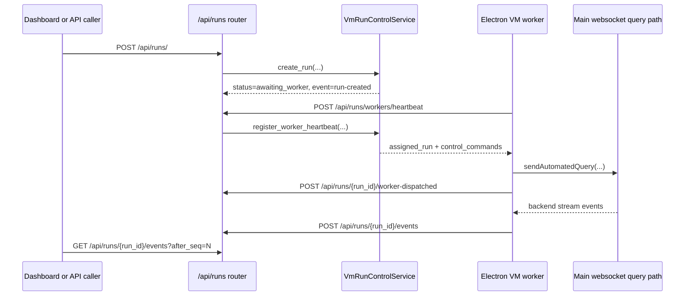

# VM Runs and Workers

This page maps the current VM run orchestration flow across backend and Electron main. It is intentionally concrete so an agent can identify where to modify code without starting from a repo-wide search.

For a task-oriented edit checklist that routes symptoms and feature changes to owner files, use [VM Run Control Change Workflow](vm_run_control_change_workflow.md).

## Code Ownership

| Concern | Owner files |
| --- | --- |
| Route registration | `backend/src/api/routes/__init__.py`, `backend/src/api/routes/runs/router.py` |
| Request/response models | `backend/src/api/routes/runs/models.py` |
| Route projections and validation | `backend/src/api/routes/runs/route_helpers.py`, `backend/src/api/routes/runs/response_builders.py`, `backend/src/api/routes/runs/support.py` |
| Run registry and lock-scoped orchestration | `backend/src/services/vm_run_control.py` |
| Queue assignment | `backend/src/services/vm_run_control_support/vm_run_control_assignment.py` |
| Status transitions | `backend/src/services/vm_run_control_support/vm_run_control_transitions.py` |
| Event append/select helpers | `backend/src/services/vm_run_control_support/vm_run_control_event_log.py` |
| Pending controls | `backend/src/services/vm_run_control_support/vm_run_control_pending_controls.py` |
| Bulk stop | `backend/src/services/vm_run_control_support/vm_run_control_bulk_stop.py` |
| Worker state payloads | `backend/src/services/vm_run_control_support/vm_run_control_worker_state.py` |
| Electron worker loop | `frontend/src/main/app/vm_worker_runtime.cjs` |
| VM mode flags | `frontend/src/main/app/runtime_mode.cjs` |

## Lifecycle

## Run Creation

`POST /api/runs/` calls `VmRunControlService.create_run(...)`.

The route dependency lazily publishes exactly one in-memory `VmRunControlService`
per FastAPI app state behind a thread lock, so concurrent first requests share
the same run map.

Creation rules:

- `workspace_id` and `query` are required.
- `agent_id`, `requested_by`, `files`, and `metadata` are optional.
- `files[]` stores artifact references only: `artifact_id`, optional `filename`, optional `content_type`.
- `metadata.conversation_ref` is used when it is a non-empty string.
- otherwise `conversation_ref` defaults to `run-{run_id}`.
- new runs start with `status="awaiting_worker"`.
- new runs start with `control_mode="agent_only"`.
- event `run-created` is appended with `source="api"`.
- the run id is appended to `_workspace_run_queues[workspace_id]`.

Active-run cap:

- env var: `WINDIE_VM_MAX_ACTIVE_RUNS_PER_WORKSPACE`
- default: `1`
- minimum effective value: `1`
- active statuses: `awaiting_worker`, `queued`, `running`, `paused`
- cap failure returns HTTP `409`

## Worker Polling and Assignment

`frontend/src/main/app/vm_worker_runtime.cjs` starts the worker loop when VM worker mode is enabled.

Worker mode flags:

- `WINDIE_VM_MODE=1` enables VM mode.
- `WINDIE_VM_WORKER_MODE=1` explicitly enables worker polling.
- when `WINDIE_VM_WORKER_MODE` is unset, worker mode defaults to VM mode.

Heartbeat request fields:

- `workspace_id`: from `WINDIE_VM_WORKSPACE_ID`, default `default-workspace`
- `worker_id`: from `WINDIE_VM_WORKER_ID`, fallback `worker-{backend-user-id}`
- `vm_id`: from `WINDIE_VM_ID`, fallback `vm-{worker_id}`
- `user_id`: from backend connection state
- `session_id`: connection session id, server user id, or user id fallback
- `agent_id`: from `WINDIE_VM_AGENT_ID`
- `status`: `running` when the worker has active run mappings, otherwise `ready`
- `metadata.platform`: `process.platform`

Assignment rules live in `vm_run_control_assignment.py`:

- only workers with status `ready` or `running` receive assignments.
- the service pops queued ids from the matching workspace queue.
- missing/deleted run ids are skipped.
- runs must be `awaiting_worker` or `queued`.
- runs already bound to a different worker id are skipped.
- assigned runs transition to `queued`.
- `run-worker-assigned` is appended with `source="backend"`.
- one heartbeat response returns at most one `assigned_run`.

## Dispatch and Acknowledgement

When the heartbeat response includes `assigned_run`, Electron main calls `dispatchAssignedRun(...)`.

Dispatch behavior:

- normalizes the run id, conversation ref, query text, and file refs.
- builds attachment context text from artifact refs.
- calls `sendAutomatedQuery({ text, conversationRef, attachmentContext, attachmentFilenames })`.
- stores maps in memory:
  - `conversation_ref -> run_id`
  - `run_id -> conversation_ref`
- posts `POST /api/runs/{run_id}/worker-dispatched` with `worker_id`, `user_id`, `turn_ref`, and `conversation_ref`.

Backend acknowledgement behavior:

- verifies the run exists.
- verifies the run is owned by the posting `worker_id`.
- verifies worker user compatibility.
- sets `status="running"`.
- stores `query_message_id=turn_ref`.
- updates `conversation_ref` when the ack includes a non-empty override.
- appends `run-dispatched` with `source="worker"`.

If `sendAutomatedQuery(...)` fails, the worker posts an `error` event to `/api/runs/{run_id}/events`.

## Event Relay

`vm_worker_runtime.cjs` registers a backend message observer. For every backend stream event with a known `conversation_ref`, the worker:

1. looks up the active run id for that conversation
2. posts `POST /api/runs/{run_id}/events`
3. sends `event_type` equal to the backend message `type`
4. sends `source="worker-stream"`
5. nests the backend event payload plus conversation, turn, session, and user ids

Status transitions for ingested events:

| Ingested event | Status effect |
| --- | --- |
| `streaming-complete` | `completed` |
| `error` | `failed` |
| any other event while `awaiting_worker` or `queued` | `running` |
| any other event while paused/stopped/completed/failed | no status override |

The worker clears active run/conversation maps after relaying `streaming-complete` or `error`.

## Controls

`POST /api/runs/{run_id}/control` validates the action and calls `apply_control(...)`.

Supported actions:

| Action | Immediate run mutation | Worker command |
| --- | --- | --- |
| `pause` | `status="paused"` | queued |
| `resume` | `running` if a worker exists, otherwise `awaiting_worker` | queued |
| `stop` | `status="stopped"` | queued |
| `set-control-mode` | updates `control_mode` | queued |

`set-control-mode` requires one of:

- `agent_only`
- `shared_control`
- `human_override`

Every control appends:

- a command in `pending_controls[]`
- event `run-control` with `source="api"`

`POST /api/runs/stop-all` applies `stop` to every active run, optionally filtered by workspace id, and marks each event payload with `bulk=true`. This endpoint requires the privileged `x-windie-runs-control-key` / `WINDIE_RUNS_CONTROL_API_KEY`; the ordinary runs key used by workers and normal run-control calls is not sufficient.

## Worker Control Application

`register_worker_heartbeat(...)` drains pending controls for runs owned by that worker. This makes control delivery one-shot: once a command is returned in `control_commands[]`, it is removed from `pending_controls[]`.

Electron currently applies only `stop` controls:

- finds the active conversation ref for the run id
- sends websocket message `stop-query`
- posts `run-control-applied` to `/api/runs/{run_id}/events`

`pause`, `resume`, and `set-control-mode` are currently recorded and delivered, but the Electron worker does not implement a runtime behavior for them beyond status/control-mode bookkeeping.

## Event Polling

`GET /api/runs/{run_id}/events` is incremental:

- `after_seq` defaults to `0`.
- `limit` defaults to `200`.
- FastAPI constrains `limit` to `1..1000`.
- returned events satisfy `seq > after_seq`.
- `next_after_seq` is the last returned event seq or the original `after_seq` when no events are returned.

Events are append-only inside a run. They are not durable across backend restarts.

## Debug Routes

Use this symptom map before patching:

| Symptom | Check first |
| --- | --- |
| `POST /api/runs/` returns `401` | runs API key mismatch; compare env with `x-windie-runs-key` |
| `POST /api/runs/` returns `409` | active-run cap and active statuses in the same workspace |
| run stays `awaiting_worker` | worker mode disabled, wrong `WINDIE_VM_WORKSPACE_ID`, backend endpoint mismatch, heartbeat auth failure |
| run becomes `queued` but not `running` | Electron worker dispatch failed before `worker-dispatched` ack |
| stream events missing | backend message observer did not see matching `conversation_ref`, or event relay auth/URL failed |
| stop control does nothing | worker has no active run mapping for that run id, or command was delivered before dispatch mapping existed |

## Validation

Backend:

- `tests/backend/test_run_control_routes.py`
- `tests/backend/test_vm_run_control_assignment.py`
- `tests/backend/test_vm_run_control_pending_controls.py`

Frontend:

- `tests/frontend/VmWorkerRuntime.test.cjs`
- `tests/frontend/RuntimeMode.test.cjs`

Docs:

- `<windie> docs list`
- update [VM Run Control Change Workflow](vm_run_control_change_workflow.md), [Runs API Runbook](runs_api_runbook.md), and [Runtime Configuration Matrix](../operations/runtime_configuration_matrix.md) when env vars, statuses, event names, or route payloads change.
