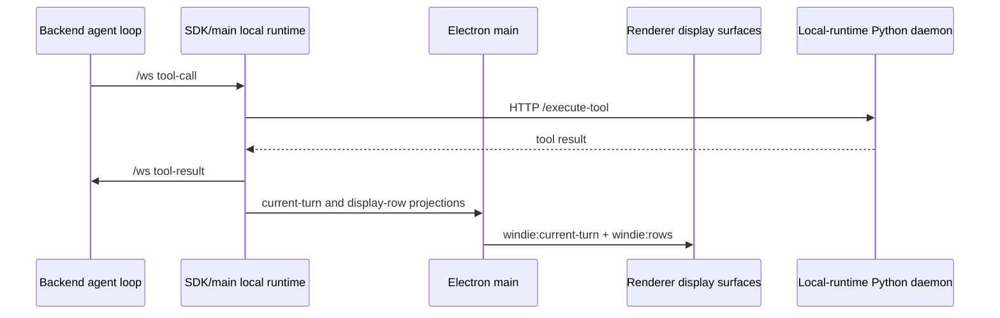

# Local Tool Channels

Local tools cross backend, SDK/main, renderer, Electron main, and local-runtime boundaries. The backend decides what the model can ask for, the SDK/main local-runtime path owns local execution routing and executable local machine action authority, and the local-runtime Python implementation provides the current concrete executors.

## End-to-End Tool Channel

## Ownership Split

| Layer | Owns | Code roots |
| --- | --- | --- |
| Backend | model-facing tool schema, policy filtering, parser validation, tool-call events, result waiting, history commit | private backend implementation |
| SDK/main local runtime | backend websocket ownership, local runtime startup/reuse, local tool-call routing, display-row projection, `tool-result` / `tool-bundle-result` return | `packages/windie-sdk-js/src/runtime/AgentClient.ts`, `packages/windie-sdk-js/src/runtime/Agent.ts`, `packages/windie-sdk-js/src/runtime/ConversationRuntime.ts`, `packages/windie-sdk-js/src/tools/ToolExecutionCoordinator.ts`, `packages/windie-sdk-js/src/runtime/LocalRuntime.ts` |
| Renderer | projected tool-call display, transcript/chat state, and stale-turn display guards; no local execution for backend tool events | `frontend/src/renderer/features/chat/hooks/useConversationRuntimeProjectionStream.ts`, `frontend/src/renderer/features/chat/hooks/chatStream/useChatStreamToolHandlers.ts`, `frontend/src/renderer/app/runtime/desktopCurrentTurnMessageRuntime.js`, `frontend/src/renderer/infrastructure/transcript/*` |
| Electron main | renderer IPC, direct `AgentClient.wakeUp(...)` customer wiring, desktop local-runtime launch option assembly, screenshot artifact upload, system-state bridge, SDK event fan-out | `frontend/src/main/ipc.cjs`, `frontend/src/main/sidecar/local_runtime_bridge.cjs`, `frontend/src/main/sidecar/local_runtime_launch_options.cjs` |
| Local-runtime Python daemon | concrete executable tool implementations and dynamic tool registry behind the local-runtime boundary | `frontend/src/main/python/sidecar_daemon.py`, `frontend/src/main/python/local_backend.py`, `frontend/src/main/python/tools/**`, `frontend/src/main/python/memory/**` |

## Main IPC Channels

Local-runtime-facing IPC channels are documented in [IPC Channel and Handler Reference](../frontend/contracts/ipc_channel_and_handler_reference.md).

Common local channels:

- SDK local tool execution: runs executable local tools through the SDK local
  runtime rather than a renderer-callable `execute-tool` IPC channel
- `get-system-state`: collect local OS/window/runtime state
- conversation and memory actions use SDK-shaped commands such as
  `conversations.search` and `memories.list`; direct sidecar-named IPC channels
  are removed

Renderer code should call the typed IPC bridge instead of raw Electron APIs.

## Local-Runtime Python Daemon Boundary

The canonical local executor is SDK/main local-runtime execution. The current
concrete executor is a token-auth Python daemon: Electron main passes desktop
launch options to `AgentClient`, the SDK starts or reuses the daemon, and local
execution uses daemon HTTP endpoints such as `/execute-tool`.

The older line-oriented JSON-RPC process remains for local memory/service IPC while those services are being carried behind the daemon boundary. It is intentionally separate from hosted backend HTTP/WebSocket contracts.

Python JSON-RPC method families:

- computer tools: mouse, keyboard, screenshot, scroll, window operations
- browser tools: dedicated browser launch/control/snapshot/file helpers
- filesystem tools: read/replace/path handling
- shell/process tools: command execution and process sessions
- system tools: waits, windows, system stats
- memory tools: local transcript/episodic/semantic storage and search
- wakeword service: separate subprocess protocol, not the generic JSON-RPC tool channel

Read next:

- [Local Runtime Python Implementation Docs Hub](../frontend/sidecar/README.md)
- [Local Runtime Process Lifecycle Change Workflow](../frontend/main/local_backend/process_lifecycle_change_workflow.md)
- [Local Runtime JSON-RPC Change Workflow](../frontend/sidecar/local_backend_jsonrpc_change_workflow.md)
- [Local-Runtime Tools Docs Hub](../frontend/sidecar/tools/README.md)
- [Local-Runtime Python Implementation and Memory](../frontend/sidecar/python_sidecar_and_memory.md)
- [Local-Runtime JSON-RPC Protocol Reference](../frontend/sidecar/core/json_rpc_protocol_stdout_framing_and_shutdown_signal_runtime_reference.md)

## Tool Result Return Path

After local-runtime Python execution, the SDK/main local runtime returns results
to the backend using the normal `/ws` tool-result path. The renderer receives
SDK display rows for chat/transcript/overlay state from that local execution
path. Backend ingests local results for model/history continuation only; it does
not echo local `tool-result` messages back to the UI as `tool-output` events.

The desktop `ChatProvider` is a display consumer. Backend tool-call execution
belongs to the SDK/main local-runtime path and local-runtime Python executor.

Result path rules:

- use `tool-result` for single calls.
- use `tool-bundle-result` for bundled/atomic tool execution.
- preserve request ids and tool-call ids expected by backend waiting/history code.
- preserve screenshot/artifact refs when tool output includes images.
- preserve raw `data.output` for local tool results; backend may truncate that
  raw output for model history but must not rewrite it into display/model
  duplicate fields.
- for MCP-backed tools, preserve the raw MCP result shape in the WindieOS
  envelope. `data.output` should contain the serialized MCP result content, but
  must elide promoted image bytes so base64 does not pollute model/display text.
  `data.mcp_result` should keep the raw MCP object, and image content should be
  additively promoted into native image fields such as `data.screenshot` and
  `data.screenshot_content_type`.
- normalize local failures into raw output/error payloads rather than silently dropping the call.

Read next:

- [Tool Execution Lifecycle](../tools/tool_execution_lifecycle.md)
- Backend Tool Result Ingress Reference (private backend docs)

## Common Failure Routing

| Symptom | Owner to inspect |
| --- | --- |
| model never sees tool | backend tool schema/policy |
| backend emits tool-call but no local action happens | SDK/main local-runtime routing or local-runtime Python implementation |
| tool card appears twice or looks duplicated | SDK display projection or renderer card rendering |
| local-runtime tool returns error before action | local-runtime tool validation or local-runtime Python executor |
| action succeeds but model does not continue | tool-result ingress, request id, or history commit path |
| screenshot path exists but image missing in chat | artifact upload/materialization path |

## Validation

Use the narrowest test set for the changed boundary:

- backend schema/policy/formatter/tool-result tests for model-facing changes
- SDK/main local-runtime tests for backend tool-call routing/result projection changes
- renderer chat-stream tests for display-only event behavior
- main-process IPC/local-runtime bridge tests for channel mapping changes
- local-runtime Python pytest tests for executable local tool behavior
- parity tests when backend schema and local-runtime executable payloads must stay aligned

Run `<windie> docs list` after docs updates.
