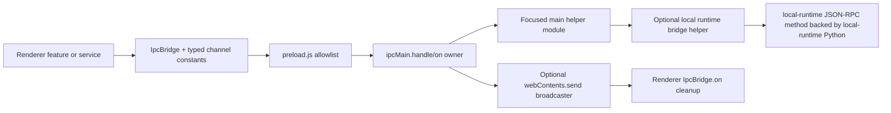

# IPC Change Workflow

Desktop Electron IPC is a trust boundary. The renderer can only use channels exposed by preload, and preload receives its allowlist from the shared channel registry passed by the main process. Do not add ad hoc `ipcRenderer` access to renderer code.

Use this workflow for Electron IPC only: renderer <-> preload <-> Electron main. If the change crosses into SDK local-runtime or Python JSON-RPC methods, continue into [Local Runtime JSON-RPC Change Workflow](sidecar/local_backend_jsonrpc_change_workflow.md). If the channel relays backend websocket messages, continue into [Query Send and Stream Relay Change Workflow](main/query_send_and_stream_relay_change_workflow.md) or [WebSocket Event Contract Change Workflow](../channels/websocket_event_contract_change_workflow.md), depending on whether the changed contract is desktop query input or backend stream output.

## Runtime Path

The shared channel registry is the naming source of truth, but it is not a handler registry. A channel is complete only when the registry, renderer caller/listener, preload allowlist, main-process registration, owner payload shaping, docs, and focused tests all agree.

## Source of Truth

| Surface | Code | Role |
| --- | --- | --- |
| Shared channel registry | `frontend/src/shared/ipcChannels.json` | Canonical channel names grouped by `SEND_CHANNELS`, `INVOKE_CHANNELS`, and `ON_CHANNELS`. |
| Preload allowlist | `frontend/src/preload.js` | Loads registry from `--desktop-runtime-ipc-channels=...`, gates send/invoke/on/once calls, strips Electron event objects. |
| Renderer constants | `frontend/src/renderer/infrastructure/ipc/channels.ts` | Typed channel constants derived from the shared JSON registry. |
| Renderer wrapper | `frontend/src/renderer/infrastructure/ipc/bridge.ts` | Typed `IpcBridge` helper used by renderer features and infrastructure. |
| Main handler surface | `frontend/src/main/ipc.cjs`, `frontend/src/main/ipc/*.cjs`, `frontend/src/main/*_ipc_runtime.cjs` | Registers handlers, backend relay, overlay channels, settings sync, memory, artifacts, permissions, lifecycle, and query events. |
| Local runtime bridge | `frontend/src/main/sidecar/local_runtime*.cjs` | Hosts scoped local tool/status IPC helpers; chat and memory persistence stay behind SDK local-runtime stores. |

## Fast Owner Map

| Channel purpose | First owner files | Common consumers | Focused tests |
| --- | --- | --- | --- |
| Backend query send or desktop chat relay | `frontend/src/main/ipc.cjs`, `frontend/src/main/ipc/ipc_query_send_runtime.cjs`, `frontend/src/main/ipc/ipc_query_runtime.cjs`, `frontend/src/main/ipc/ipc_query_runtime.cjs` | chat sender hooks, SDK tool-result relay, transcript sync | `tests/frontend/IpcMainBridge.query.test.cjs`, `tests/frontend/IpcQueryRuntime.test.cjs`, query payload tests |
| Backend stream ingress or synthetic query events | `frontend/src/main/ipc.cjs`, `frontend/src/main/ipc/ipc_runtime_helpers.cjs`, `frontend/src/main/ipc/ipc_query_broadcast.cjs`, `frontend/src/main/ipc/ipc_query_events.cjs` | renderer chat stream handlers, app status, transcript writer | stream/event consumer tests plus `IpcMainBridge.*` |
| Overlay phase, chatbox, response overlay, screenshot prep | `frontend/src/main/surfaces/overlay_phase_ipc_runtime.cjs`, `frontend/src/main/surfaces/window_visibility_runtime.cjs`, `frontend/src/main/ipc/ipc_overlay_phase_*` | chat pill, response overlay | `tests/frontend/OverlayPhaseIpcRuntime.test.cjs`, `tests/frontend/IpcOverlayPhase*.test.cjs` |
| Main-window controls and display inventory | `frontend/src/main/surfaces/window_controls_ipc_runtime.cjs`, `frontend/src/main/surfaces/main_window_controls_handler.cjs`, `frontend/src/main/surfaces/display_query_handler.cjs` | dashboard shell, app root, settings display picker | `tests/frontend/WindowControlsIpcRuntime.test.cjs`, `tests/frontend/MainWindowControlsHandler.test.cjs` |
| Local tool execution and local-runtime status | `frontend/src/main/sidecar/local_runtime_bridge.cjs`, `frontend/src/main/sidecar/local_runtime_execute_tool_runtime.cjs` | tool execution service, browser controls, attachment reads, status panels | `tests/frontend/LocalRuntimeBridge*.test.cjs`, `tests/sidecar/test_json_rpc_protocol.py`, related local-runtime Python tests |
| Conversation and memory persistence | SDK local-runtime store and renderer app-runtime facades | transcript writer, memory panels | SDK conversation/memory store tests plus related local-runtime memory tests |
| Artifact and image helpers | `frontend/src/main/ipc/ipc_artifact_fetch.cjs`, `frontend/src/main/ipc/ipc_clipboard_image.cjs`, `frontend/src/main/ipc/ipc_image_context_menu.cjs`, `frontend/src/main/ipc/ipc_image_interaction_handlers.cjs` | message renderer, artifact fetch/upload bridge, image menus | `tests/frontend/IpcArtifactFetch.test.cjs`, `tests/frontend/IpcClipboardImageHandler.test.cjs`, `tests/frontend/IpcImageContextMenuHandler.test.cjs`, `tests/frontend/IpcImageInteractionHandlers.test.cjs` |
| Wakeword/audio bridge | `frontend/src/main/wakeword/wakeword_bridge.cjs`, `frontend/src/main/wakeword/wakeword_bridge_runtime.cjs` | voice hooks, wakeword supervisor, Python wakeword subprocess | `tests/frontend/WakewordBridge.test.cjs`, `tests/frontend/WakewordBridgeRuntime.test.cjs`, `tests/frontend/voice/WakewordDetectionHook.test.ts` |
| Desktop UI config and model/settings sync | `frontend/src/main/ipc.cjs`, `frontend/src/main/ipc/ipc_desktop_ui_config.cjs`, `frontend/src/main/ipc/ipc_settings_sync.cjs` | app config provider, settings tabs, model settings | `tests/frontend/AppConfigProvider*.test.tsx`, `tests/frontend/IpcSettingsSync.test.cjs`, settings tests |

When a symptom spans rows, start at the producer row. For example, if a renderer listener receives malformed backend stream data, inspect the backend event producer, Agent SDK normalization/projection path, and typed Electron fan-out channel before adding renderer-only fallback parsing.

## Channel Type Decision

| Need | Channel family | Rule |
| --- | --- | --- |
| Renderer emits fire-and-forget command to main | `SEND_CHANNELS` | Use only when renderer does not need a result and main can tolerate duplicate or late delivery. |
| Renderer asks main for a result | `INVOKE_CHANNELS` | Prefer for local tool execution, config loads, permission probes, memory operations, artifact upload/fetch, and window commands needing success/failure. |
| Main broadcasts events to renderer | `ON_CHANNELS` | Use for backend stream ingress, local-runtime status, overlay phase, wakeword status, workspace updates, and window open targets. |

If a request/response needs correlation, use `invoke` or include an explicit id in the payload. Do not rely on event ordering across unrelated channels.

## Add a Channel Decision Tree

| Question | If yes | If no |
| --- | --- | --- |
| Does the renderer need a direct result? | Use `INVOKE_CHANNELS`. | Continue. |
| Is the main process broadcasting state to multiple renderer windows? | Use `ON_CHANNELS`. | Continue. |
| Is this a one-way command with no durable result and no required ordering with a later response? | Use `SEND_CHANNELS`. | Use `INVOKE_CHANNELS` with a structured result. |
| Does the channel execute local OS/tool behavior? | Keep Electron main as the IPC security boundary and put local execution behind local-runtime JSON-RPC. | Keep the implementation in the owning Electron main helper. |
| Does the channel change model-facing behavior or backend query shape? | Update the backend/websocket contract docs and tests, not just Electron IPC docs. | Keep the change scoped to Electron IPC and adjacent renderer/sidecar consumers. |

Prefer one focused channel over a generic "do-anything" channel. The preload allowlist is a security boundary, so broad channels must be justified by a narrow payload schema and tests that reject unsafe shapes at the owning runtime.

## Add a Channel

1. Add the channel name to `frontend/src/shared/ipcChannels.json` under the right family.
2. Update `frontend/src/renderer/infrastructure/ipc/channels.ts` type shape if the channel registry type is explicit.
3. Add or update renderer helper code so feature components call `IpcBridge` or a domain service instead of raw `window.ipc`.
4. Register the main handler or broadcaster in the owning main-process module from the fast owner map.
5. Return a structured payload from invoke handlers, usually `{ success, ... }` or a domain-specific object already used by nearby handlers. Avoid returning bare booleans for new behavior.
6. If the channel reaches Python, prefer an SDK local-runtime command/store path; only add Electron main bridge code for scoped host channels that truly need Electron authority.
7. Read [Local Runtime JSON-RPC Change Workflow](sidecar/local_backend_jsonrpc_change_workflow.md) before changing Python JSON-RPC method names, handler params, timeouts, readiness, or response envelopes.
8. Add tests for registry/preload parity plus the handler, broadcaster, mapper, or renderer consumer behavior.
9. Update docs for the affected domain, not only this workflow.

## Payload Contract Rules

| Rule | Reason |
| --- | --- |
| Keep channel payloads plain JSON-compatible values. | Payloads may cross sandbox, Electron, tests, and JSON-RPC boundaries. |
| Normalize at the owner boundary, not in every caller. | Callers should not duplicate validation or shape coercion. |
| Name fields by local convention at each boundary. | Renderer can use camelCase; SDK local-runtime callers convert to snake_case where the Python method expects it. |
| Include explicit ids for replay, correlation, or stale-event filtering. | IPC and websocket events can arrive after a renderer state transition. |
| Strip privileged Electron event objects before renderer callbacks. | `preload.js` intentionally passes only payload args to `on` and `once` callbacks. |
| Do not leak secrets through IPC payloads or logs. | IPC is local, but renderer state and test logs are easier to expose than main-process internals. |

Do not add direct sidecar-named IPC channels for chat or memory compatibility. Use SDK-shaped `windie:invoke` commands and keep the renderer-to-sidecar translation behind the SDK local-runtime store or a focused main-only helper.

## Change or Remove a Channel

| Change | Required checks |
| --- | --- |
| Rename | Update shared registry, renderer constants, renderer usage, preload tests, main handler tests, and any transcript/replay references. |
| Payload shape change | Update renderer caller, main handler, sidecar mapper if involved, backend-bound payload docs, and focused validation tests. |
| Handler move | Keep channel name stable, move implementation, and update ownership docs. |
| Removal | Delete registry entry, renderer usage, main handler, tests, and docs. Do not leave dead channels in preload. |

Do not keep compatibility shims unless there is a verified packaged-app, transcript replay, or external client dependency.

## Handler Implementation Checklist

Before editing:

1. Run `<windie> docs list`.
2. Read the nearest owner docs from the fast owner map.
3. Inspect current callers with `rg "CHANNEL_NAME|IpcBridge\\.(invoke|send|on)|ipcMain\\.(handle|on)" frontend/src tests`.
4. Decide whether the producer is renderer, Electron main, sidecar, or backend websocket.

During editing:

1. Keep registration close to the owning runtime module.
2. Keep the channel string centralized in `frontend/src/shared/ipcChannels.json`; do not inline new strings in renderer code.
3. Keep renderer cleanup functions returned by `IpcBridge.on` wired into hook/component cleanup.
4. Guard missing or destroyed BrowserWindow instances in main handlers that touch windows.
5. Use existing timeout/readiness helpers for local-runtime requests instead of ad hoc timers.
6. Add deterministic logs only when the existing domain has a trace or diagnostic gate.

Before committing:

1. Run registry/preload tests when channel names change.
2. Run the owning main/renderer/local-runtime tests from the matrix below.
3. Run `<windie> docs list` and a focused Markdown link check for touched docs.
4. Update `CHANGELOG.md`.

## Common Failure Signals

| Symptom | First owner to inspect |
| --- | --- |
| Renderer `invoke` rejects with invalid channel | Shared registry or preload registry argument. |
| TypeScript accepts channel but runtime rejects it | `channels.ts` type shape drift from `ipcChannels.json`. |
| Handler never runs | Missing `ipcMain.handle`/`ipcMain.on` registration or wrong channel family. |
| Event listener gets stale data | Main broadcaster, replay state, or renderer cleanup leak. |
| Packaged app differs from dev | Main process channel registry injection or preload path/build packaging. |
| Local-runtime tool call returns unexpected payload | Local-runtime bridge helper, SDK local-runtime caller, or Python JSON-RPC handler. |
| Renderer receives Electron event-like data | `preload.js` listener wrapper is bypassed or a custom bridge leaked privileged fields. |
| Multiple duplicate stream/status events after navigation | Renderer listener cleanup is missing or a provider re-registers listeners without unmount cleanup. |
| Invoke hangs or times out only for local tools | Local-runtime readiness, request correlation, timeout policy, or local-runtime JSON-RPC response shape. |
| Screenshot/window IPC fails only on one OS | Platform window visibility, display affinity, content protection, or permission owner docs. |
| Channel works in dev but not packaged app | `additionalArguments` registry injection, preload path, Electron Builder file inclusion, or main-process bootstrap order. |

## Debug Routes

| Failure point | Quick proof | Next doc |
| --- | --- | --- |
| Registry/preload mismatch | Inspect `frontend/src/shared/ipcChannels.json`, `frontend/src/renderer/infrastructure/ipc/channels.ts`, and `tests/frontend/PreloadIpcChannels.test.cjs`. | [Preload Allowlist and Channel-Constant Parity Reference](contracts/ipc/preload_allowlist_and_channel_constant_parity_reference.md) |
| Missing main handler | Search `ipcMain.handle('<channel>'` or `ipcMain.on('<channel>'`; confirm registration module is wired by `index.cjs` or `ipc.cjs`. | [Main-Process IPC Handler Ownership and RPC Mapper Reference](contracts/ipc/main_process_ipc_handler_ownership_and_rpc_mapper_reference.md) |
| Bad local-runtime payload | Inspect the SDK local-runtime caller or scoped main helper, method names, mapped keys, and local-runtime Python handler params. | [Local Runtime JSON-RPC Change Workflow](sidecar/local_backend_jsonrpc_change_workflow.md) |
| Backend relay drift | Inspect `windie:invoke` SDK commands, typed SDK/backend-event fan-out, settings sync gate, query payload builder, and Agent SDK backend transport send. | [Query Send and Stream Relay Change Workflow](main/query_send_and_stream_relay_change_workflow.md) |
| Renderer stale event | Inspect `IpcBridge.on` cleanup, stream turn refs, transcript session refs, and replay state. | [Renderer State Change Workflow](renderer/renderer_state_change_workflow.md) |
| Security concern | Inspect preload exposure, credential handling, permission gates, and local-runtime authority. | Security Change Playbook (private backend docs) |

## Test Targets

| Behavior | Tests |
| --- | --- |
| Preload allowlist and registry parity | `tests/frontend/PreloadIpcChannels.test.cjs`, `tests/frontend/IpcBridge.test.ts`, `tests/frontend/IpcBridgeValidation.test.ts` |
| Main query/backend relay | `tests/frontend/IpcMainBridge.query.test.cjs`, `tests/frontend/IpcMainBridge.lifecycle.test.cjs`, `tests/frontend/IpcQueryRuntime.test.cjs` |
| Settings, transcript, memory, artifacts | `tests/frontend/IpcSettingsSync.test.cjs`, `tests/frontend/IpcTranscriptSessionSync.test.cjs`, `tests/frontend/DesktopMemoryRuntimeClient.test.ts`, `tests/frontend/IpcArtifactFetch.test.cjs` |
| Overlay and window channels | `tests/frontend/IpcOverlayPhase*.test.cjs`, `tests/frontend/Overlay*.test.cjs`, `tests/frontend/MainWindow*.test.cjs` |
| Local runtime bridge | `tests/frontend/LocalRuntimeBridge*.test.cjs`, `tests/sidecar/test_json_rpc_protocol.py` |
| Permissions/workspace/sudo | `tests/frontend/PermissionIpcRuntime.test.cjs`, `tests/frontend/PermissionService.test.cjs`, `tests/frontend/permissionStore.test.js`, related sidecar permission tests |
| Wakeword/voice IPC | `tests/frontend/WakewordBridge.test.cjs`, `tests/frontend/WakewordBridgeRuntime.test.cjs`, `tests/frontend/voice/WakewordDetectionHook.test.ts` |
| Clipboard/image context IPC | `tests/frontend/IpcClipboardImageHandler.test.cjs`, `tests/frontend/IpcImageContextMenuHandler.test.cjs`, `tests/frontend/IpcImageInteractionHandlers.test.cjs`, `tests/frontend/MessageContent.test.jsx` |

Docs-only IPC updates should still run `<windie> docs list`, `git diff --check`, and a focused link check on changed docs. Code changes should additionally run the narrowest owner tests above and any renderer tests for changed consumers.

## Related Docs

- [Frontend Contracts IPC Docs Hub](contracts/ipc/README.md)
- [Preload Channel Allowlist and Renderer Bridge Reference](preload/preload_channel_allowlist_and_renderer_bridge_reference.md)
- [IPC Channel and Handler Reference](contracts/ipc_channel_and_handler_reference.md)
- [Main-Process IPC Handler Ownership and RPC Mapper Reference](contracts/ipc/main_process_ipc_handler_ownership_and_rpc_mapper_reference.md)
- [Local Runtime JSON-RPC Change Workflow](sidecar/local_backend_jsonrpc_change_workflow.md)
- [Local Tool Channels](../channels/sidecar_and_tool_channels.md)
