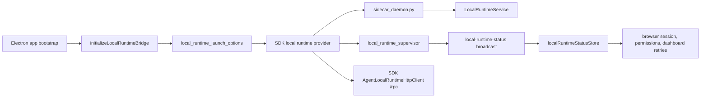

# Local Runtime Process Lifecycle Change Workflow

Use this workflow when desktop needs to start/reuse the configured local-runtime daemon,
report readiness, or route Electron helper calls through the SDK local runtime.
Use [Local Runtime JSON-RPC Change Workflow](../../sidecar/local_backend_jsonrpc_change_workflow.md)
for method registration and payload-shape changes after the daemon is reachable.

## Runtime Path

The SDK owns local-runtime daemon lifetime and RPC unwrapping. Electron main owns only
desktop launch facts, host window/screenshot/artifact behavior, and renderer
readiness/status broadcasts.

## Source of Truth

| Surface | Code | Role |
| --- | --- | --- |
| Bridge composition | `frontend/src/main/sidecar/local_runtime_bridge.cjs` | Wires SDK local runtime provider access, status broadcasts, host helper IPC, and local-runtime RPC helpers. |
| Supervisor state | `frontend/src/main/sidecar/local_runtime_supervisor.cjs` | Tracks renderer-visible daemon status, ready flag, generation, and last error. |
| Launch options | `frontend/src/main/sidecar/local_runtime_launch_options.cjs` | Resolves desktop daemon command/args/cwd/env/launch context before passing them to the SDK. |
| Timeout policy | `frontend/src/main/sidecar/local_runtime_timeout_policy.cjs` | Defines default and browser-specific request timeout tiers. |
| Launch target resolution | `frontend/src/main/app/runtime_paths.cjs` | Chooses packaged local-runtime binary, packaged Python runtime, source `.py`, or configured Python executable. |
| Endpoint/env inputs | `frontend/src/main/app/backend_endpoints.cjs`, `frontend/src/main/sidecar/local_runtime_utils.cjs` | Resolves backend URL/env and normalizes `NODE_OPTIONS`. |
| Renderer readiness store | `frontend/src/renderer/infrastructure/runtime/localRuntimeStatusStore.js` | Bootstraps current status and subscribes to `local-runtime-status` events. |
| Browser readiness consumer | `frontend/src/renderer/infrastructure/runtime/browserSessionStore.js` | Gates browser session sync and controls on local-runtime readiness. |
| Local-runtime Python daemon | `frontend/src/main/python/sidecar_daemon.py`, `frontend/src/main/python/local_backend.py` | Hosts the app-session `LocalRuntimeService` implementation, `/rpc` endpoint, local-tool handlers, memory handlers, and chat-event storage behind SDK local-runtime ownership. |

## Change Decision Tree

| Symptom or request | Primary owner | Continue into |
| --- | --- | --- |
| Local-runtime daemon never starts, missing Python/runtime, wrong cwd/env, packaged-only launch failure | Desktop local-runtime launch options passed to the SDK provider | `local_runtime_launch_options.cjs`, `runtime_paths.cjs`, install/packaging docs |
| `local-runtime-status` shows stale ready/error state | Supervisor and status broadcast path | `local_runtime_supervisor.cjs`, `buildLocalRuntimeStatusPayload`, renderer status store |
| SDK provider fails or `/rpc` rejects | SDK local runtime provider and daemon client | `LocalRuntime.ts`, bridge lifecycle/RPC tests |
| Browser controls wait forever despite local-runtime readiness | Renderer readiness consumer | `localRuntimeStatusStore.js`, `browserSessionStore.js`, browser control tests |
| Python method exists but payload maps incorrectly | IPC/JSON-RPC contract, not lifecycle | [Local Runtime JSON-RPC Change Workflow](../../sidecar/local_backend_jsonrpc_change_workflow.md) |
| Local tool result shape is wrong after local-runtime Python executes | Tool execution contract, not lifecycle | [Local-Runtime Tool Change Workflow](../../local_runtime_tool_change_workflow.md) |

## Lifecycle Contract

1. `initializeLocalRuntimeBridge(...)` resolves windows and creates an SDK local runtime provider from desktop launch options.
2. The bridge must not spawn `local_backend.py` as a standalone Electron-owned process.
3. Launch target resolution must prefer packaged binaries/runtime paths in packaged mode and source Python paths in development mode.
4. Startup env must preserve `PYTHONUNBUFFERED=1`, the generic local-runtime
   keys (`AGENT_BACKEND_HTTP_URL`, `AGENT_BACKEND_AUTH_STATE_PATH` when
   provided, `AGENT_PACKAGED_APP`,
   `AGENT_ENABLE_BROWSER_FEATURE_PACK_AUTOINSTALL`) plus WindieOS skin aliases
   when configured (`WINDIE_BACKEND_HTTP_URL`, `WINDIE_BACKEND_AUTH_STATE_PATH`,
   `WINDIE_PERMISSION_STATE_PATH`, `WINDIE_PACKAGED_APP`,
   `WINDIE_ENABLE_BROWSER_FEATURE_PACK_AUTOINSTALL`), and packaged Python
   isolation variables when applicable.
   Daemon env-key normalization is private to
   `createDesktopLocalRuntimeLaunchPlan(...)`; validate env behavior through
   the returned launch plan instead of importing helper functions from
   `local_runtime_launch_options.cjs`.
5. The `get-local-runtime-status` bootstrap read is a readiness probe: when a valid SDK local runtime provider exists and no runtime client has been resolved yet, it wakes the SDK local runtime and then returns the current status payload.
6. A resolved SDK local runtime provider emits `local-runtime-status` with `ready:true` and the full normalized status payload.
7. SDK provider failures keep `ready:false`, publish `status:"error"` with a short sanitized error, and helper calls fail closed.
8. `stopLocalRuntime()` shuts down the resolved SDK runtime when present and clears the local status snapshot. The old `stopLocalBackend()` export has been removed.

## Status Payload Contract

| Field | Producer | Consumer contract |
| --- | --- | --- |
| `ready` | `buildLocalRuntimeStatusPayload()` and direct status sends | Renderer treats only `true` as ready; everything else gates local-runtime-dependent controls. |
| `status` | `local_runtime_supervisor` snapshot | Renderer defaults missing status to `ready` or `stopped` based on `ready`; keep values stable for debugging. |
| `error` | launch failure, process error, non-zero exit, supervisor last error | Renderer stores string errors and shows dependent feature failures without inspecting process internals. |
| `localRuntime` | SDK local runtime snapshot | Diagnostic snapshot for host/status tests. Renderer readiness consumers must not infer process state from this nested object. |

If a new lifecycle state is added, update the supervisor tests, renderer normalization, docs, and any UI that displays or gates on status. Avoid making renderer code infer detailed process state from log text.

## Helper Request Rules

| Rule | Reason |
| --- | --- |
| Resolve the SDK local runtime provider before bridge helper RPCs. | Keeps daemon startup/reuse and JSON-RPC unwrapping SDK-owned. |
| Use `runtime.rpc(...)` for Python JSON-RPC methods and `runtime.executeTool(...)` for executable local tools. | Preserves SDK result normalization and local-tool lifecycle hooks. |
| Keep Electron-only screenshot display bounds, window hiding, and artifact upload materialization in the bridge helper layer. | These are host concerns, not SDK protocol semantics. |
| Convert provider/RPC failures into stable `{ success:false, error }` envelopes for renderer-facing helpers. | Renderer callers need terminal failures without inspecting SDK internals. |

## Packaged App Rules

Packaged local-runtime behavior is different from source mode and must be validated separately when changed.

| Area | Required behavior |
| --- | --- |
| Missing bundled runtime | SDK launch option construction fails closed with reinstall guidance. |
| Python runtime env | Set Python isolation variables and delete `PYTHONPATH` when packaged Python runtime is used. |
| Browser feature pack autoinstall | Disabled in packaged mode, enabled in source mode unless explicitly overridden. |
| Local-runtime binary path | Prefer packaged binary when present before falling back to Python runtime. |
| User-facing errors | Avoid machine-specific stack traces; use actionable runtime or reinstall guidance. |

If a source-mode change works but packaged mode fails, inspect
`runtime_paths.cjs`, Electron Builder file inclusion, and the `autoLocalRuntime` env
passed to the SDK provider before changing local-runtime Python code.

## Renderer Consumer Rules

Renderer readiness consumers should subscribe through
`DesktopLocalRuntimeStatusRuntimeClient`; the underlying `localRuntimeStatusStore`
keeps the shared IPC bootstrap and event subscription so consumers do not invoke
local-runtime status repeatedly. Consumers that only need readiness should use
the client's value-level `onReady(...)` or `isReady()` helpers instead of
reading raw status snapshot fields.
The store installs the live `local-runtime-status` listener before starting the
bootstrap `get-local-runtime-status` read. If a live event arrives while the
bootstrap read is pending, the bootstrap response is treated as stale and cannot
overwrite the newer event snapshot.

| Consumer | Expected behavior |
| --- | --- |
| Browser session store | Disconnects and clears busy state while the local runtime is not ready; syncs browser session after readiness becomes true. |
| Browser controls | Wait for readiness before issuing browser tool calls; the bootstrap status read is allowed to wake the SDK local runtime so the control does not wait forever on a runtime it never starts. |
| Dashboard conversation retry paths | Treat local-runtime-not-ready as retryable through the desktop conversation library facade. |
| Permission/browser probes | Use Electron main permission service and local-runtime status helpers rather than direct process checks. |

## Browser Session Diagnostics

Use the persistent app diagnostics path `browser.session_control` when the
browser header is disabled, stuck, or failing before a conversation turn exists.
Renderer events record local-runtime status observations and suppressed connect
attempts. Electron main events record status bootstrap wake success/failure,
`local-runtime-status` broadcasts, and summarized `run-browser-action` results.
Rows must stay sanitized: store booleans, action names, status strings, counts,
request ids, durations, and short errors only. Do not store browser URLs, page
titles, local paths, page text, screenshots, tool output, or stack traces.

When adding a new renderer feature that depends on local-runtime readiness, wire it through the status store and test both initial bootstrap read and later `local-runtime-status` event updates.

## Debug Routes

| Failure | First proof | Next file |
| --- | --- | --- |
| SDK provider cannot start daemon | Check launch target, missing command/script errors, launch context, and SDK provider error. | `runtime_paths.cjs`, `local_runtime_launch_options.cjs`, `LocalRuntime.ts` |
| Daemon starts but helper RPC fails | Check SDK `/rpc` unwrapping and daemon `LocalRuntimeService.protocol.handle_request(...)`. | `LocalRuntime.ts`, `sidecar_daemon.py`, `local_backend.py` |
| Ready event reaches main but renderer still disabled | Check `get-local-runtime-status` bootstrap invoke and `local-runtime-status` listener cleanup. | `localRuntimeStatusStore.js` |
| Browser controls stuck | Check browser session readiness handler and the first browser status/sync request after readiness. | `browserSessionStore.js` |
| Packaged app only | Check packaged runtime path resolution, Python env isolation, and release packaging docs. | `runtime_paths.cjs`, `local_runtime_launch_options.cjs`, `docs/operations/release_packaging_change_workflow.md` |

## Test Matrix

| Changed behavior | Minimum focused tests |
| --- | --- |
| Supervisor generation/status semantics | `cd frontend && npm run test -- ../tests/frontend/LocalRuntimeSupervisor.test.cjs` |
| SDK provider readiness, unavailable launch plan, shutdown, fail-closed helpers | `cd frontend && npm run test -- ../tests/frontend/LocalRuntimeBridge.lifecycle.test.cjs` |
| Helper RPC mapping, tool routing, screenshot host shaping, JSON-RPC errors | `cd frontend && npm run test -- ../tests/frontend/LocalRuntimeBridge.rpc.test.cjs` |
| Renderer status subscription and browser readiness gating | `cd frontend && npm run test -- ../tests/frontend/ChatBrowserSessionControl.test.jsx` plus any direct status-store tests |
| Daemon protocol behavior | `./scripts/python-in-env local-runtime pytest tests/sidecar/test_sidecar_daemon.py tests/sidecar/test_local_backend.py` |
| Packaged path/runtime changes | focused runtime path tests plus package/reinstall smoke from [Release and Packaging Change Workflow](../../../operations/release_packaging_change_workflow.md) |

Docs-only changes should run `<windie> docs list`, `git diff --check`, and a focused Markdown link check. Code changes should run the narrowest row above plus any adjacent IPC, sidecar, or packaging tests for the touched path.

## Related Docs

- [Frontend Main Local-Runtime Docs Hub](README.md)
- [Local-Runtime Process Lifecycle, Readiness, and Request-Correlation Reference](process_lifecycle_readiness_and_request_correlation_reference.md)
- [SDK-Owned Local-Runtime Lifecycle Reference](../../sidecar/local_backend_process_lifecycle_reference.md)
- [Local Runtime JSON-RPC Change Workflow](../../sidecar/local_backend_jsonrpc_change_workflow.md)
- [Local-Runtime Python Implementation Change Workflow](../../sidecar/local_runtime_python_change_workflow.md)
- [IPC Change Workflow](../../ipc_change_workflow.md)
- [Release and Packaging Change Workflow](../../../operations/release_packaging_change_workflow.md)
