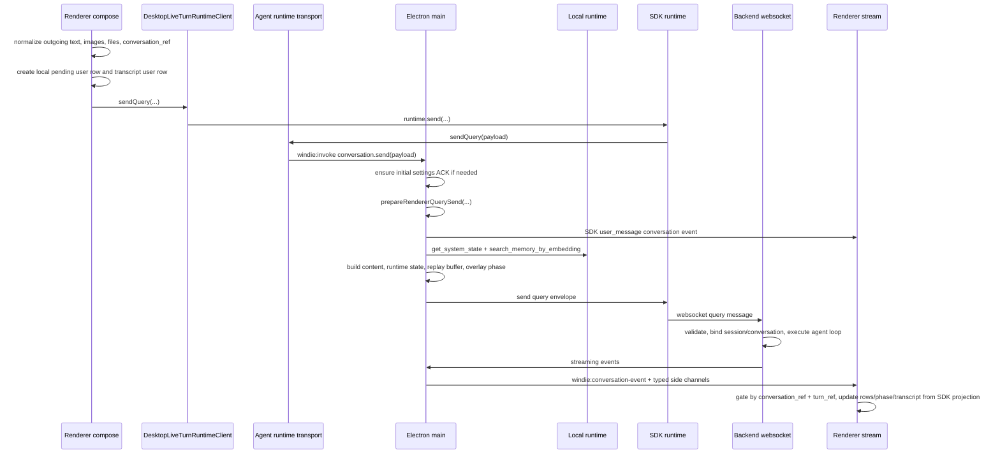

# Query Send and Stream Relay Change Workflow

Use this workflow when the requested change is phrased as "sending a message",
"query payload", "stream relay", "SDK user row", "wrong chat", "missing
screenshot", "stuck awaiting", or "first query uses stale settings". The path is
split across renderer UI, Electron main, SDK runtime, backend websocket transport, backend
query execution, and renderer stream consumption; do not patch only the visible
chat component until the producer and relay contracts are identified.

## Boundary Rules

- Renderer owns compose state, typed resource handle collection, send preflight,
  and active conversation selection.
- Electron main owns the SDK-shaped `windie:invoke` command handler,
  settings ACK gate, SDK-only resource/metadata preservation, synthetic
  send-failure errors, replay buffer, and overlay phase fan-out.
- The SDK runtime owns base user-row emission, turn resource resolution,
  backend websocket construction, envelope send/close primitives, and SDK-owned
  local tool-result routing.
- Local-runtime Python only supplies local enrichment data through JSON-RPC
  helpers such as system state and memory search. It must not inspect backend
  schemas or construct model-facing websocket messages.
- The hosted backend owns websocket message validation, query handler dispatch,
  agent/session execution, stream formatting, and final completion semantics.
- Renderer, Electron main, and local-runtime Python code must not import backend modules to gain schema
  parity. Keep parity in contracts, tests, and explicit payload normalization.
- `screenshot_url`, `attachment_context`, `attachment_filenames`, and
  `memory_retrieval_enabled` are frontend relay metadata. Only fields explicitly
  preserved by Electron main should reach the backend websocket.

## Fast Owner Map

| Change or symptom | Primary owner files | Tests to inspect or add |
| --- | --- | --- |
| Message button or keyboard submit behavior changes | `frontend/src/renderer/features/chat/components/MessageInput.jsx`, `frontend/src/renderer/features/chat/hooks/useChatMessageSender.ts`, `frontend/src/renderer/app/runtime/desktopMessageSendUiRuntime.ts`, `frontend/src/renderer/app/runtime/desktopChatPillSessionRuntime.ts` | `tests/frontend/MessageInput.test.jsx`, `tests/frontend/MessageSendUiPolicy.test.ts`, `tests/frontend/ChatMessageSender.test.tsx`, `tests/frontend/ChatPillSessionFlow.test.ts` |
| Query payload fields, screenshot refs, attachment names, workspace path, or memory toggle changes | `frontend/src/renderer/app/runtime/desktopLiveTurnRuntimeClient.ts`, `frontend/src/renderer/app/runtime/desktopRuntimeTransport.ts`, `frontend/src/renderer/app/runtime/desktopChatSendPayloadRuntime.ts`, `frontend/src/renderer/app/runtime/desktopChatSendPreparationRuntime.ts`, `frontend/src/main/ipc/ipc_query_runtime.cjs`, `frontend/src/main/ipc/ipc_query_send_runtime.cjs` | `tests/frontend/DesktopLiveTurnRuntimeClient.test.ts`, `tests/frontend/DesktopChatSendPayloadRuntime.test.ts`, `tests/frontend/IpcQueryRuntime.test.cjs`, `tests/frontend/IpcMainBridge.query.test.cjs` |
| Stop/cancel routing changes | `frontend/src/renderer/features/chat/hooks/useStopTurnHandler.js`, `frontend/src/renderer/app/runtime/desktopStopTurnRuntime.js`, `frontend/src/renderer/features/chat/stores/chatStore.ts`, `frontend/src/renderer/app/runtime/desktopLiveTurnRuntimeClient.ts`, `frontend/src/renderer/app/runtime/desktopRuntimeTransport.ts`, `packages/windie-sdk-js/src/runtime/ConversationRuntime.ts` | `tests/frontend/DesktopStopTurnRuntime.test.js`, `tests/frontend/PendingStopLiveSurfaceIntegration.test.jsx`, `tests/frontend/ChatStore.test.ts`, `tests/frontend/ChatInterfaceWiring.test.jsx`, `tests/frontend/IpcMainBridge.lifecycle.test.cjs`, `tests/frontend/AgentSdkConversationRuntime.test.ts` |
| SDK context enrichment or memory/attachment context changes | `packages/windie-sdk-js/src/runtime/ContextEnrichmentPipeline.ts`, `frontend/src/main/python/local_backend_memory_handlers.py`, `frontend/src/main/python/memory/*` | `tests/frontend/AgentSdkContextEnrichment.test.ts`, `tests/frontend/IpcMainBridge.query.test.cjs`, `tests/sidecar/test_local_backend.py`, `tests/sidecar/test_conversation_search_helpers.py`, `tests/sidecar/test_conversation_semanticization_runtime.py` |
| First query settings are stale or not ACKed | `frontend/src/main/ipc.cjs`, `frontend/src/main/ipc/ipc_settings_sync.cjs`, `frontend/src/renderer/app/providers/appConfigRuntimeSync.js` | `tests/frontend/IpcSettingsSync.test.cjs`, `tests/frontend/IpcMainBridge.query.test.cjs`, backend settings handler tests |
| Optimistic user message appears twice, missing, or has wrong metadata | `frontend/src/main/ipc/ipc_query_broadcast.cjs`, `frontend/src/main/ipc/ipc_query_events.cjs`, `frontend/src/main/ipc/ipc_event_replay_state.cjs`, `frontend/src/renderer/features/chat/hooks/useChatStream.ts` | `tests/frontend/IpcQueryRuntime.test.cjs`, `tests/frontend/IpcMainBridge.query.test.cjs`, `tests/frontend/DesktopChatStreamEventRuntime.test.ts` |
| Stuck awaiting, wrong overlay phase, or response overlay does not clear | `frontend/src/main/ipc/ipc_overlay_phase_state.cjs`, `frontend/src/main/ipc/ipc_overlay_phase_events.cjs`, `frontend/src/renderer/app/runtime/desktopStreamPhaseRuntime.js`, `frontend/src/renderer/app/runtime/desktopChatLoopUiRuntime.js`, `frontend/src/renderer/features/chat/hooks/useChatLoopUiState.js` | `tests/frontend/IpcOverlayPhaseState.test.cjs`, `tests/frontend/IpcOverlayPhaseEvents.test.cjs`, `tests/frontend/StreamPhaseState.test.js` |
| Stream events mutate the wrong conversation or old turn | `frontend/src/renderer/features/chat/hooks/useChatStream.ts`, `frontend/src/renderer/features/chat/hooks/chatStream/*`, `frontend/src/renderer/app/runtime/desktopChatStream*.ts`, `frontend/src/renderer/features/chat/stores/chatStore.ts` | `tests/frontend/DesktopChatStreamIngressRuntime.test.ts`, `tests/frontend/DesktopChatStreamTurnGuardRuntime.test.ts`, `tests/frontend/DesktopChatStreamTerminalHandoffRuntime.test.ts` |
| Backend receives query but emits missing or malformed stream events | `backend/src/api/handlers/query.py`, `backend/src/api/services/query_execution.py`, `backend/src/api/processing/*`, `backend/src/api/routes/websocket/*` | `tests/backend/test_query_execution_*`, `tests/backend/test_stream_pipeline.py`, `tests/backend/test_websocket_message_handler.py` |
| Send fails while disconnected or websocket is not ready | `frontend/src/main/ipc.cjs`, `frontend/src/main/ipc/ipc_query_send_runtime.cjs`, `frontend/src/main/ipc/ipc_query_broadcast.cjs`, `frontend/src/renderer/app/runtime/desktopRuntimeTransport.ts` | `tests/frontend/IpcMainBridge.query.test.cjs`, `tests/frontend/DesktopStopTurnRuntime.test.js`, websocket reconnect tests |

## Runtime Flow

Send and stop/cancel follow the same app-runtime boundary. Chat UI calls
`DesktopLiveTurnRuntimeClient.sendQuery(...)`; that creates an SDK
conversation runtime and calls `runtime.send(...)`. The SDK desktop transport
adapter is the only renderer-side layer that maps the semantic SDK query command
into the `windie:invoke` command `conversation.send`. Chat UI calls
`DesktopLiveTurnRuntimeClient.stop(...)`; that creates an SDK conversation
runtime and calls `runtime.stop(...)`, which the same adapter maps into the
`windie:invoke` command `conversation.stop`. Stop targets resolve from SDK
`ConversationView` first, renderer pending turn second, and idle conversation
fallback last. Pending-turn stops carry the pending `turnRef`; they are not
turnless stops. Renderer surfaces share `useStopTurnHandler(...)`, which passes
an already resolved stop target and UI dependency callbacks into
`DesktopStopTurnRuntime.executeStopTurnExecutionPlan(...)`; the app runtime owns
the stop-plan field handling, stopped-turn store acceptance, pending-bridge
cleanup classification, and dispatch to `DesktopLiveTurnRuntimeClient.stop(...)`.

## Change Sequence

### 1. Classify the change by owner

Before editing, answer which contract is changing:

- Compose contract: text, pasted images, readable files, screenshot capture,
  message-send policy, disabled send states.
- Renderer runtime facade contract: `DesktopLiveTurnRuntimeClient.sendQuery(...)` arguments,
  SDK `runtime.send(...)` payload, and SDK desktop transport adapter
  typed chat IPC payload shape.
- Main/SDK runtime contract: query payload filtering, enrichment, settings ACK
  gate, SDK runtime send, local synthetic events, replay, and send failure behavior.
- Backend websocket contract: incoming `query` schema, handler dispatch, stream
  event formatting, completion, cancellation, or task cleanup.
- Renderer stream contract: event guards, conversation routing, turn tracking,
  transcript persistence, terminal handoff, or UI phase projection.

If more than one contract changes, update producer docs/tests first, then
consumer docs/tests in the same commit.

### 2. Inspect the renderer send path

Read these files when changing what is collected before a query leaves the UI:

- `frontend/src/renderer/features/chat/hooks/useChatMessageSender.ts`
- `frontend/src/renderer/app/runtime/desktopChatSendPayloadRuntime.ts`
- `frontend/src/renderer/app/runtime/desktopChatSendPreparationRuntime.ts`
- `frontend/src/renderer/app/runtime/desktopConversationSessionRuntime.ts`
- `frontend/src/renderer/app/runtime/desktopLiveTurnRuntimeClient.ts`
- `frontend/src/renderer/app/runtime/desktopRuntimeTransport.ts`

Renderer invariants:

- A conversation ref must exist before send. If none exists, renderer creates one
  and synchronizes chat store and transcript state before dispatch.
- The pending local user row is rendered before backend send. The SDK
  `user_message` projection later replaces it for cross-window/replay parity.
- Clipboard images are normalized into screenshot entries and artifact refs when
  upload succeeds.
- Readable file content becomes hidden `attachment_context`; filenames remain UI
  metadata until main strips or echoes them.
- `workspace_path` is frontend metadata forwarded to backend query payloads only
  when it is non-empty.
- Send failure must clear the matching renderer `pendingTurn` and append a
  local error row. Replay failures from edit/resend and try-again must follow
  the same visible-error contract after restoring the previous transcript, so
  failed replay dispatches do not look like inert edit buttons.

### 3. Inspect the Electron main relay path

Read these files when changing SDK runtime relay behavior:

- `frontend/src/main/ipc.cjs`
- `packages/windie-sdk-js/src/runtime/ConversationRuntime.ts`
- `frontend/src/main/ipc/ipc_query_send_runtime.cjs`
- `frontend/src/main/ipc/ipc_query_runtime.cjs`
- `packages/windie-sdk-js/src/runtime/ContextEnrichmentPipeline.ts`
- `frontend/src/main/ipc/ipc_query_events.cjs`
- `frontend/src/main/ipc/ipc_query_broadcast.cjs`
- `frontend/src/main/ipc/ipc_event_replay_state.cjs`
- `frontend/src/main/ipc/ipc_overlay_phase_state.cjs`
- `frontend/src/main/ipc/ipc_settings_sync.cjs`

Main relay invariants:

- `query` and `wakeword-detected` must pass the initial settings ACK gate before
  backend send so first-turn settings do not lag renderer config.
- `prepareRendererQueryPayload(...)` clones the renderer payload, resolves
  `conversation_ref`, strips prompt-only attachment context, strips the memory
  retrieval flag, and normalizes attachment filenames.
- `prepareRendererQuerySend(...)` sets response overlay phase to
  `awaiting-first-chunk`, records active display affinity, starts the event
  replay buffer with the turn id, filters backend query fields, and returns the
  final websocket payload. SDK `ConversationRuntime.send(...)` emits
  `turn_started` and `user_message` projections.
- `buildQueryPayload(...)` requires a current authenticated user id. If the
  query send path can run before install auth, fix auth/connection ordering
  instead of inventing an anonymous fallback.
- SDK `ContextEnrichmentPipeline.ts` may call local-runtime memory helpers and
  renders escaped model-facing memory/attachment/query content.
- On websocket send failure, main clears replay state and emits an SDK
  `turn_error` conversation event from query-events runtime
  `buildQuerySendFailure(...)` context.
- Renderer SDK transports that call `conversation.send` through `windie:invoke`
  must inspect the
  invoke result and reject on `{ ok: false }`. Normal send and replay/edit
  flows depend on that rejection to clear optimistic UI state instead of
  treating a failed main-process dispatch as accepted.

### 4. Inspect backend query handling only when backend semantics change

Read backend code when payload fields, stream events, completion behavior, or
handler routing changes:

- `backend/src/api/schemas/incoming.py`
- `backend/src/api/handlers/query.py`
- `backend/src/api/services/query_execution.py`
- `backend/src/api/services/query_execution_support/*`
- `backend/src/api/processing/*`
- `backend/src/api/routes/websocket/message_handler.py`

Backend invariants:

- Incoming query schema owns backend-visible fields. Do not assume frontend-only
  relay metadata is accepted unless the backend schema and tests say so.
- `QueryMessageHandler` and `QueryExecutionService` own screenshot ref
  resolution, runtime system-state normalization, stream context attachment, and
  completion fallback/backfill.
- Stream event formatter changes must update backend outgoing contracts and
  renderer event guards together.

### 5. Inspect renderer stream consumption

Read these files when query sends succeed but UI, transcript, or phase state is
wrong:

- `frontend/src/renderer/features/chat/hooks/useChatStream.ts`
- `frontend/src/renderer/features/chat/hooks/chatStream/*`
- `frontend/src/renderer/app/runtime/desktopChatStream*.ts`
- `frontend/src/renderer/app/runtime/desktopStreamPhaseRuntime.js`
- `frontend/src/renderer/features/chat/hooks/useChatLoopUiState.js`
- `frontend/src/renderer/app/runtime/desktopConversationContinuityService.ts`
- `frontend/src/renderer/app/runtime/desktopConversationLibraryClient.js`

Renderer stream invariants:

- SDK `user_message` events seed the active turn through the shared stream
  dispatch path.
- Other stream events must be scoped by `turn_ref` and routed to the correct
  `conversation_ref`.
- Terminal handoff predicates protect new sends from old terminal events.
- Tool-call/tool-output rows and assistant final rows must be recorded to
  transcript with the same conversation/user context used by visible chat rows.
- Loop UI state must reset on terminal events and on websocket disconnect
  watchdog expiration.

## Field Ownership Cheatsheet

| Field | Producer | Consumer | Notes |
| --- | --- | --- | --- |
| `text` | Renderer compose | Main payload builder, backend query schema | Raw query text is escaped into `<user_query>` by main. |
| `content` | Electron main | Backend query handler | Model-facing enriched content. Renderer should not create it. |
| `conversation_ref` | Renderer session runtime, main fallback | Backend session/query execution, renderer stream guards | Missing values cause wrong-chat symptoms. Keep alias behavior in transcript sync tests. |
| `turn_ref` / query message id | Electron main | Renderer stream tracking, replay state, backend stream context | Main-generated id scopes optimistic event and backend send. |
| `screenshot_ref` | Renderer screenshot/artifact pipeline | Main local echo, backend artifact lookup | Preferred image transport for query screenshots. |
| `screenshot_refs` | Renderer screenshot/artifact pipeline | Backend multi-image loading | Null when empty; normalize before send. |
| `screenshot_url` | Renderer/main local echo | Renderer display only | Main may derive URLs for local synthetic events; do not rely on it as backend data. |
| `capture_meta` | Renderer screenshot pipeline | Backend query execution | Keep as structured metadata; tests should cover omitted and populated cases. |
| `attachment_context` | Renderer readable-file helper | Main prompt enrichment | Prompt-only; stripped before backend send as a top-level field. |
| `attachment_filenames` | Renderer compose | Local synthetic event/display metadata | Normalized and echoed locally; not model-facing context by itself. |
| `workspace_path` | Renderer workspace binding | Backend query/rehydrate context | Keep nullable and non-machine-specific in docs/tests. |
| `memory_retrieval_enabled` | Renderer preference | Main query builder | Controls local prompt memory injection; stripped before backend send. |
| `system_state_internal` | Electron main query builder | Backend query execution runtime | Currently carries normalized runtime-only screen resolution. |

## Debug Routes

| Symptom | First checks | Likely fix area |
| --- | --- | --- |
| User row appears but no backend response | Confirm `DesktopLiveTurnRuntimeClient.sendQuery` fired, `windie:invoke` command `conversation.send` reached main, websocket was connected, and send failure event was not synthesized. | `useChatMessageSender.ts`, `desktopLiveTurnRuntimeClient.ts`, `ipc.cjs`, `ipc_query_send_runtime.cjs`, websocket connection docs |
| First query uses old model/settings | Check `ensureInitialSettingsSync()`, pending ACK map, `settings-updated` event id, and timeout logs. | `ipc_settings_sync.cjs`, app config runtime sync, backend settings handler |
| Screenshot displays locally but model cannot inspect it | Check artifact upload result, `screenshot_ref`/`screenshot_refs`, and backend artifact lookup. | query screenshot pipeline, `DesktopLiveTurnRuntimeClient.sendQuery`, backend `QueryExecutionService` |
| File attachment is visible but ignored by model | Check readable file context generation, SDK enrichment, and `<attached_file_context>` insertion. | renderer file helper, `ipc_query_runtime.cjs`, `ContextEnrichmentPipeline.ts` |
| Response streams into old dashboard conversation | Check `conversation_ref` creation, transcript-session sync, event `conversation_ref`, and `turn_ref` mapping. | renderer session runtime, `ipc_transcript_session_sync.cjs`, chat stream conversation gate |
| Minimal pill stuck awaiting | Check SDK `user_message`, first stream chunk, terminal/error event, overlay phase transitions, and disconnect watchdog. | overlay phase state, stream phase state, `useChatLoopUiState` |
| Duplicate local user rows | Check renderer optimistic row plus SDK `user_message` projection replacement and replay dedupe behavior. | `useChatMessageSender`, `useChatStream`, `ipc_event_replay_state.cjs` |
| Backend rejects query payload | Compare `DesktopLiveTurnRuntimeClient.sendQuery`, `desktopRuntimeTransport.sendQuery`, and main-filtered payload against `backend/src/api/schemas/incoming.py`. | renderer SDK transport, main query runtime, backend incoming schema |

## Validation Matrix

Docs-only change:

- `<windie> docs list`
- `git diff --check`
- focused Markdown link check for touched docs

Renderer send payload or compose change:

- `cd frontend && npm run test -- DesktopChatSendPayloadRuntime`
- `cd frontend && npm run test -- ChatMessageSender`
- `cd frontend && npm run test -- MessageInput`

Electron main query relay change:

- `cd frontend && npm run test -- IpcMainBridge.query`
- `cd frontend && npm run test -- IpcQueryRuntime`
- `cd frontend && npm run test -- AgentSdkContextEnrichment`
- `cd frontend && npm run test -- IpcOverlayPhaseState`

Renderer stream state change:

- `cd frontend && npm run test -- ChatStream`
- `cd frontend && npm run test -- StreamPhaseState`
- `cd frontend && npm run test -- ConversationSessionRuntime`

Backend query schema or stream event change:

- `./scripts/python-in-env backend pytest tests/backend/test_websocket_message_handler.py`
- `./scripts/python-in-env backend pytest tests/backend/test_query_execution_service_helpers.py`
- `./scripts/python-in-env backend pytest tests/backend/test_stream_pipeline.py`

Local-runtime memory/system-state enrichment change:

- `./scripts/python-in-env local-runtime pytest tests/sidecar/test_conversation_search_helpers.py`
- `./scripts/python-in-env local-runtime pytest tests/sidecar/test_conversation_semanticization_runtime.py`
- focused sidecar system-state tests if field collection changes

## Docs to Sync

Update these docs when the query-send contract changes:

- [Query Payload and Relay Reference](query_payload_and_relay_reference.md)
- [IPC Query Runtime and Transcript Sync Helper Reference](ipc_query_runtime_and_transcript_sync_helper_reference.md)
- [Stream Event State Machine](../runtime/stream_event_state_machine.md)
- [Tool Execution and Streaming](../runtime/tool_execution_and_streaming.md)
- [Local User Message and Query Send-Failure Synthesis](../contracts/events/local_user_message_and_query_send_failure_synthesis_reference.md)
- [Session and Conversation Identity Change Workflow](../../memory/session_conversation_identity_change_workflow.md)
- WebSocket Connection Change Workflow (private backend docs)
- [WebSocket Event Contract Change Workflow](../../channels/websocket_event_contract_change_workflow.md)
- Query Lifecycle Change Workflow (private backend docs)
- [Code Change Surface Index](../../reference/code_change_surface_index.md)
