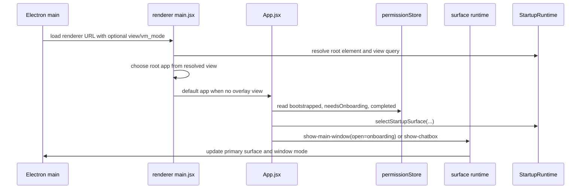

# App Startup and Onboarding Change Workflow

Use this workflow before changing first-frame routing, onboarding, VM mode,
renderer root selection, or startup visibility handoff. Startup is split across
Electron main window creation, renderer URL view selection, renderer permission
gate state, and main-process surface visibility.

## Boundary Rules

- Electron main owns window creation, renderer URL query parameters, primary
  surface mode, and show/hide behavior for main window, chat pill, and overlays.
- Renderer `main.jsx` owns React root/render selection while
  `DesktopStartupRuntimeClient` owns the root DOM lookup and `view` query
  adapter used for component selection.
- Renderer `App.jsx` owns React rendering and startup side effects while
  `DesktopStartupRuntimeClient.selectStartupSurface(...)` owns the default
  main-app startup decision between VM dashboard, onboarding slideshow, and
  normal dashboard/chat-pill handoff.
- Permission onboarding completion is renderer-local persisted state keyed by
  the permission manifest version.
- Permission manifest/status probing is Electron-main IPC behavior; renderer
  should not duplicate platform permission probes.
- Wakeword should mount only on dashboard-capable main app surfaces, not on
  onboarding or overlay-only surfaces.
- VM mode bypasses onboarding and overlay/tray startup so hosted worker windows
  do not wait on local user permission setup.

## Fast Owner Map

| Change or symptom | Primary owner files | Tests to inspect or add |
| --- | --- | --- |
| App opens onboarding vs dashboard vs chat pill incorrectly | `frontend/src/renderer/app/App.jsx`, `frontend/src/renderer/app/runtime/desktopStartupRuntimeClient.ts`, `frontend/src/renderer/features/permissions/stores/permissionStore.js` | `tests/frontend/startupSurface.test.js`, `tests/frontend/AppPermissionGate.test.jsx`, `tests/frontend/AppVmMode.test.jsx` |
| `view=` route loads wrong renderer app | `frontend/src/renderer/app/main.jsx`, Electron window loader/runtime files | `tests/frontend/MainWindowOverlayRuntime.test.cjs`, renderer provider/view routing tests |
| VM mode shows onboarding or overlays | `frontend/src/main/app/runtime_mode.cjs`, `frontend/src/main/app/main_process_lifecycle_runtime.cjs`, `frontend/src/renderer/app/runtime/desktopStartupRuntimeClient.ts`, `frontend/src/renderer/infrastructure/runtime/vmMode.js`, `App.jsx` | `tests/frontend/MainProcessLifecycleRuntime.test.cjs`, `tests/frontend/AppVmMode.test.jsx`, `tests/frontend/startupSurface.test.js` |
| Onboarding completion does not persist or resets unexpectedly | `frontend/src/renderer/app/runtime/desktopPermissionOnboardingStorageRuntime.js`, `permissionStore.js` | `tests/frontend/PermissionStorage.test.js`, `tests/frontend/permissionStore.test.js` |
| Permission slides/progression are wrong | `frontend/src/renderer/features/onboarding/components/DesktopOnboardingSlideshow.jsx`, `PermissionOnboardingSlide.jsx`, `StopShortcutOnboardingSlide.jsx`, `frontend/src/renderer/app/runtime/desktopOnboardingSlideRuntime.js` | `tests/frontend/DesktopOnboardingSlideshow.test.jsx`, `tests/frontend/onboardingSlides.test.js` |
| Restart onboarding from Settings opens wrong surface | `SettingsSection.jsx`, `settings/OnboardingSettingsTab.jsx`, main-window open-target IPC | `tests/frontend/SettingsSection.test.jsx`, surface/open-target tests |
| Wakeword starts during onboarding or starts twice | `frontend/src/renderer/app/App.jsx`, `WakewordController.jsx`, overlay app wrappers | `tests/frontend/AppPermissionGate.test.jsx`, voice/wakeword renderer tests |

## Runtime Flow

## Change Sequence

### 1. Classify the startup change

Start by deciding which contract is changing:

- Renderer route selection: `view` query value to app wrapper.
- Default app startup: VM dashboard, onboarding, or dashboard/chat-pill handoff.
- Permission onboarding: manifest/status bootstrap, completion persistence, or
  slide progression.
- Main-process visibility: which window is shown/focused/hidden.
- VM mode: hosted worker behavior that bypasses desktop overlays and onboarding.
- Wakeword placement: whether a mounted renderer surface should own detection.

Do not mix renderer routing, permission semantics, and Electron window policy in
one patch unless the same bug genuinely crosses all three.

### 2. Inspect renderer root selection

Read:

- `frontend/src/renderer/app/main.jsx`
- `frontend/src/renderer/app/App.jsx`
- `frontend/src/renderer/app/MinimalChatPillApp.jsx`
- `frontend/src/renderer/app/MinimalResponseOverlayApp.jsx`
- `frontend/src/renderer/app/ToolGhostDebugApp.jsx`
- Electron window loading code in `frontend/src/main/surfaces/main_window_runtime.cjs`

Root rules:

- no `view` query loads `App`.
- `view=minimal-chat-pill` loads the minimal chat pill app.
- `view=minimal-response-overlay` loads the response overlay app.
- `view=tool-ghost-debug` loads the dev tool-ghost debug app.
- Only the default `App` should run the full dashboard/onboarding startup gate.

### 3. Inspect default app startup selection

Read:

- `frontend/src/renderer/app/App.jsx`
- `frontend/src/renderer/app/runtime/desktopStartupRuntimeClient.ts`
- `frontend/src/renderer/infrastructure/runtime/vmMode.js`
- `frontend/src/renderer/app/WakewordController.jsx`

Startup rules:

- `DesktopStartupRuntimeClient.selectStartupSurface(...)` returns
  `dashboard-vm` when VM mode is enabled.
- Before permission bootstrap finishes, persisted onboarding completion prevents
  a first-frame onboarding flash.
- After bootstrap finishes, `needsOnboarding` is authoritative so manifest
  version changes can route users back into onboarding.
- `dashboard-vm` invokes focused main-window restore through
  `DesktopWindowRuntimeClient.showMainWindowWithValues(...)`.
- `onboarding` invokes focused onboarding main-window restore through
  `DesktopWindowRuntimeClient.showMainWindowWithValues(...)`.
- normal `dashboard` invokes focused chatbox restore through
  `DesktopWindowRuntimeClient.showChatboxWithValues(...)` so desktop startup
  lands on the minimal chat pill. The runtime client assembles the host-shaped
  window command options.

### 4. Inspect permission onboarding state

Read:

- `frontend/src/renderer/features/permissions/stores/permissionStore.js`
- `frontend/src/renderer/app/runtime/desktopPermissionOnboardingStorageRuntime.js`
- `frontend/src/main/permissions/permission_service*.cjs`
- `frontend/src/main/permissions/permission_ipc_runtime.cjs`

Permission rules:

- storage key is `windieos-permission-onboarding`.
- old `desktop-agent-permission-onboarding` state is ignored.
- completion is valid only when stored `manifest_version` matches the current
  manifest version.
- `needsOnboarding` is based on completion-for-manifest, not directly on every
  permission being granted.
- permission status/probe/request payloads come from Electron main IPC.
- `restartOnboarding()` clears completion for the current manifest and reopens
  the gate.

### 5. Inspect onboarding UI and Settings restart path

Read:

- `frontend/src/renderer/features/onboarding/components/DesktopOnboardingSlideshow.jsx`
- `frontend/src/renderer/features/onboarding/components/PermissionOnboardingSlide.jsx`
- `frontend/src/renderer/features/onboarding/components/StopShortcutOnboardingSlide.jsx`
- `frontend/src/renderer/features/onboarding/hooks/useOnboardingPermissionActions.js`
- `frontend/src/renderer/app/runtime/desktopOnboardingSlideRuntime.js`
- `frontend/src/renderer/features/dashboard/components/sections/settings/OnboardingSettingsTab.jsx`
- `frontend/src/renderer/features/dashboard/components/sections/SettingsSection.jsx`

UI rules:

- onboarding renders permission slides from the current manifest plus a final
  stop-shortcut slide.
- the skin-provided start CTA completes onboarding even if optional or follow-up
  permissions are still missing.
- onboarding main window suppresses maximize/fullscreen behavior so OS prompts
  are not hidden behind a fullscreen shell.
- Settings restart should reopen the onboarding target through the same
  main-window open-target path, not by manually remounting the slideshow.

### 6. Inspect Electron main surface ownership

Read:

- `frontend/src/main/index.cjs`
- `frontend/src/main/app/main_process_lifecycle_runtime.cjs`
- `frontend/src/main/surfaces/main_window_runtime.cjs`
- `frontend/src/main/surfaces/surface_runtime.cjs`
- `frontend/src/main/surfaces/overlay_phase_ipc_runtime.cjs`

Surface rules:

- VM mode starts the main window and skips overlay/tray/hotkey setup.
- main-window restore with the `onboarding` open target sets main-window mode and primary
  surface to onboarding.
- normal dashboard mode and onboarding are both main-window modes, but they must
  stay distinguishable for close/reopen and second-instance focus.
- second-instance focus should restore onboarding if onboarding is the primary
  surface.
- allowed main-window open targets include `chat`, `memory`, `models`,
  `onboarding`, and `settings`.

## Debug Routes

| Symptom | First checks | Likely owner |
| --- | --- | --- |
| Onboarding flashes for completed users | `DesktopStartupRuntimeClient.selectStartupSurface(...)`, `bootstrapped`, persisted onboarding completion. | Renderer startup selector |
| Onboarding never reappears after manifest change | permission manifest version, `completedForManifest`, `needsOnboarding`. | Permission store |
| Wakeword prompts before onboarding completion | `WakewordController` placement in `App.jsx`. | Renderer app startup |
| Settings "Open onboarding" does not route | main-window open-target emission and `OnboardingSettingsTab`. | Settings plus surface runtime |
| Overlay window renders full dashboard | renderer URL `view` query, `DesktopStartupRuntimeClient`, and `main.jsx` root selection. | Window loader/root routing |

## Validation Matrix

Docs-only change:

- `<windie> docs list`
- `git diff --check`
- focused Markdown link check for touched docs

Renderer startup/onboarding change:

- `cd frontend && npm run test -- startupSurface`
- `cd frontend && npm run test -- AppPermissionGate`
- `cd frontend && npm run test -- AppVmMode`

Onboarding wizard or permission storage change:

- `cd frontend && npm run test -- DesktopOnboardingSlideshow`
- `cd frontend && npm run test -- onboardingSlides`
- `cd frontend && npm run test -- permissionStore`
- `cd frontend && npm run test -- PermissionStorage`

Electron main startup/surface change:

- `cd frontend && npm run test -- MainProcessLifecycleRuntime`
- `cd frontend && npm run test -- MainWindowRuntime`
- `cd frontend && npm run test -- MainWindowOverlayRuntime`
- `cd frontend && npm run test -- SurfaceRuntime`

Settings restart path change:

- `cd frontend && npm run test -- SettingsSection`
- relevant main-window open-target tests

## Docs to Sync

Update these docs when startup/onboarding changes:

- [App Startup VM-Mode and Permission Onboarding Runtime Reference](app_startup_vm_mode_and_permission_onboarding_runtime_reference.md)
- [Entrypoint View Routing and Provider Stack Reference](providers/entrypoint_view_routing_and_provider_stack_reference.md)
- [Permission Onboarding Gate, Manifest Version, and Data-Controls Runtime Reference](permissions/permission_onboarding_gate_manifest_version_and_data_controls_runtime_reference.md)
- [Onboarding and Permissions](../../desktop/onboarding_permissions.md)
- [Main Process Change Workflow](../main/main_process_change_workflow.md)
- [Frontend Runtime Surface Reference](../runtime/frontend_runtime_surface_main_renderer_sidecar_and_vm_worker_reference.md)
