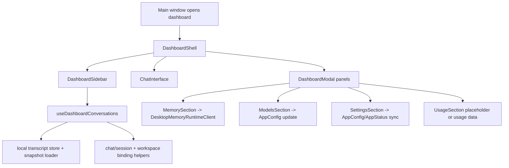

# Dashboard Change Workflow

Use this workflow before editing dashboard behavior. Dashboard bugs often look
like a single React component problem, but the real owner may be transcript
state, local-runtime memory JSON-RPC, app config sync, main-process open-target
routing, or chat-session rehydrate. Start with the feature surface, then follow
the owner map before changing code.

## Boundary Rules

- Dashboard is renderer-owned. It should not own backend websocket schemas,
  local-runtime memory storage internals, or provider runtime logic.
- `DashboardShell` owns modal exclusivity, sidebar open/collapse state,
  dashboard-open animation, `main-window-open-target` routing, and panel
  composition.
- `useDashboardConversations` owns recent chats, search, title polling, open
  conversation, delete, pin, rename-local-state, workspace binding, and chat
  session handoff.
- Section components own only their panel-level UI and immediate renderer
  actions. Persistence and runtime sync stay in shared providers/IPC helpers.
- Chat resume must go through transcript/session helpers and local snapshot
  loading. Do not rebuild backend history directly from dashboard UI code.
- Memory panels must use renderer IPC/main bridge channels; do not import or
  mutate local-runtime memory files directly.
- Model/settings panels must round-trip through AppConfig/AppStatus and backend
  ACK events. Do not update model runtime state by mutating local component state
  only.
- Destructive dashboard actions must keep confirmation, transcript state cleanup,
  workspace binding cleanup, and chat-session reset aligned.

## Fast Owner Map

| Change or symptom | Primary owner files | Tests to inspect or add |
| --- | --- | --- |
| Sidebar open/collapse, navigation buttons, active panel highlighting | `frontend/src/renderer/features/dashboard/components/DashboardSidebar.jsx`, `components/sidebar/*`, `DashboardShell.jsx` | `tests/frontend/DashboardSidebar.test.jsx`, `tests/frontend/DashboardShell.test.jsx` |
| Main-window target opens wrong dashboard panel | `frontend/src/renderer/features/dashboard/components/DashboardShell.jsx`, `frontend/src/main/*open*`, `frontend/src/main/ipc*` | `tests/frontend/DashboardShell.test.jsx`, main-window open-target tests if present |
| Recent chats do not load, retry, group, or show titles | `frontend/src/renderer/features/dashboard/hooks/useDashboardConversations.js`, `app/runtime/desktopDashboardConversationLoadRuntime.js`, `app/runtime/desktopDashboardConversationGroupRuntime.js`, transcript local store | `tests/frontend/DashboardConversationLoad.test.js`, `tests/frontend/ConversationGroups.test.js`, `tests/frontend/DashboardSidebar.test.jsx` |
| Search modal behavior changes | `frontend/src/renderer/features/dashboard/components/SearchChatsModal.jsx`, `useDashboardConversations.js`, `desktopConversationLibraryClient.js`, `desktopConversationStore.ts` | `tests/frontend/DashboardSidebar.test.jsx`, conversation search tests, focused modal tests when added |
| Opening a conversation lands in wrong chat/session/workspace | `useDashboardConversations.js`, `desktopWorkspaceRuntimeClient.ts`, `desktopConversationStore.ts`, `desktopConversationSessionRuntime.ts`, `conversationWorkspaceBinding.js`, Electron main SDK runtime registry | `tests/frontend/DashboardConversationLoad.test.js`, `tests/frontend/ConversationSessionRuntime.test.ts`, `tests/frontend/ConversationWorkspaceBinding.test.js`, `tests/frontend/IpcMainConversationRuntimeRegistry.test.cjs` |
| Delete/clear chats leaves stale transcript, workspace, or active state | `useDashboardConversations.js`, `DashboardShell.jsx`, `desktopConversationStore.ts`, `desktopActiveChatSessionRuntime.ts`, workspace binding helpers | `tests/frontend/DashboardConversationLoad.test.js`, `tests/frontend/DesktopConversationStore.test.ts`, `tests/frontend/UseDashboardConversations.test.jsx`, `tests/frontend/ResetActiveChatSession.test.ts` |
| Memory panel list/delete/search/toggle changes | `components/sections/MemorySection.jsx`, `MemoryItem.jsx`, `app/runtime/desktopMemoryPresentationRuntime.js`, `DesktopMemoryRuntimeClient`, memory runtime contracts | `tests/frontend/MemorySection.test.jsx`, `tests/frontend/DesktopMemoryPresentationRuntime.test.js`, `tests/frontend/RendererChatRuntimeBoundary.test.ts`, memory runtime/local-runtime Python tests |
| Models panel selection, provider grouping, API keys, or fallback changes | `components/sections/ModelsSection.jsx`, `app/runtime/desktopModelSelectionRuntime.js`, `app/runtime/desktopModelCardPresentationRuntime.js`, `app/runtime/desktopProviderCredentialRuntime.js`, `modelCards.jsx`, `ApiKeysSection.jsx` | `tests/frontend/ModelsSection.test.jsx`, `tests/frontend/ModelSelectionUtils.test.js`, `tests/frontend/DesktopModelCardPresentationRuntime.test.js`, `tests/frontend/DesktopProviderCredentialRuntime.test.js` |
| Settings panel tabs or config controls change | `components/sections/SettingsSection.jsx`, `components/sections/settings/*`, AppConfig provider utilities | `tests/frontend/SettingsSection.test.jsx`, `tests/frontend/GeneralSettingsTab.test.jsx`, `tests/frontend/DesktopSettingsEventRuntimeClient.test.ts` |
| Usage panel changes from placeholder to real data | `components/sections/UsageSection.jsx`, token/usage event consumers, backend token-count docs | `tests/frontend/UsageSection.test.jsx`, token-count renderer/backend tests when data becomes real |
| Dashboard layout, shell styles, responsive behavior | `frontend/src/renderer/styles/DashboardShell.css`, `SettingsSurface.css`, shell components | focused frontend render/layout tests; visual/manual checks for large UI changes |

## Runtime Flow

## Change Sequence

### 1. Classify the dashboard surface

Before editing, decide which layer owns the behavior:

- Shell: modal exclusivity, sidebar layout, open-target routing, dashboard wake
  animation, transport snapshot, `vmModeEnabled` gating.
- Sidebar/search: navigation actions, recent conversation rows, workspace
  grouping, conversation menus, search modal, active-row highlighting.
- Conversation handoff: local snapshot load, transcript session update, chat
  store messages, inference session state, workspace selection.
- Section panel: memory, models, settings, usage, and panel-specific state.
- Shared runtime: AppConfig/AppStatus, transcript storage, local-runtime memory,
  backend model catalog, or token/usage events.

If a change crosses layers, update the shared runtime tests before adjusting
presentation-only assertions.

### 2. Inspect shell and routing first

Read these files for dashboard open/close, sidebar, panel, or open-target work:

- `frontend/src/renderer/features/dashboard/components/DashboardShell.jsx`
- `frontend/src/renderer/features/dashboard/components/DashboardSidebar.jsx`
- `frontend/src/renderer/features/dashboard/components/sidebar/*`
- `frontend/src/renderer/features/dashboard/components/SearchChatsModal.jsx`
- `frontend/src/main/*` files that emit `main-window-open-target`

Shell invariants:

- `closeAllPanels()` should preserve modal exclusivity when opening settings,
  models, memory, usage, or search.
- `vmModeEnabled` disables dashboard chrome/panels and keeps only the chat
  surface.
- `main-window-open-target` should wake dashboard layout through
  `DesktopDashboardLayoutRuntime.requestDashboardLayoutPass(...)` and route
  only to known targets.
- runtime clients provide normalized dashboard transport and user context snapshots
  (`DesktopWindowRuntimeClient.onMainWindowOpenTarget(...)` and
  `DesktopClientSessionRuntimeClient.loadMainSessionUserId()`). Do not
  duplicate host-shaped target/user payload parsing or backend connection state
  in section panels.
- Search open should reset stale query/results before displaying the modal.

### 3. Inspect conversation list, search, and resume

Read these files for recent chats, search, open, rename, pin, or delete work:

- `frontend/src/renderer/features/dashboard/hooks/useDashboardConversations.js`
- `frontend/src/renderer/app/runtime/desktopDashboardConversationLoadRuntime.js`
- `frontend/src/renderer/app/runtime/desktopDashboardConversationGroupRuntime.js`
- `frontend/src/renderer/infrastructure/transcript/desktopConversationStore.ts`
- `frontend/src/renderer/app/runtime/desktopConversationLibraryClient.js`
- `frontend/src/renderer/app/runtime/desktopConversationSessionRuntime.ts`
- `frontend/src/renderer/app/runtime/desktopWorkspaceRuntimeClient.ts`
- `frontend/src/renderer/infrastructure/workspace/conversationWorkspaceBinding.js`
- `frontend/src/main/ipc.cjs`

Conversation invariants:

- Recent chat loads are per user and deduplicate in-flight requests.
- Stale recent-load responses must not overwrite newer user/session state.
- Title visibility polling follows assistant transcript writes and must clear
  timers on unmount.
- Search waits for at least two trimmed characters and cancels stale delayed
  searches.
- Opening a conversation loads the local snapshot, synchronizes workspace
  selection, applies renderer conversation selection, resets sending/thinking
  state, and updates chat messages for that conversation.
- Delete clears conversation events, transcript state, workspace binding,
  inference session state, pinned/search/recent rows, and active chat state via
  the `desktopActiveChatSessionRuntime` app-runtime facade when deleting the
  current conversation.
- Rename and pin are currently local dashboard state operations; do not document
  them as durable backend changes unless persistence is implemented.

### 4. Inspect section panels by domain

Memory section:

- `frontend/src/renderer/features/dashboard/components/sections/MemorySection.jsx`
- `frontend/src/renderer/features/dashboard/components/sections/MemoryItem.jsx`
- `frontend/src/renderer/app/runtime/desktopMemoryPresentationRuntime.js`
- [Memory Section Data Normalization and Semantic Delete Contract Reference](sections/memory_section_data_normalization_and_semantic_delete_contract_reference.md)

Models section:

- `frontend/src/renderer/features/dashboard/components/sections/ModelsSection.jsx`
- `frontend/src/renderer/app/runtime/desktopModelSelectionRuntime.js`
- `frontend/src/renderer/app/runtime/desktopModelCardPresentationRuntime.js`
- `frontend/src/renderer/app/runtime/desktopProviderCredentialRuntime.js`
- `frontend/src/renderer/features/dashboard/components/sections/modelCards.jsx`
- [Models Section Selection Reconciliation and Dashboard Storage Contract Reference](sections/models_section_selection_reconciliation_and_dashboard_storage_contract_reference.md)

Settings section:

- `frontend/src/renderer/features/dashboard/components/sections/SettingsSection.jsx`
- `frontend/src/renderer/features/dashboard/components/sections/settings/*`
- `frontend/src/renderer/app/runtime/desktopSettingsEventRuntimeClient.ts`
- [Settings Section Tabs and Wakeword Toggle Runtime Reference](../settings/sections/settings_section_tabs_and_wakeword_toggle_runtime_reference.md)

Usage section:

- `frontend/src/renderer/features/dashboard/components/sections/UsageSection.jsx`
- [Usage Section Placeholder Panel and Modal Contract Reference](sections/usage_section_placeholder_panel_and_modal_contract_reference.md)

Panel invariants:

- Panel close buttons should call the shell-provided close callback.
- Memory deletion must surface failure without mutating local state first.
- Memory retrieval toggle changes query prompt injection preference, not the
  stored memory rows themselves.
- Model selection patches must include the canonical model/provider pair and
  go through `onConfigChange`.
- Settings controls must use AppConfig-owned fields and backend ACK status.
- Usage is a placeholder until a real usage data source is wired; avoid implying
  billing or quota behavior that does not exist.

## Debug Routes

| Symptom | First checks | Likely owner |
| --- | --- | --- |
| Sidebar button opens the wrong panel | Verify `DashboardSidebarNavigation` callback, `DashboardShell` open handler, and `closeAllPanels()`. | Shell/sidebar |
| Recent chats are empty after sending a message | Check `transcript-entry-stored` event, user id snapshot, local conversation list, and title poll. | `useDashboardConversations`, transcript store |
| Search results lag or show stale query | Check 180ms search debounce cancellation, query length gate, and `searchOpen` reset path. | Search modal and conversation hook |
| Conversation opens but messages belong to previous chat | Check snapshot loader, `applyRendererConversationSelection`, chat store `conversationRef`, and inference session state. | Conversation handoff |
| Delete removes row but chat still shows old messages | Check active-conversation delete branch and `desktopActiveChatSessionRuntime`. | Conversation hook and replay state |
| Memory delete fails silently | Check IPC invoke result, `runtimeMemoryId`, `runtimeMemoryKind`, and error state handling. | Memory section and memory IPC |
| Model appears selected but backend uses old model | Check `onConfigChange`, AppConfig persistence, `update-settings` ACK, and backend model catalog. | Models section plus settings sync |
| Settings save status is stuck | Check AppStatus provider ACK/error routing and settings-error text coupling. | AppConfig/AppStatus and ACK routing |
| Dashboard behaves differently in VM mode | Check `vmModeEnabled` panel/sidebar gating in `DashboardShell`. | Shell |

## Validation Matrix

Docs-only change:

- `<windie> docs list`
- `git diff --check`
- focused Markdown link check for touched docs

Shell/sidebar/search change:

- `cd frontend && npm run test -- DashboardShell`
- `cd frontend && npm run test -- DashboardSidebar`
- add focused `SearchChatsModal` coverage if search modal behavior changes

Conversation list/resume/delete change:

- `cd frontend && npm run test -- DashboardConversationLoad`
- `cd frontend && npm run test -- ConversationGroups`
- `cd frontend && npm run test -- ConversationSessionRuntime`
- `cd frontend && npm run test -- ConversationWorkspaceBinding IpcMainConversationRuntimeRegistry`
- `cd frontend && npm run test -- DesktopConversationStore UseDashboardConversations DashboardConversationLoad`

Memory panel change:

- `cd frontend && npm run test -- MemorySection`
- `cd frontend && npm run test -- DesktopMemoryPresentationRuntime RendererChatRuntimeBoundary`
- relevant local-runtime memory tests when IPC/memory storage behavior changes

Models/settings panel change:

- `cd frontend && npm run test -- ModelsSection`
- `cd frontend && npm run test -- ModelSelectionUtils`
- `cd frontend && npm run test -- SettingsSection`
- `cd frontend && npm run test -- DesktopSettingsEventRuntimeClient`
- backend model/settings tests when model catalog or backend config changes

Usage panel change:

- `cd frontend && npm run test -- UsageSection`
- token/usage event tests if a real data source is introduced

## Docs to Sync

Update these docs when dashboard behavior changes:

- [Dashboard](../../../desktop/dashboard.md)
- [Renderer Dashboard Docs Hub](README.md)
- [Dashboard Shell Docs Hub](shell/README.md)
- [Dashboard Sections Docs Hub](sections/README.md)
- [Dashboard Memory Management and Resume Reference](../dashboard_memory_management_and_resume_reference.md)
- [Session and Conversation Identity Change Workflow](../../../memory/session_conversation_identity_change_workflow.md)
- [Settings Sync Change Workflow](../../runtime/settings_sync_change_workflow.md)
- [Model Catalog Change Workflow](../../../providers/model_catalog_change_workflow.md)
- [Memory Change Workflow](../../../memory/memory_change_workflow.md)
