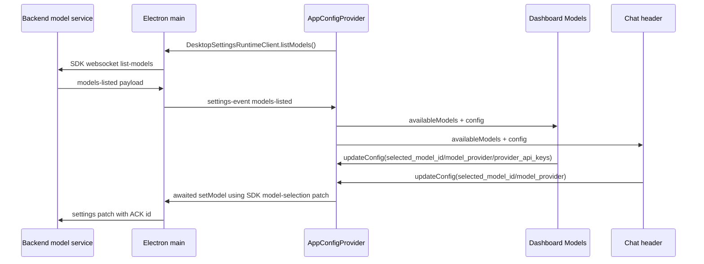

# Model Settings Change Workflow

Use this workflow when changing user-facing model selection or provider settings.
The surface is intentionally split: the backend owns the model catalog and
provider runtime policy, while the renderer owns the dashboard/cards, chat
header controls, and persisted selected model config.

## Boundary Rules

- Backend model catalog metadata is the source of truth for model ids, provider
  ids, display metadata, reasoning variants, web-search support, OAuth support,
  and list-models payloads.
- Renderer model UI consumes `availableModels` and must not invent provider
  capabilities that are not present in backend metadata.
- `selected_model_id`, `model_provider`, `model_mode`, and `provider_api_keys`
  are renderer-managed config fields that are persisted locally and sent through
  `update-settings`.
- Deferred query-time model updates must use the SDK model-selection contract
  for the canonical `model_provider`/`selected_model_id` patch instead of
  hand-shaping renderer payloads.
- Chat header selectors and dashboard Models section both update the same
  AppConfig state. Keep their fallback and provider-mismatch behavior aligned.
- Provider API-key controls are renderer settings state, but key resolution and
  provider routing are backend behavior.
- Codex/OpenAI OAuth storage may remain in desktop UI config for compatibility,
  but do not re-add a visible OAuth settings control unless the product surface
  explicitly requires it.

## Fast Owner Map

| Change or symptom | Primary owner files | Tests to inspect or add |
| --- | --- | --- |
| Add, remove, rename, or regroup a backend model | `backend/src/llm/models/models_config.py`, `backend/src/llm/models/model_service.py`, provider modules under `backend/src/llm/providers` | `tests/backend/test_models_config.py`, `tests/backend/test_model_service.py`, provider factory/provider tests |
| Dashboard Models section cards, provider drilldown, or API-key controls change | `frontend/src/renderer/features/dashboard/components/sections/ModelsSection.jsx`, `frontend/src/renderer/app/runtime/desktopModelCardPresentationRuntime.js`, `frontend/src/renderer/app/runtime/desktopProviderCredentialRuntime.js`, `modelCards.jsx`, `frontend/src/renderer/app/runtime/desktopModelSelectionRuntime.js`, `ApiKeysSection.jsx` | `tests/frontend/ModelsSection.test.jsx`, `tests/frontend/DesktopModelCardPresentationRuntime.test.js`, `tests/frontend/DesktopProviderCredentialRuntime.test.js`, `tests/frontend/ModelSelectionUtils.test.js` |
| Chat header provider/model/reasoning selector changes | `frontend/src/renderer/features/chat/components/ChatInterface.jsx`, `frontend/src/renderer/app/runtime/desktopChatModelOptionsRuntime.js`, `frontend/src/renderer/app/runtime/desktopModelThinkingRuntime.ts` | `tests/frontend/ChatInterfaceWiring.test.jsx`, `tests/frontend/DesktopChatModelOptionsRuntime.test.js`, `tests/frontend/ModelThinkingCapabilities.test.ts` |
| Selected model resets after reload or across windows | `frontend/src/renderer/app/runtime/desktopRendererConfigStorageRuntime.js`, `desktopRendererConfigFilterRuntime.js`, `app/providers/AppConfigProvider.jsx`, `app/providers/appConfigPersistence.js` | `tests/frontend/configStorage.test.js`, `tests/frontend/configFilter.test.js`, `tests/frontend/AppConfigProvider.models.test.tsx`, `tests/frontend/AppConfigProvider.storageAndIpc.test.tsx` |
| Model list is stale or missing in renderer | `frontend/src/renderer/app/providers/AppConfigProvider.jsx`, `frontend/src/renderer/app/runtime/desktopSettingsEventRuntimeClient.ts`, `frontend/src/main/ipc.cjs`, `backend/src/api/handlers/settings.py` | `tests/frontend/AppConfigProvider.models.test.tsx`, `tests/frontend/DesktopSettingsEventRuntimeClient.test.ts`, `tests/backend/test_api_handlers.py` |
| Backend ignores selected provider/model after save | `frontend/src/main/ipc/ipc_settings_sync.cjs`, `frontend/src/main/ipc/ipc_agent_sdk_runtime_commands.cjs`, `frontend/src/renderer/app/runtime/desktopSettingsRuntimeClient.ts`, `backend/src/api/handlers/settings.py`, `backend/src/core/validation/validators.py`, `backend/src/agent/session/session_config_service.py` | `tests/frontend/IpcSettingsSync.test.cjs`, `tests/frontend/IpcAgentSdkRuntimeCommands.test.cjs`, `tests/frontend/DesktopSettingsRuntimeClient.test.ts`, `tests/frontend/ChatMessageSender.test.tsx`, `tests/backend/test_settings_update_rules.py`, `tests/backend/test_session_config_service.py` |
| Provider key toggle saves but provider cannot call model | `desktopProviderCredentialRuntime.js`, `desktopRendererConfigStorageRuntime.js`, `backend/src/core/config/loader.py`, provider config/factory modules | `tests/frontend/ModelsSection.test.jsx`, `tests/frontend/DesktopProviderCredentialRuntime.test.js`, `tests/frontend/configStorage.test.js`, backend provider key/config tests |

## Runtime Flow

## Change Sequence

### 1. Classify the model change

Start by naming the owning contract:

- Catalog: a backend model entry, capability flag, runtime model id, or provider
  id changes.
- Selection UI: a dashboard card, provider card, chat selector, or reasoning
  selector changes.
- Persistence: a saved selected model/provider/key is wrong after reload.
- Sync: list-models or update-settings messages are missing, stale, or rejected.
- Credentials: a provider API key or OAuth token affects runtime provider
  routing.

If the change crosses more than one row, update tests at every boundary that
accepts or transforms the payload.

### 2. Inspect backend model catalog first for metadata changes

Read:

- `backend/src/llm/models/models_config.py`
- `backend/src/llm/models/model_service.py`
- `backend/src/llm/providers/factory.py`
- provider implementation under `backend/src/llm/providers`

Catalog rules:

- `id` is the persisted frontend selection id. Renaming it can break saved user
  config unless a migration exists.
- `runtime_model_id` is the provider-facing id. Changing it affects provider
  request routing.
- `provider` must match a backend provider id that factory/config code can
  resolve.
- Reasoning variants should be represented in catalog metadata, not hard-coded
  only in renderer controls.
- Capability flags such as native web search or Codex OAuth can change tool
  policy and credential behavior.

### 3. Inspect dashboard model settings

Read:

- `frontend/src/renderer/features/dashboard/components/sections/ModelsSection.jsx`
- `frontend/src/renderer/app/runtime/desktopModelCardPresentationRuntime.js`
- `frontend/src/renderer/features/dashboard/components/sections/modelCards.jsx`
- `frontend/src/renderer/app/runtime/desktopModelSelectionRuntime.js`
- `frontend/src/renderer/app/runtime/desktopProviderCredentialRuntime.js`
- `frontend/src/renderer/features/dashboard/components/sections/ApiKeysSection.jsx`

Dashboard rules:

- `ModelsSection` groups models by provider first, then shows provider-scoped
  model cards.
- `DesktopModelSelectionRuntime.evaluateModelSelection(...)` resets missing selected ids and fixes provider
  mismatch when a model id is shared by multiple providers.
- `DesktopModelSelectionRuntime.scheduleModelResetWarningClear(...)` and
  `clearModelResetWarningTimer(...)` own missing-model warning timeout
  scheduling and cleanup for `ModelsSection`.
- `DesktopModelSelectionRuntime.buildModelConfigUpdate(...)` must preserve `model_mode`,
  `speech_mode_enabled`, and `interaction_mode` while changing the selected
  model/provider.
- Legacy catalog entries can trigger a one-time refresh through
  `DesktopSettingsRuntimeClient.listModels()` from the renderer.
- Provider API key entries must be normalized through
  `DesktopProviderCredentialRuntime.normalizeProviderApiKeys(...)` before
  storing in config.

### 4. Inspect chat header model controls

Read:

- `frontend/src/renderer/features/chat/components/ChatInterface.jsx`
- `frontend/src/renderer/app/runtime/desktopModelThinkingRuntime.ts`
- chat model option helpers/tests

Chat rules:

- Chat selector state comes from the same `config` and `availableModels` as the
  dashboard.
- Provider selection should keep the current model only when that model exists
  in the new provider group.
- Model selection should write both `selected_model_id` and `model_provider`.
- Reasoning mode selection should resolve to a catalog-backed model id variant.
- Query, tool-result, and transcript metadata read the selected model/provider
  from AppConfig state; changing selector semantics can affect stored chats.

### 5. Inspect Renderer Config Persistence and Settings Sync

Read:

- `frontend/src/renderer/app/runtime/desktopRendererConfigStorageRuntime.js`
- `frontend/src/renderer/app/runtime/desktopRendererConfigFilterRuntime.js`
- `frontend/src/renderer/app/providers/AppConfigProvider.jsx`
- `frontend/src/renderer/app/providers/appConfigPersistence.js`
- `frontend/src/main/ipc/ipc_settings_sync.cjs`
- `backend/src/api/handlers/settings.py`
- `backend/src/core/validation/validators.py`

Persistence rules:

- Add new renderer-managed model/provider fields to both renderer filtering and
  backend validation only when the backend is meant to accept the field.
- Do not persist unknown provider-key shapes; normalize provider entries to
  `{ enabled, api_key }`.
- If a default selected model changes, update frontend local defaults and
  backend `AppConfig` defaults together.
- First-query `DesktopSettingsRuntimeClient.setModel(...)` sync must still send the latest model selection before a
  query reaches the backend.

## Debug Routes

| Symptom | First checks | Likely owner |
| --- | --- | --- |
| Dashboard shows a model that chat does not | Compare `availableModels` consumption in `ModelsSection` and `ChatInterface`; inspect model option builders. | Renderer model UI |
| Selected model resets with warning | Check `evaluateModelSelection`, catalog ids, and persisted `selected_model_id`. | Catalog or renderer selection reconciliation |
| Provider changes but model stays invalid | Check provider model group resolution and provider mismatch handling. | Chat/dashboard selector logic |
| Reasoning dropdown missing modes | Check backend catalog variants and `desktopModelThinkingRuntime`. | Backend catalog metadata plus chat selector |
| API key saves but backend still uses env key | Check provider key enabled flag, backend config loader precedence, and update-settings ACK. | Provider credentials/config |
| First query uses previous model | Check AppConfig update path, main settings ACK gate, and backend session config update. | Settings sync and backend session config |

## Validation Matrix

Docs-only change:

- `<windie> docs list`
- `git diff --check`
- focused Markdown link check for touched docs

Dashboard model UI change:

- `cd frontend && npm run test -- ModelsSection`
- `cd frontend && npm run test -- ModelSelectionUtils`
- `cd frontend && npm run test -- DesktopModelCardPresentationRuntime`

Chat selector or reasoning-mode change:

- `cd frontend && npm run test -- ChatInterfaceWiring`
- `cd frontend && npm run test -- DesktopChatModelOptionsRuntime`
- `cd frontend && npm run test -- ModelThinkingCapabilities`

Config persistence or settings sync change:

- `cd frontend && npm run test -- AppConfigProvider.models`
- `cd frontend && npm run test -- AppConfigProvider.storageAndIpc`
- `cd frontend && npm run test -- configStorage`
- `cd frontend && npm run test -- IpcSettingsSync`
- `./scripts/python-in-env backend pytest tests/backend/test_settings_update_rules.py`

Backend model catalog/provider change:

- `./scripts/python-in-env backend pytest tests/backend/test_models_config.py`
- `./scripts/python-in-env backend pytest tests/backend/test_model_service.py`
- provider factory/provider-specific tests for the changed provider

## Docs to Sync

Update these docs when model settings change:

- [Settings Sync Change Workflow](../../runtime/settings_sync_change_workflow.md)
- [Config Sync and Settings Lifecycle Reference](../../runtime/config_sync_and_settings_lifecycle_reference.md)
- [Model Catalog Change Workflow](../../../providers/model_catalog_change_workflow.md)
- [Provider Change Workflow](../../../providers/provider_change_workflow.md)
- [Provider Credentials](../../../providers/credentials.md)
- [Renderer Config Filter, Storage, and Provider Merge Runtime Reference](config/frontend_config_filter_storage_and_provider_merge_runtime_reference.md)
- [Dashboard Change Workflow](../dashboard/dashboard_change_workflow.md)
