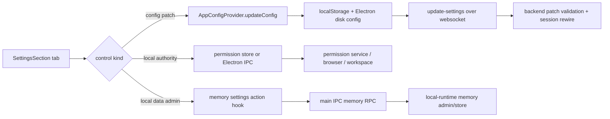

# Settings Surface Change Workflow

Use this workflow for user-facing settings controls in the desktop dashboard. It complements [Settings Sync Change Workflow](../../runtime/settings_sync_change_workflow.md): that workflow owns config propagation, while this one starts from the settings UI surface and routes each tab/control to the right runtime.

The main rule is: a settings control should have exactly one semantic owner. Some controls write `AppConfig`, some invoke Electron permission or admin actions, some read workspace state, and some are only presentation. Do not make every control an `onConfigChange` patch just because it lives in Settings.

## Retired Agent Sudo Access Setting

The dashboard no longer has an agent sudo access setting or General tab sudo
auth mode control. Broad searches for retired `agent sudo access` UI should
route here because this workflow owns settings-surface removal and tab/control
routing. Shell execution behavior after that removal is documented in
[Filesystem and Shell Tools](../../../tools/filesystem_shell.md).

## Runtime Path

## Fast Owner Map

| Change or symptom | First owner | Inspect first | Then inspect |
| --- | --- | --- | --- |
| Add, remove, rename, or reorder a settings tab | Renderer settings shell | `desktopSettingsTabRuntime.js`, `SettingsSection.jsx`, `renderTabContent()` | `tests/frontend/DesktopSettingsTabRuntime.test.js`, `tests/frontend/SettingsSection.test.jsx`, settings docs |
| Toggle emits config but value disappears after reload | Renderer config allowlist/storage | `frontend/src/renderer/app/runtime/desktopRendererConfigFilterRuntime.js`, `desktopRendererConfigStorageRuntime.js`, `appConfigPersistence.js` | [Settings Sync Change Workflow](../../runtime/settings_sync_change_workflow.md) |
| Setting saves locally but backend ignores it | Backend patch validation or main sync | `frontend/src/main/ipc/ipc_settings_sync.cjs`, private backend implementation, backend validation docs | backend settings/update tests |
| General wakeword listening toggle is wrong | AppConfig context wakeword state | `GeneralSettingsTab.jsx`, `AppConfigProvider.jsx`, wakeword bridge/runtime docs | wakeword/voice tests |
| Wakeword STT toggle is wrong | Renderer config patch path | `GeneralSettingsTab.jsx`, config filter/storage, settings sync | `GeneralSettingsTab.test.jsx`, config tests |
| View tool logs changes execution instead of presentation | Renderer transcript/display settings | `GeneralSettingsTab.jsx`, chat message rendering, transcript display filtering | chat/message display tests |
| Global stop shortcut fails to register, falls back, or syncs to backend | Renderer config plus Electron main shortcut runtime | `GeneralSettingsTab.jsx`, `desktopShortcutRuntimeClient.ts`, `agentStopShortcut.js`, `agent_stop_shortcut_runtime.cjs`, `AppConfigProvider.jsx` | [Global Stop Shortcut Runtime Reference](../../main/global_stop_shortcut_runtime_reference.md), settings/config/IPC tests |
| Workspace settings uses wrong folder | Workspace permission/runtime path | `WorkspaceSettingsTab.jsx`, `DesktopWorkspaceRuntimeClient`, Electron workspace permission service | [Workspace Context Change Workflow](../../runtime/workspace_context_change_workflow.md), file/shell workflow |
| Browser settings opens wrong browser or status is stale | Permission store plus browser permission service | `BrowserSettingsTab.jsx`, `permissionStore.js`, browser permission service, browser runtime docs | permission/browser tests |
| Memory tab nukes wrong data | Memory settings actions and local-runtime admin path | `MemorySettingsTab.jsx`, `useMemorySettingsActions.js`, main memory IPC, local-runtime memory admin/store | memory reset/delete tests |
| Onboarding tab shows wrong permission state | Permission onboarding surface | `OnboardingSettingsTab.jsx`, permission store, onboarding permission docs | onboarding/permission tests |
| Save status gets stuck | App status provider and settings ACK routing | `AppStatusProvider.jsx`, `desktopSettingsEventRuntimeClient.ts`, `ipc_settings_sync.cjs` | `AppStatusProvider`/settings ACK tests |

## Current Settings Tabs

| Tab | Renderer component | Primary behavior | Owner boundary |
| --- | --- | --- | --- |
| General | `GeneralSettingsTab.jsx` | wakeword listening, wakeword STT, tool log visibility, global stop shortcut | mixed: context setters and config patches |
| Workspace | `WorkspaceSettingsTab.jsx` | active workspace display and folder selection | `DesktopWorkspaceRuntimeClient` update fan-out plus Electron workspace permission/runtime path |
| Browser | `BrowserSettingsTab.jsx` | dedicated browser permission/status and open-browser action | renderer permission store plus Electron/local-runtime browser runtime |
| Memory | `MemorySettingsTab.jsx`, `useMemorySettingsActions.js` | local memory reset and chat-history reset | renderer action hook, main IPC, local-runtime memory admin |
| Onboarding | `OnboardingSettingsTab.jsx` | permission/onboarding reset or status controls | renderer permission/onboarding store |

## Change Sequence

1. Classify the control.
   - Config patch: persists in renderer config and may sync to backend.
   - Permission or authority action: calls permission store or Electron main.
   - Local data admin: calls main/local-runtime memory actions.
   - Workspace/browser action: calls specialized runtime paths.
   - Presentation-only: affects renderer display only.

2. Update the owning tab and shell.
   - Add tab metadata through `DesktopSettingsTabRuntime`.
   - Add explicit `renderTabContent()` routing.
  - Keep the tab id stable if existing links or initial-tab opens use it.
   - Update `SettingsSection.propTypes` when props change.

3. For config controls, update the config pipeline.
   - Add defaults in `desktopRendererConfigStorageRuntime.js`.
   - Add allowlist projection in `desktopRendererConfigFilterRuntime.js`.
   - Update `AppConfigProvider` or hook usage if the field has special merge/defer semantics.
   - Update Electron disk persistence only if payload shape changes.
   - Update backend settings validation/session rewire only if hosted backend runtime behavior changes.

4. For authority controls, update the authority path.
   - Permission controls should go through `permissionStore` and permission services.
   - Browser controls should apply permission grant effects and update browser automation config only through the established permission path.
   - Workspace controls should go through `DesktopWorkspaceRuntimeClient`
     value helpers for active-workspace display/selection, normalized workspace
     update payloads only when metadata is required, and Electron workspace
     permission/runtime services.

5. For destructive local data controls, update all reset effects.
   - The renderer hook should call the correct IPC channel.
   - Electron main should route to the right local-runtime method.
   - The local runtime should delete the intended record family only.
   - Dashboard/chat state should refresh after success.
   - The UI should block duplicate pending actions.

6. Update docs and validation together.
   - Settings surface changes update this workflow and the settings hub.
   - Config propagation changes update [Settings Sync Change Workflow](../../runtime/settings_sync_change_workflow.md).
   - Model/provider controls update [Model Settings Change Workflow](model_settings_change_workflow.md).
   - Permission controls update [Permissions and Local Authority Workflow](../../../security/permissions_and_local_authority_workflow.md).
   - Workspace controls update [Workspace Context Change Workflow](../../runtime/workspace_context_change_workflow.md).
   - Memory reset controls update memory docs.

## Validation Matrix

| Change type | Focused validation |
| --- | --- |
| Settings tab routing, initial tab, close behavior | `cd frontend && npm run test -- DesktopSettingsTabRuntime SettingsSection` |
| General tab config/authority controls | `cd frontend && npm run test -- GeneralSettingsTab SettingsSection` |
| Config allowlist/storage/provider merge | `cd frontend && npm run test -- configFilter configStorage AppConfigProvider.storageAndIpc AppConfigPersistence DesktopSettingsEventRuntimeClient` |
| Settings ACK/main sync | `cd frontend && npm run test -- IpcSettingsSync AppConfigEvents` plus backend settings tests when payload shape changes |
| Backend settings validation/session rewire | private backend test runner |
| Permission/onboarding controls | `cd frontend && npm run test -- AppPermissionGate PermissionStorage PermissionIpcRuntime PermissionService useOnboardingPermissionActions DesktopOnboardingSlideshow` |
| Workspace controls | `cd frontend && npm run test -- ChatWorkspaceState` plus workspace IPC/permission tests if main-process behavior changes |
| Browser controls | `cd frontend && npm run test -- ChatBrowserSessionControl PermissionService PermissionIpcRuntime` plus browser workflow tests if runtime changes |
| Memory reset controls | `cd frontend && npm run test -- SettingsSection` plus focused local-runtime memory delete/reset tests if local-runtime admin behavior changes |
| Docs-only settings surface | `<windie> docs list`, `git diff --check`, focused Markdown link check |

If a test stem is not available in the current checkout, search by the component or helper name before adding new coverage.

## Debug Playbooks

### Setting Reappears After Reload

1. Confirm the control emits the intended config patch.
2. Confirm the field is included in backend `CLIENT_SETTINGS_PATCH_FIELDS`.
3. Confirm `configStorage` default and merge behavior preserve the value.
4. Confirm `AppConfigProvider` applies the disk/local merge only when changed.
5. Confirm Electron disk config is not writing an older value over renderer state.

### Setting Saves Locally but Runtime Does Not Change

1. Decide whether the runtime is renderer-only, Electron main, backend, or local runtime.
2. If backend-owned, inspect `update-settings` ACK and backend patch allowlist.
3. If Electron-owned, inspect the matching IPC handler and disk config path.
4. If the local runtime owns the setting, inspect the launch env or JSON-RPC action path, then use local-runtime Python docs only for implementation-specific changes.
5. Add producer and consumer tests for the changed field.

### Retired Sudo Toggle Appears In Settings

1. Remove the renderer setting instead of reviving `agent_full_sudo_enabled`.
2. Keep Linux sudo behavior in the local-runtime shell tool. Current
   `run_shell_command` rewrites leading `sudo ...` commands to `pkexec`
   prompting; renderer settings do not choose a sudo auth mode.
3. Update docs-search routing so `agent sudo access` and `sudo auth mode`
   queries land on current settings or shell docs, not deleted IPC-handler docs.

### Memory Reset Deletes the Wrong Thing

1. Confirm whether the requested action is memory reset or chat-history reset.
2. Confirm `useMemorySettingsActions` asks `DesktopMemorySettingsDialogRuntime`
   for destructive browser confirmation before running.
3. Confirm `useMemorySettingsActions` invokes the matching memory runtime
   client command.
4. Confirm the local runtime deletes only the intended local store records.
5. Confirm dashboard/chat state refreshes after success.
6. Confirm semantic/vector artifacts are rebuilt or cleared only when needed.

## Review Checklist

- Each control has one owner and one update path.
- New config fields have defaults, allowlist entries, persistence tests, and backend validation if synced.
- Authority controls do not persist optimistic config before required OS/app action succeeds.
- Destructive controls block duplicate clicks and refresh visible state after success.
- Settings UI tests cover tab routing and user-facing state.
- Docs name the owner, IPC/backend/local-runtime path, and focused validation.

## Related Docs

- [Frontend Renderer Settings Docs Hub](README.md)
- [Renderer Settings Sections Docs Hub](sections/README.md)
- [Settings Sync Change Workflow](../../runtime/settings_sync_change_workflow.md)
- [Config Sync and Settings Lifecycle Reference](../../runtime/config_sync_and_settings_lifecycle_reference.md)
- [Model Settings Change Workflow](model_settings_change_workflow.md)
- [Permissions and Local Authority Workflow](../../../security/permissions_and_local_authority_workflow.md)
- [Workspace Context Change Workflow](../../runtime/workspace_context_change_workflow.md)
- [Memory Change Workflow](../../../memory/memory_change_workflow.md)
