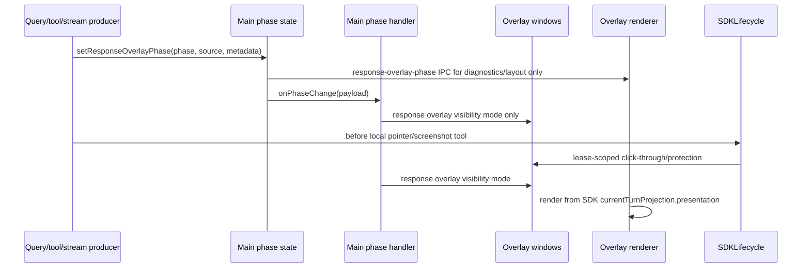

# Overlay Phase and Surface Change Workflow

Use this workflow before changing the minimal chat pill, response overlay,
overlay phase IPC, screenshot capture visibility, content protection, or tool
surface handoff behavior. These bugs usually look visual, but the owner is
often the SDK runtime, Electron main host policy, or platform capture policy
rather than the React component that happens to render the symptom.

## Non-Negotiable Contracts

- The loop phase is the source of truth for response overlay visibility and
  stale-correlation gating only.
- Active loop phases are `awaiting-first-chunk`, `streaming`, `tool-call`, and
  `tool-output`.
- Terminal or idle phases are `idle`, `complete`, and `error`.
- Active loop phase alone must not make the chat pill click-through,
  non-focusable, screenshot-invisible, or content-protected.
- SDK local tool lifecycle leases own temporary native-window policy:
  `mouse_control` / `scroll_control` use a pointer-control lease, and
  `screenshot` uses a screenshot-capture lease.
- During pointer-control leases, Electron main keeps the chat pill, response
  overlay non-focusable and click-through, then restores
  normal pill and response-overlay hit-testing and focusability in `finally`.
- During screenshot-capture leases, Linux hides visible desktop overlay
  surfaces and restores them afterward; macOS and Windows use content
  protection for the capture window only and disable it immediately afterward.
- Renderer code must not directly own loop-wide interactivity toggles. It may
  report normal drag/hit-test intent for the pill and response shell; Electron
  main applies native policy.
- Minimal chat pill awaiting state comes from SDK
  `currentTurnProjection.presentation`;
  overlay phase must not decide typing, busy, stop, or response content state.
- Native response overlay show paths must pass the Electron main
  surface-ownership gate. The floating response overlay and typing shell may
  show only while the chat pill owns the visible live-turn surface; dashboard
  and onboarding ownership suppress floating response presentation.
- Avoid focus-recovery hacks in renderer chat-pill code. If focus changes are
  needed, route them through Electron main/window policy.

## Fast Owner Map

| Change or symptom | Primary owner files | Tests to inspect or add |
| --- | --- | --- |
| Add, remove, or rename an overlay phase | `frontend/src/shared/response_overlay_phase_contract.json`, `frontend/src/main/ipc/ipc_overlay_phase_contract.cjs`, `frontend/src/renderer/app/runtime/desktopResponseOverlayPhaseRuntime.js` | `tests/frontend/OverlayPhaseContractParity.test.js`, `tests/frontend/IpcOverlayPhaseContract.test.cjs`, `tests/frontend/ResponseOverlayPhaseContract.test.js` |
| Phase event is ignored, malformed, or loses metadata | `frontend/src/main/ipc/ipc_overlay_phase_state.cjs`, `frontend/src/main/ipc/ipc_overlay_phase_events.cjs`, `frontend/src/shared/response_overlay_phase_contract.json` | `tests/frontend/IpcOverlayPhaseState.test.cjs`, `tests/frontend/IpcOverlayPhaseEvents.test.cjs`, `tests/frontend/OverlayPhaseContractParity.test.js` |
| Response overlay window shows/hides at wrong time | `frontend/src/main/surfaces/response_overlay_phase_handler.cjs`, `frontend/src/main/surfaces/response_overlay_visibility_policy.cjs`, `frontend/src/main/surfaces/overlay_responsebox_handler.cjs` | `tests/frontend/ResponseOverlayPhaseHandler.test.cjs`, `tests/frontend/ResponseOverlayVisibilityPolicy.test.cjs`, `tests/frontend/OverlayResponseboxHandler.test.cjs` |
| Chat pill click-through or focusability is wrong | `frontend/src/main/surfaces/surface_runtime.cjs`, `frontend/src/main/surfaces/tool_surface_lifecycle.cjs`, `frontend/src/main/surfaces/overlay_chatbox_handler.cjs`, `frontend/src/renderer/features/minimalChatPill/components/MinimalChatPill.jsx` | `tests/frontend/ChatBoxOverlayMouseIgnore.test.jsx`, `tests/frontend/OverlayChatboxHandler.test.cjs`, `tests/frontend/SurfaceRuntime.test.cjs` |
| Response overlay click-through or close/scroll hit-testing is wrong | `frontend/src/main/surfaces/surface_runtime.cjs`, `frontend/src/main/surfaces/overlay_responsebox_handler.cjs`, `frontend/src/renderer/features/minimalChatPill/components/MinimalResponseOverlay.jsx` | `tests/frontend/ChatBoxResponse.state.test.jsx`, `tests/frontend/OverlayResponseboxHandler.test.cjs`, `tests/frontend/SurfaceRuntime.test.cjs` |
| Awaiting indicator flickers or sticks | `packages/windie-sdk-js/src/runtime/ConversationRuntime.ts`, `frontend/src/renderer/features/minimalChatPill/components/MinimalResponseOverlay.jsx`, `frontend/src/renderer/features/minimalChatPill/hooks/useResponseOverlayViewModel.js`, `frontend/src/renderer/app/runtime/desktopLiveTurnSurfaceRuntime.js`, `frontend/src/renderer/app/runtime/desktopResponseOverlayLayoutRuntime.js` | `tests/frontend/AgentSdkConversationRuntime.test.ts`, `tests/frontend/ChatBoxResponse.state.test.jsx`, `tests/frontend/LiveTurnSurfaceState.test.js`, `tests/frontend/ResponseOverlayLayoutMode.test.js` |
| Screenshot captures desktop overlay UI or hides surfaces on the wrong OS | `frontend/src/main/sidecar/local_runtime_execute_tool_runtime.cjs`, `frontend/src/main/sidecar/local_runtime_window_visibility.cjs`, `frontend/src/main/platform/content_protection/*`, SDK/main screenshot resource handling | `tests/frontend/LocalRuntimeExecuteToolRuntime.test.cjs`, `tests/frontend/LocalRuntimeWindowVisibility.test.cjs`, platform policy tests |
| Tool execution handoff leaves dashboard/pill in wrong state | `frontend/src/main/surfaces/main_window_runtime.cjs`, `frontend/src/main/surfaces/surface_runtime.cjs`, `frontend/src/main/surfaces/tool_surface_lifecycle.cjs`, `frontend/src/main/sidecar/local_runtime_execute_tool_runtime.cjs`, `packages/windie-sdk-js/src/runtime/ConversationRuntime.ts`, `packages/windie-sdk-js/src/tools/ToolExecutionCoordinator.ts` | `tests/frontend/LocalRuntimeExecuteToolRuntime.test.cjs`, `tests/frontend/OverlayVisibilityHandler.test.cjs`, `tests/frontend/ResponseOverlayPhaseHandler.test.cjs`, `tests/frontend/SurfaceRuntime.test.cjs` |
| Window bounds, frame size, or drag anchor jumps | `frontend/src/main/surfaces/overlay_bounds.cjs`, `frontend/src/main/surfaces/overlay_chatbox_visual_anchor_handler.cjs`, `frontend/src/renderer/app/runtime/desktopResponseOverlayLayoutRuntime.js`, `frontend/src/renderer/app/runtime/desktopChatboxLayoutRuntime.js` | `tests/frontend/OverlayBounds.test.cjs`, `tests/frontend/OverlayFrameSize.test.js`, `tests/frontend/ChatBoxPillLayout.test.js` |

## Phase Pipeline

## Change Sequence

### 1. Classify the change

Start by identifying the contract being changed:

- Phase contract: phase names, metadata keys, parser behavior, IPC payload shape.
- Main window policy: response overlay window visibility
  visibility.
- Tool-surface leases: click-through, focusability, screenshot hide/restore,
  and content protection around local tool execution.
- Renderer presentation: awaiting shell, response layout, frame measurement,
  thinking text, tool ghost preview, scroll state.
- Capture policy: screenshot hide/restore, dashboard-to-pill handoff,
  platform-specific visibility behavior.
- Geometry: overlay bounds, visual anchor, fixed frame sizes, drag behavior.

If the symptom spans more than one category, update the producer and policy docs
before changing presentation code.

### 2. Inspect phase producers

Common phase producers:

- query send accepted in `frontend/src/main/ipc/ipc_query_send_runtime.cjs`
- SDK conversation-event and typed backend side-channel fan-out in
  `frontend/src/main/ipc.cjs`
- overlay phase helpers in `frontend/src/main/ipc/ipc_overlay_phase_events.cjs`
- renderer stream state projection in `frontend/src/renderer/app/runtime/desktopStreamPhaseRuntime.js`
- SDK tool routing in `packages/windie-sdk-js/src/runtime/ConversationRuntime.ts`
  and `packages/windie-sdk-js/src/tools/ToolExecutionCoordinator.ts`
- main-process computer-use surface prep in
  `frontend/src/main/sidecar/local_runtime_execute_tool_runtime.cjs`
- system-state and screenshot capture requests crossing Electron main IPC

Producer rules:

- Use only phases listed in `frontend/src/shared/response_overlay_phase_contract.json`.
- Preserve metadata keys through normalization when they are useful for tracing:
  `correlation_id`, `attempt`, `max_attempts`, `recovery_stage`,
  `failure_reason`.
- Preserve `correlation_id` on active-loop and terminal events whenever the
  backend event has a stable request, correlation, bundle, or event id. Main
  process phase application uses that value to reject stale terminal updates
  from older responses.
- Do not invent local-only phase strings in renderer code. Add contract tests if
  a new phase is truly required.

### 3. Inspect Electron main phase handling

Read these files before changing window visibility or interactivity:

- `frontend/src/main/surfaces/response_overlay_phase_handler.cjs`
- `frontend/src/main/surfaces/response_overlay_visibility_policy.cjs`
- `frontend/src/main/ipc/ipc_overlay_phase_state.cjs`
- `frontend/src/main/ipc/ipc_overlay_phase_contract.cjs`
- `frontend/src/main/surfaces/overlay_responsebox_handler.cjs`
- `frontend/src/main/surfaces/overlay_chatbox_handler.cjs`
- `frontend/src/main/surfaces/overlay_visibility_handler.cjs`

Main-process rules:

- `resolveResponseOverlayWindowMode(...)` maps active phases to
  `active-loop`, `idle` to hidden, and terminal phases to terminal restore.
- The response overlay should be shown during active loop phases, hidden on
  idle, and restored after terminal phases only when the overlay was visible and
  the chat window is still visible.
- SDK overlay intent, renderer responsebox size reports, pending-turn preflight,
  and terminal restore must not show the native response overlay unless the
  chat-pill surface currently owns presentation. Pending-turn preflight preserves
  the optimistic user row and busy state across renderer windows; the first
  native show for typing must still come from the renderer's measured
  `set-responsebox-size` report emitted immediately after the typing layout
  commits.
- Dismissed SDK response-overlay intents are filtered inside Electron main's
  live-turn surface controller. The main process composition root injects the
  dismissed-guard lookup and must not parse SDK overlay intent fields directly.
- Terminal/idle phases with a mismatched active response `correlation_id` must
  be ignored so late events from a previous response cannot mutate current
  overlay visibility.
- Click-through, focusability, screenshot invisibility, and content protection
  do not belong in phase handling. Route those policies through
  `tool_surface_lifecycle.cjs` and `surfaces/surface_runtime.cjs` leases.
- Preserve debug trace fields when changing handler order so phase regressions
  can be reconstructed from logs.

### 4. Inspect renderer overlay presentation

Read these files before changing what the user sees:

- `frontend/src/renderer/app/MinimalChatPillApp.jsx`
- `frontend/src/renderer/app/MinimalResponseOverlayApp.jsx`
- `frontend/src/renderer/features/minimalChatPill/components/MinimalChatPill.jsx`
- `frontend/src/renderer/features/minimalChatPill/components/MinimalResponseOverlay.jsx`
- `frontend/src/renderer/features/minimalChatPill/hooks/useResponseOverlayViewModel.js`
- `frontend/src/renderer/features/minimalChatPill/hooks/useResponseOverlayWindowSync.js`
- `frontend/src/renderer/app/runtime/desktopLiveTurnSurfaceRuntime.js`
- `frontend/src/renderer/app/runtime/desktopResponseOverlayPhaseRuntime.js`
- `frontend/src/renderer/app/runtime/desktopResponseOverlayViewRuntime.ts`
- `frontend/src/renderer/styles/ChatBox.css`
- `frontend/src/renderer/styles/ChatBoxResponseOverlay.css`

Renderer rules:

- Derive visible layout from SDK `currentTurnProjection.presentation`. Do not
  add timers or renderer phase listeners that compete with SDK current-turn
  state.
- Project SDK current-turn presentation entries into the shared chat message
  model and render them with the same message components used by the dashboard.
  The minimal response overlay may apply compact shell styling, scrolling, hit
  testing, and size reporting, but it must not keep a separate markdown,
  thinking, tool-call, tool-output, or source-badge content renderer.
- Keep `awaiting-typing` and `response` frame sizes stable. Avoid per-token
  resize churn.
- Keep awaiting-to-response transitions non-animated in the minimal pill loop.
- Tool ghost preview is display-only. Local tool execution remains in the SDK
  runtime, Electron main bridge, and local-runtime Python tools.

### 5. Inspect platform capture behavior

Read these files before changing screenshot or content-protection behavior:

- `frontend/src/main/surfaces/surface_runtime.cjs`
- `frontend/src/main/surfaces/tool_surface_lifecycle.cjs`
- `frontend/src/main/sidecar/local_runtime_execute_tool_runtime.cjs`
- `frontend/src/main/sidecar/local_runtime_window_visibility.cjs`
- `frontend/src/main/surfaces/window_visibility_runtime.cjs`
- `frontend/src/main/surfaces/overlay_visibility_handler.cjs`
- `frontend/src/main/platform/content_protection/*`
- Electron main IPC and local-runtime bridge paths for system-state and screenshot capture

Platform rules:

- Linux SDK-local screenshot tool capture uses hide/restore through the
  Electron screenshot-capture lease.
- macOS and Windows overlay screenshot capture should not hide/show the minimal
  pill or response overlay.
- macOS and Windows content protection should be enabled only while the
  screenshot-capture lease is active and disabled immediately after capture.
- Dashboard-originated computer-use should hand off to the minimal pill in
  Electron main before SDK/main invokes the local-runtime Python executor.
- Surface restore should not steal focus.

## Debug Routes

| Symptom | First checks | Likely owner |
| --- | --- | --- |
| Response overlay never appears | Confirm main receives `awaiting-first-chunk` or `streaming`, then check window mode resolution and renderer phase parser. | `ipc_overlay_phase_state.cjs`, `response_overlay_phase_handler.cjs`, overlay listener |
| Response overlay stays after completion | Check terminal phase handling, visible-state restore policy, and renderer layout mode. | `response_overlay_visibility_policy.cjs`, `ChatBoxResponse.jsx` |
| Awaiting dots flicker after screenshot | Check Linux hide-only collapse path, transient `idle` latch, and response content visibility clear. | SDK/main surface prep, `desktopStreamPhaseRuntime.js`, response overlay view model |
| Chat pill blocks clicks during idle | Check pointer-control lease release and chatbox hit-test active state. | `surface_runtime.cjs`, `tool_surface_lifecycle.cjs`, `overlay_chatbox_handler.cjs` |
| Screenshot includes desktop overlay UI on Linux | Check screenshot-capture lease prepare/restore path and compositor settle timing. | `surface_runtime.cjs`, renderer attachment capture lifecycle, and Linux surface visibility |
| Screenshot hides desktop overlay UI on macOS/Windows | Remove capture-time hide/show path and verify content-protection policy instead. | platform surface visibility and content protection |
| Focus jumps after tool screenshot | Check for renderer focus hacks or platform restore calls outside main/window policy. | SDK/main surface prep and main window policy |
| Overlay frame jumps while streaming | Check frame-size reporting, layout mode, fixed height contracts, and per-token resize paths. | `desktopResponseOverlayLayoutRuntime.js`, CSS |

## Validation Matrix

Docs-only change:

- `<windie> docs list`
- `git diff --check`
- focused Markdown link check for touched docs

Phase contract or payload change:

- `cd frontend && npm run test -- OverlayPhaseContractParity`
- `cd frontend && npm run test -- IpcOverlayPhaseContract`
- `cd frontend && npm run test -- IpcOverlayPhaseState IpcOverlayPhaseEvents`

Main-process phase/window policy change:

- `cd frontend && npm run test -- ResponseOverlayPhaseHandler`
- `cd frontend && npm run test -- ResponseOverlayVisibilityPolicy`
- `cd frontend && npm run test -- IpcOverlayPhaseState`
- `cd frontend && npm run test -- IpcOverlayPhaseEvents`

Renderer overlay presentation change:

- `cd frontend && npm run test -- ChatBoxResponse`
- `cd frontend && npm run test -- ResponseOverlayLayoutMode`
- `cd frontend && npm run test -- OverlayFrameSize`
- `cd frontend && npm run test -- ChatBoxPillLayout`

Capture/platform behavior change:

- `cd frontend && npm run test -- LocalRuntimeExecuteToolRuntime`
- `cd frontend && npm run test -- OverlayVisibilityHandler`
- `cd frontend && npm run test -- LocalRuntimeWindowVisibility`
- platform-specific manual screenshot check on the affected OS

## Docs to Sync

Update these docs when overlay phase or surface policy changes:

- [Frontend Runtime Invariants and PR Checklist](frontend_runtime_invariants_checklist.md)
- [Minimal Chat Pill](../../desktop/minimal_chat_pill.md)
- [Response Overlay](../../desktop/response_overlay.md)
- [Screenshot and Overlay Policy](../../platforms/screenshot_overlay_policy.md)
- [Frontend Response Overlay Phase and Tool-Ghost Runtime Reference](../renderer/overlays/response_overlay_phase_and_tool_ghost_runtime_reference.md)
- [Frontend Chatbox Overlay Input, Drag, and Click-Through Reference](../renderer/overlays/chatbox_overlay_input_drag_and_clickthrough_reference.md)
- [Frontend Overlay + Wakeword Control Channel Reference](../contracts/overlay_and_wakeword_control_channel_reference.md)
- [Query Send and Stream Relay Change Workflow](../main/query_send_and_stream_relay_change_workflow.md)
- [Platform Change Workflow](../../platforms/platform_change_workflow.md)
