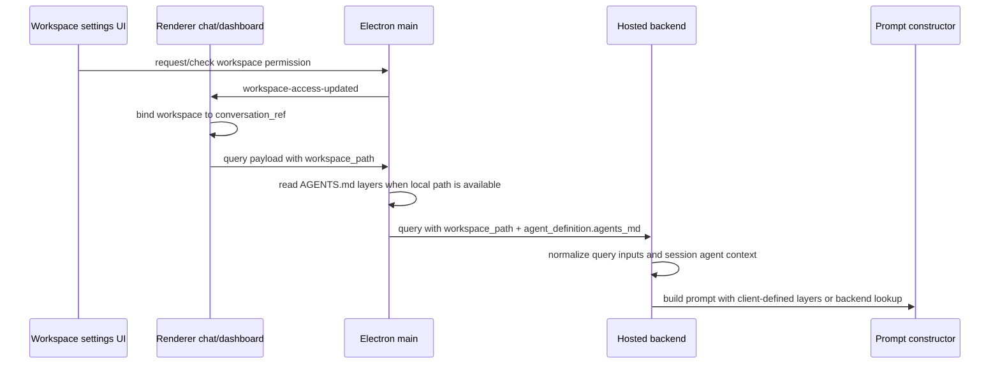

# Workspace Context Change Workflow

Use this workflow when a change involves "workspace", "project folder",
`workspace_path`, repo instructions, AGENTS.md, conversation workspace binding, or
file/shell default directory behavior. This path crosses renderer permission UI,
conversation-local state, Electron main repo-instruction reading, backend query
execution, and backend prompt construction.

## Boundary Rules

- Renderer owns active workspace display, user selection requests, per-conversation
  workspace binding, and passing `workspace_path` with query/rehydrate payloads.
- Electron main owns filesystem permission prompts, active workspace permission
  status, and local AGENTS.md reading for the desktop query path.
- Backend owns prompt construction, session workspace path, backend-side
  AGENTS.md lookup when the backend can access the path, and preference for
  injected `agents_md` prompt layers when the backend cannot read local files.
- Local-runtime Python tools may use workspace-related config for execution
  defaults, but the local-runtime Python implementation must not construct
  backend prompt context or import backend code.
- `workspace_path` is context. It must not be treated as proof that the backend
  can access the same filesystem path.
- Repo instruction prompt layers are generated from AGENTS.md files. Preserve
  the layer content format unless every consumer/test is updated.

## Fast Owner Map

| Change or symptom | Primary owner files | Tests to inspect or add |
| --- | --- | --- |
| Workspace picker, active workspace display, or permission status changes | `frontend/src/renderer/features/dashboard/components/sections/settings/WorkspaceSettingsTab.jsx`, `frontend/src/renderer/app/runtime/desktopWorkspaceRuntimeClient.ts`, `frontend/src/main/permissions/permission_service_workspace.cjs`, `frontend/src/main/permissions/permission_ipc_runtime.cjs` | `tests/frontend/PermissionIpcRuntime.test.cjs`, settings tab tests when UI changes |
| Per-conversation workspace binding is missing or stale | `frontend/src/renderer/app/runtime/desktopWorkspaceRuntimeClient.ts`, `frontend/src/renderer/infrastructure/workspace/conversationWorkspaceBinding.js`, `useChatMessageSender.ts`, `useDashboardConversations.js`, transcript snapshot loader | `tests/frontend/ChatWorkspaceState.test.ts`, dashboard conversation tests, transcript snapshot tests |
| Query payload has missing or wrong `workspace_path` | `frontend/src/renderer/features/chat/hooks/useChatMessageSender.ts`, `frontend/src/renderer/app/runtime/desktopRuntimeTransport.ts`, `frontend/src/main/ipc/ipc_workspace_path_runtime.cjs`, `frontend/src/main/ipc/ipc_query_send_runtime.cjs`, `frontend/src/main/ipc/ipc_query_runtime.cjs` | `tests/frontend/DesktopLiveTurnRuntimeClient.test.ts`, `tests/frontend/IpcWorkspacePathRuntime.test.cjs`, `tests/frontend/IpcMainBridge.query.test.cjs`, `tests/frontend/IpcQueryRuntime.test.cjs` |
| Electron main AGENTS.md injection changes | `frontend/src/main/app/repo_instruction_runtime.cjs`, `frontend/src/main/ipc.cjs` | `tests/frontend/RepoInstructionRuntime.test.cjs`, query relay tests |
| Backend query execution does not pass workspace into agent session | `backend/src/api/services/query_execution_support/query_execution_inputs.py`, `backend/src/api/services/query_execution.py`, `backend/src/agent/session/manager.py` | `tests/backend/test_query_execution_inputs.py`, `tests/backend/test_api_handlers.py`, `tests/backend/test_session_manager.py` |
| Backend prompt misses AGENTS.md or uses stale repo instructions | `backend/src/llm/prompts/repo_instructions.py`, prompt constructor/manager modules | `tests/backend/test_repo_instructions.py`, `tests/backend/test_prompt_constructor_utils.py`, `tests/backend/test_prompt_manager.py` |
| Rehydrated conversation resumes with wrong workspace | `backend/src/api/services/rehydrate_execution.py`, renderer rehydrate payload builders, conversation workspace binding helpers | backend rehydrate tests, frontend conversation replay/resume tests |

## Runtime Flow



## Change Sequence

### 1. Classify the workspace behavior

Start by deciding which contract is changing:

- Permission and selection: the user chooses or clears a local workspace.
- Conversation binding: a chat retains the workspace it started or resumed with.
- Query forwarding: `workspace_path` and repo instructions are attached to query
  or rehydrate payloads.
- Prompt context: AGENTS.md messages and `workspace_path` affect backend prompt
  construction.
- Tool defaults: local tools use workspace as a default execution directory.

If the change touches prompt context and local selection, update frontend and
backend tests in the same batch.

### 2. Inspect workspace selection and permission UI

Read these files for active workspace selection:

- `frontend/src/renderer/features/dashboard/components/sections/settings/WorkspaceSettingsTab.jsx`
- `frontend/src/renderer/app/runtime/desktopWorkspaceRuntimeClient.ts`
- `frontend/src/main/permissions/permission_service_workspace.cjs`
- `frontend/src/main/permissions/permission_ipc_runtime.cjs`
- `frontend/src/main/index.cjs`

Selection rules:

- `filesystem_workspace_access` is the permission id used by renderer helpers.
- `DesktopWorkspaceRuntimeClient.fetchActiveWorkspaceSelection()` reads
  permission status through the renderer app runtime boundary.
- `DesktopWorkspaceRuntimeClient.fetchActiveWorkspace()` returns only the
  normalized active workspace value for UI surfaces that do not need permission
  metadata.
- `DesktopWorkspaceRuntimeClient.requestActiveWorkspaceSelection()` asks main to
  open the selection flow through the renderer app runtime boundary.
- `DesktopWorkspaceRuntimeClient.requestGrantedActiveWorkspace()` returns the
  normalized workspace value only when the permission request resolves granted,
  or `null` when no workspace was granted.
- `DesktopWorkspaceRuntimeClient.getActiveWorkspacePresentation(...)` returns
  selected-workspace path and update-success display text for UI surfaces that
  should not read raw `activeWorkspaceName` or `activeWorkspacePath` fields.
- `DesktopWorkspaceRuntimeClient.setActiveWorkspaceSelection(workspacePath)`
  updates the selected workspace
  without re-opening the picker only when that path is already present in the
  stored permission entry from the workspace selection flow. It must not grant
  access to a renderer-supplied path.
- The displayed workspace name is derived from the final path segment.

`desktopWorkspaceRuntimeClient.ts` keeps the permission id, IPC invokes,
selection payload-shaping helpers, and live workspace update normalization
private. Renderer callers that need status or event metadata should use
`DesktopWorkspaceRuntimeClient.fetchActiveWorkspaceSelection()`,
`DesktopWorkspaceRuntimeClient.requestActiveWorkspaceSelection()`,
`DesktopWorkspaceRuntimeClient.setActiveWorkspaceSelection(workspacePath)`, and
`DesktopWorkspaceRuntimeClient.onWorkspaceAccessUpdated(...)`. Chat/settings
UI that only needs workspace values should prefer `fetchActiveWorkspace()`,
`requestGrantedActiveWorkspace()`, `onWorkspaceSelectionUpdated(...)`, or
`onActiveWorkspaceUpdated(...)`; UI that displays the selected workspace should
prefer `getActiveWorkspacePresentation(...)`. Stale searches
for exported helper names such as `normalizeWorkspaceAccessPayload`,
`normalizeActiveWorkspace`, `extractWorkspaceStatus`, or
`WORKSPACE_ACCESS_PERMISSION_ID` should route to this workflow and not to
generic package export docs.

Workspace update subscriptions should go through
`DesktopWorkspaceRuntimeClient.onWorkspaceSelectionUpdated(...)` or
`onActiveWorkspaceUpdated(...)` for feature UI state. The richer
`onWorkspaceAccessUpdated(...)` remains available when a caller truly needs
normalized event metadata. Feature code should consume workspace values and a
picker-selection boolean instead of importing the `workspace-access-updated`
IPC channel or interpreting raw `source`, `workspaceName`, `workspacePath`, or
normalized `workspace` envelope fields directly.

### 3. Inspect conversation workspace binding

Read these files when a resumed conversation uses the wrong workspace:

- `frontend/src/renderer/app/runtime/desktopWorkspaceRuntimeClient.ts`
- `frontend/src/renderer/infrastructure/workspace/conversationWorkspaceBinding.js`
- `frontend/src/renderer/features/chat/hooks/useChatMessageSender.ts`
- `frontend/src/renderer/features/dashboard/hooks/useDashboardConversations.js`
- `frontend/src/renderer/infrastructure/transcript/desktopConversationStore.ts`
- `frontend/src/renderer/app/runtime/desktopConversationSessionRuntime.ts`

Binding rules:

- Bindings are keyed by `conversation_ref` and stored in session storage.
- Sending a new query should reuse an existing conversation binding, or fetch the
  active workspace selection and bind it to the conversation.
- Opening a dashboard conversation should restore the snapshot's workspace
  binding and set active workspace selection in main.
- Deleting or clearing chats must clear matching workspace bindings.
- Empty workspace paths normalize to an empty binding, not `null`-shaped objects.

### 4. Inspect query and rehydrate forwarding

Read these files when `workspace_path` is missing on the backend:

- `frontend/src/renderer/app/runtime/desktopRuntimeTransport.ts`
- `frontend/src/renderer/features/chat/hooks/useChatMessageSender.ts`
- `frontend/src/main/ipc/ipc_workspace_path_runtime.cjs`
- `frontend/src/main/ipc/ipc_query_send_runtime.cjs`
- `frontend/src/main/ipc/ipc_query_runtime.cjs`
- `frontend/src/main/app/repo_instruction_runtime.cjs`
- `backend/src/api/services/query_execution_support/query_execution_inputs.py`
- `backend/src/api/services/query_execution.py`
- `backend/src/api/services/rehydrate_execution.py`

Forwarding rules:

- Renderer sends normalized `workspace_path` through `DesktopLiveTurnRuntimeClient.sendQuery`.
- Electron main resolves command payload and cached desktop UI config
  workspace-path fallbacks through `ipc_workspace_path_runtime.cjs`.
- Electron main resolves local AGENTS.md instructions from the workspace path
  into `agent_definition.agents_md` before forwarding to the backend.
- Backend query execution normalizes `workspace_path` and `agent_definition`
  before calling `agent_instance.process_query`.
- Rehydrate forwards the prepared transcript snapshot without adding fresh
  Electron main agent-definition context; resumed context must come from the
  stored/replayed transcript state or the next query payload.

### 5. Inspect AGENTS.md instruction lookup

Electron main path:

- `frontend/src/main/app/repo_instruction_runtime.cjs`
- `tests/frontend/RepoInstructionRuntime.test.cjs`

Backend path:

- `backend/src/llm/prompts/repo_instructions.py`
- `tests/backend/test_repo_instructions.py`

Instruction rules:

- A workspace file path normalizes to its parent directory.
- If the workspace is inside a git repository, include every AGENTS.md from the
  git root down to the workspace directory.
- Outside a git repository, only the workspace directory is checked.
- `agents_md` layers are ordered broadest-to-narrowest with increasing priority.
- Blank AGENTS.md files are ignored.
- The layer content format is:

```text
# AGENTS.md instructions for /path/to/scope

...
```

### 6. Inspect backend prompt behavior

Read these files when the model does not see workspace context:

- `backend/src/llm/prompts/repo_instructions.py`
- prompt constructor/manager modules under `backend/src/llm/prompts`
- `backend/src/agent/session/manager.py`
- `backend/src/agent/session/config_runtime.py`

Prompt rules:

- Client-supplied `agent_definition.agents_md` layers take priority over backend
  local workspace lookup because the hosted backend usually cannot read desktop
  paths.
- `set_session_workspace_path(...)` must update the active prompt builder and
  conversation history system prompt.
- Prompt tests should cover both backend lookup and injected instruction
  priority.

## Debug Routes

| Symptom | First checks | Likely owner |
| --- | --- | --- |
| Workspace settings shows no workspace after choosing one | Check permission result payload, `workspace-access-updated`, selected paths, and `normalizeActiveWorkspace`. | Permission IPC and workspace settings |
| New query omits `workspace_path` | Check conversation binding, `DesktopWorkspaceRuntimeClient.fetchActiveWorkspaceSelection`, and `DesktopLiveTurnRuntimeClient.sendQuery` args. | Renderer send path |
| Resumed chat uses another workspace | Check snapshot workspace metadata, `DesktopWorkspaceRuntimeClient.setConversationWorkspaceBinding`, and `DesktopWorkspaceRuntimeClient.setActiveWorkspaceSelection`. | Dashboard conversation handoff |
| AGENTS.md works locally but not with hosted backend | Check Electron-injected `agent_definition.agents_md`; do not rely on backend reading a desktop path. | Main repo instruction runtime |
| Backend prompt uses old workspace | Check `QueryExecutionInputs.workspace_path`, `process_query`, and session manager workspace update path. | Backend query/session runtime |
| File tools run in wrong folder | Check workspace permission status, local-runtime/backend config propagation, and tool execution cwd defaults. | Workspace permission and local-runtime tool implementation |

## Validation Matrix

Docs-only change:

- `<windie> docs list`
- `git diff --check`
- focused Markdown link check for touched docs

Workspace selection or permission change:

- `cd frontend && npm run test -- PermissionIpcRuntime`
- settings tab tests if UI behavior changes

Conversation binding or dashboard resume change:

- `cd frontend && npm run test -- ChatWorkspaceState`
- `cd frontend && npm run test -- DashboardConversationLoad`
- `cd frontend && npm run test -- ConversationSessionRuntime`
- `cd frontend && npm run test -- ConversationLocalSnapshotLoader`

Query forwarding or repo instruction injection change:

- `cd frontend && npm run test -- DesktopLiveTurnRuntimeClient`
- `cd frontend && npm run test -- IpcMainBridge.query`
- `cd frontend && npm run test -- RepoInstructionRuntime`
- `./scripts/python-in-env backend pytest tests/backend/test_query_execution_inputs.py`
- `./scripts/python-in-env backend pytest tests/backend/test_repo_instructions.py`

Backend prompt/session change:

- `./scripts/python-in-env backend pytest tests/backend/test_prompt_constructor_utils.py`
- `./scripts/python-in-env backend pytest tests/backend/test_prompt_manager.py`
- `./scripts/python-in-env backend pytest tests/backend/test_session_manager.py`

## Docs to Sync

Update these docs when workspace context changes:

- [Query Send and Stream Relay Change Workflow](../main/query_send_and_stream_relay_change_workflow.md)
- [Dashboard Change Workflow](../renderer/dashboard/dashboard_change_workflow.md)
- Prompt Context Change Workflow (private backend docs)
- [Prompt and Tool Context](../../concepts/prompt_and_tool_context.md)
- [Session and Conversation Identity Change Workflow](../../memory/session_conversation_identity_change_workflow.md)
- [Permissions and Local Authority Workflow](../../security/permissions_and_local_authority_workflow.md)
- [Filesystem and Shell Tool Guide](../../tools/filesystem_shell.md)
