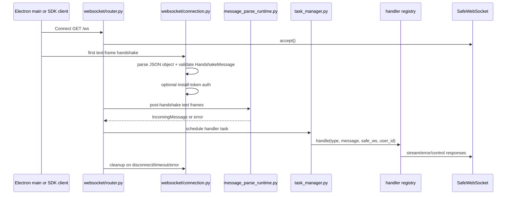

# WebSocket Connection Change Workflow

Use this workflow when a request touches the main WindieOS agent websocket at `GET /ws`. This is the transport used for desktop chat queries, tool results, settings messages, rehydrate requests, manual compaction, wakeword events, model listing, and streamed backend output.

This page does not cover the transcription websocket at `GET /ws/transcription`; use [Voice and Audio Channels](../channels/voice_and_audio_channels.md) for that path. It also does not cover event payload semantics after a query is already running; use [WebSocket Event Contract Change Workflow](../channels/websocket_event_contract_change_workflow.md) for formatter/event changes.

## Boundary Rules

- `GET /ws` is the main agent transport. Do not route SDK REST calls, VM run-control APIs, or transcription frames through it.
- The first websocket text frame is the handshake. It is not an ordinary `IncomingMessage`.
- Hosted installs should authenticate the websocket with `Authorization: Bearer <install_token>` when install auth is enabled.
- Authenticated install identity overrides the claimed handshake `user_id`.
- Post-handshake messages get `user_id` injected from the connection context before Pydantic validation.
- Every validated message is scheduled as a tracked task under the per-connection concurrency limit.
- Handler tasks must not spawn untracked background work that survives disconnect.
- Error responses after handshake must go through the canonical websocket error envelope path.
- Cleanup must cancel outstanding per-connection tasks and end the backend session only after the final active connection for that user closes.

## Fast Owner Map

| Change or symptom | First owner | Code roots | Focused tests |
| --- | --- | --- | --- |
| Handshake payload shape or capability fields | Handshake schema and connection helper | `backend/src/api/schemas/common.py`, `backend/src/api/routes/websocket/connection.py` | `tests/backend/test_websocket_connection.py`, schema/validation tests |
| Install-token websocket auth | Connection helper and install auth service | `backend/src/api/routes/websocket/connection.py`, `backend/src/api/auth/service.py`, `backend/src/api/auth/context.py` | `tests/backend/test_websocket_connection.py`, `tests/backend/test_install_auth.py` |
| Identity binding or same-user connection cleanup | Connection helper and session manager | `backend/src/api/routes/websocket/connection.py`, `backend/src/agent/session` | websocket connection tests, session-manager tests |
| Message size or JSON parse behavior | Parse runtime and JSON parse helper | `backend/src/api/routes/websocket/message_parse_runtime.py`, `backend/src/api/routes/websocket/json_parse.py` | `tests/backend/test_websocket_message_parse_runtime.py`, `tests/backend/test_websocket_json_parse.py` |
| Incoming message schema or route type | Incoming schemas and handler registry | `backend/src/api/schemas/incoming.py`, `backend/src/core/container/incoming_routing.py`, `backend/src/api/handlers/*` | incoming schema, route table, handler tests |
| Handler dispatch or error envelope | Message handler and error helpers | `backend/src/api/routes/websocket/message_handler.py`, `backend/src/api/infrastructure/errors.py` | `tests/backend/test_websocket_message_handler.py` |
| Per-connection task limit | Loop runtime and task manager | `backend/src/api/routes/websocket/loop_runtime.py`, `backend/src/api/routes/websocket/task_manager.py` | `tests/backend/test_websocket_loop_runtime.py`, `tests/backend/test_websocket_task_manager.py` |
| Receive timeout policy | Router receive loop and loop runtime | `backend/src/api/routes/websocket/router.py`, `backend/src/api/routes/websocket/loop_runtime.py` | websocket route/loop tests |
| Disconnect cleanup or task leak | Connection cleanup, task manager, session manager | `backend/src/api/routes/websocket/connection.py`, `backend/src/api/routes/websocket/task_manager.py`, session manager | websocket connection/task-manager/session tests |
| Closed-socket send or streaming write failure | Safe websocket transport | `backend/src/api/transport/websocket.py`, `backend/src/api/transport/sender.py` | `tests/backend/test_safe_websocket.py`, transport sender tests |
| Electron handshake or reconnect drift | SDK backend session runtime | `packages/windie-sdk-js/src/runtime/Agent.ts`, `packages/windie-sdk-js/src/runtime/AgentClient.ts`, `frontend/src/main/ipc.cjs`, SDK/Electron endpoint/auth code | Electron client websocket/main IPC tests |

## Lifecycle With Edit Points

## Change Sequences

### Change Handshake Shape

Implementation path:

1. Update `HandshakeMessage` in `backend/src/api/schemas/common.py`.
2. Keep `model_config = ConfigDict(extra="forbid")` unless the protocol intentionally accepts unknown fields.
3. Update `perform_handshake(...)` when the new field affects authenticated identity, session config, capability overrides, or safe websocket attributes.
4. Update Electron main handshake sender code if the Electron client must provide the field.
5. Add tests for valid payload, invalid payload, auth-enabled behavior, and mismatch behavior when relevant.
6. Update protocol/docs references and hosted client docs if non-Electron clients need the field.

Preserve:

- first frame must be a JSON object.
- invalid JSON, non-object roots, and schema failures close with policy-violation semantics.
- authenticated identity wins over claimed `user_id`.

### Change WebSocket Auth

Implementation path:

1. Update `perform_handshake(...)` and the install auth service only if `/ws` authentication itself changes.
2. Keep REST middleware behavior separate from websocket handshake behavior.
3. Update Electron main token propagation and SDK clients if header names or auth requirements change.
4. Add tests for missing token, invalid token, valid token, missing auth service, and claimed/authenticated user mismatch.
5. Update gateway/auth docs and operational troubleshooting.

Do not reuse the runs API key for `/ws`. Runs API auth is a separate `x-windie-runs-key` control-plane key.

### Change Post-Handshake Message Validation

Implementation path:

1. Update incoming schemas under `backend/src/api/schemas/incoming.py` when the message model changes.
2. Update route-table binding under `backend/src/core/container/incoming_routing.py` when a message type is added or moved.
3. Update the owning handler under `backend/src/api/handlers/*`.
4. Keep `message_parse_runtime.py` focused on parse/size/schema validation, not business behavior.
5. Update frontend senders and tests for any payload shape change.
6. Update websocket event and channel docs when the message changes observable behavior.

Preserve:

- post-handshake `user_id` comes from connection context.
- oversized messages return a client-visible websocket error after handshake.
- malformed JSON and schema failures should not crash the receive loop.

### Change Task Limits, Timeouts, or Cleanup

Implementation path:

1. Update `TaskManager` when the active-task data structure, concurrency limit, or cleanup semantics change.
2. Update `loop_runtime.py` when scheduling or timeout close behavior changes.
3. Update `router.py` only when the receive loop orchestration needs to change.
4. Make sure rejected coroutine inputs are closed when the limit is exceeded.
5. Keep task cleanup bounded by `websocket_task_cancellation_timeout`.
6. Add tests for limit rejection, cleanup cancellation, cleanup timeout, stale-done-task pruning, and receive timeout behavior.

Preserve:

- limit errors use `Too many concurrent requests. Please wait.`
- timeout closes with code `1008`.
- cleanup ends the session only after connection count reaches zero.

### Change Error Handling or Transport Sends

Implementation path:

1. Use `send_error(...)` for route-layer errors after handshake.
2. Keep handler `ValueError` exposure distinct from unexpected exception sanitization.
3. Update `SafeWebSocket` only for send queue, close serialization, or closed-socket behavior.
4. Update transport sender tests when query execution or formatter sends are affected.
5. Keep logs useful but avoid leaking secrets or raw local data into client-visible errors.

## Debug Routing Table

| Symptom | Check first |
| --- | --- |
| close code `1008` immediately after connect | handshake JSON object shape, `HandshakeMessage`, install bearer token, install auth service availability |
| client `user_id` ignored | expected when install auth is enabled and token identity differs |
| post-handshake error says message too large | `websocket_max_message_size`, payload byte size, client payload growth |
| post-handshake error says invalid message format | incoming schema, route type, field names, connection-context `user_id` injection |
| concurrent query/tool messages rejected | `websocket_max_concurrent_tasks`, long-running active handler tasks |
| connection closes while idle | `websocket_receive_timeout` |
| tool result is dropped | incoming `tool-result` schema, request/tool ids, handler registry, active session state |
| session disappears while another window remains connected | connection-count decrement and final-session cleanup |
| CPU/task leak after disconnect | untracked handler subtasks or task-manager cleanup timeout |
| stream send fails after disconnect | `SafeWebSocket` send queue/close behavior and sender error handling |

## Validation Matrix

| Changed surface | Validation |
| --- | --- |
| Handshake/auth/identity | `./scripts/python-in-env backend pytest tests/backend/test_websocket_connection.py tests/backend/test_install_auth.py` |
| JSON parse and post-handshake validation | `./scripts/python-in-env backend pytest tests/backend/test_websocket_json_parse.py tests/backend/test_websocket_message_parse_runtime.py` |
| Receive loop and scheduling | `./scripts/python-in-env backend pytest tests/backend/test_websocket_route.py tests/backend/test_websocket_loop_runtime.py` |
| Task manager/concurrency/cleanup | `./scripts/python-in-env backend pytest tests/backend/test_websocket_task_manager.py` |
| Handler dispatch/error envelope | `./scripts/python-in-env backend pytest tests/backend/test_websocket_message_handler.py tests/backend/test_incoming_routing.py` |
| Safe websocket/transport sends | `./scripts/python-in-env backend pytest tests/backend/test_safe_websocket.py` plus transport sender tests |
| Electron handshake/reconnect changes | focused frontend main websocket tests |
| Docs-only websocket changes | `<windie> docs list`, `git diff --check`, focused Markdown link checks |

## Docs to Keep Synchronized

When `/ws` behavior changes, update the closest docs in the same commit:

- [WebSocket Connection Lifecycle](websocket_connection_lifecycle.md)
- [Backend API WebSocket Docs Hub](../backend/api/websocket/README.md)
- [WebSocket Connection and Task Lifecycle Reference](../backend/api/websocket_connection_and_task_lifecycle_reference.md)
- [Gateway Auth and Health Runbook](gateway_auth_and_health_runbook.md) for auth changes
- [Frontend Main WebSocket Handshake and Settings Sync Reference](../frontend/main/websocket_handshake_and_settings_sync_reference.md) for Electron handshake/reconnect changes
- [HTTP and WebSocket API Surface](../reference/http_api_surface.md) for public route/contract changes
- [WebSocket Event Contract Change Workflow](../channels/websocket_event_contract_change_workflow.md) for outgoing event payload changes

## Related Docs

- [Gateway Hub](README.md)
- [WebSocket Connection Lifecycle](websocket_connection_lifecycle.md)
- [Backend API WebSocket Docs Hub](../backend/api/websocket/README.md)
- [Gateway Auth and Health Runbook](gateway_auth_and_health_runbook.md)
- [Credential and Token Change Workflow](../security/credential_token_change_workflow.md)
- [Backend WebSocket Protocol Surface Matrix](../backend/inventory/protocols/backend_websocket_protocol_surface_matrix_reference.md)
