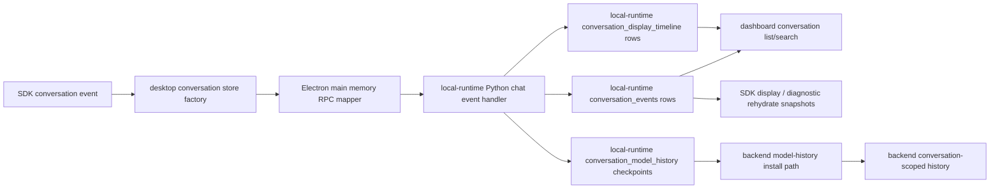

# Transcript Replay Change Workflow

Use this workflow for the visible-chat projection path. Transcript replay is
related to memory, but it is not the same thing as semantic memory or backend
active model history.

The core rule is: SDK local-runtime `conversation_events` rows are the canonical
runtime/audit log, display timeline checkpoints are the editable user-visible
document, and model-history checkpoints are the bounded inference ledger.
Edit/resend and retry must replace display timeline rows and then send; they
must not cut raw runtime events or pre-mutate visible rows before the SDK
accepts the child display revision. Fix display and replay at the SDK
projection/store layer. Fix resumed model context at the model-history
rehydrate layer. Fix derived memory search/semantic facts in local-runtime
memory and semanticization code.

## Runtime Path

## Boundary Rules

- SDK projection/runtime code owns visible chat projection, local replay
  snapshots, and diagnostic/export rehydrate snapshots. Normal backend resume
  installs model-history checkpoints instead of assembling provider history
  from stored conversation events.
- SDK store adapters expose `replaceDisplayTimeline(...)` and
  `loadDisplayTimeline(...)` for first-class editable display timeline
  checkpoints. This is the public user-visible document surface for child
  revisions. It is distinct from raw runtime events and from bounded model
  history. When no checkpoint exists, display still falls back to the current
  event projection.
- SDK store adapters expose `replaceModelHistory(...)` and
  `loadModelHistory(...)` for provider-neutral, bounded model-history
  checkpoints. This is a separate inference ledger, not a visible transcript
  projection. Normal rehydrate installs this checkpoint when available and
  skips backend hydration when no checkpoint exists.
- Backend live turns now emit `model-history-updated` checkpoints after
  assistant and tool-result history commits. The SDK persists those hidden
  events through `replaceModelHistory(...)`; display projections ignore them.
- Electron main owns IPC/RPC mapping and identity sync between windows. It should not interpret chat semantics beyond normalizing bridge payload keys and forwarding session updates.
- The SDK local-runtime store owns durable local row storage, conversation list/search/title/delete queries, message-index ordering, and transcript-window APIs; local-runtime Python implements the current SQLite backing store.
- Backend rehydrate owns installing persisted model-history checkpoints into
  model-compatible backend history. Legacy event-projection rehydrate snapshots
  are diagnostic/export surfaces only; normal resume, edit/resend, and retry
  preparation must not invoke backend rehydrate from display/runtime events.
- Backend active history is not the source of dashboard conversation list truth. Do not patch backend history to make a missing sidebar conversation appear.
- Fork children are visible from their active display timeline checkpoint before
  they have child events. Dashboard/list metadata should union visible event
  conversations with active display timeline conversations, preserve the forked
  display title, and use newer child events for the tail when the child
  continues.
- Model-history checkpoint rows are not dashboard/list truth and must not copy
  full raw tool output, screenshots, or provider-specific payloads as durable
  local truth.
- Semantic memory is derived from transcript/interaction rows. Do not edit semantic memory as a shortcut for fixing replay or visible transcript bugs.
- `conversationRef`/`conversation_id`, `userId`/`user_id`, role, message type, timestamp, message index, tool identifiers, and screenshot refs must survive any row that can be replayed or rehydrated later.

## Fast Owner Map

| Symptom | First owner | Inspect first | Then inspect |
| --- | --- | --- | --- |
| User or assistant row appears in UI but is missing after restart | SDK store/display projection | `desktopConversationStore.ts`, `desktopSdkDisplayChatMessageProjectionRuntime.ts`, SDK conversation runtime/store | `DesktopConversationStore.test.ts`, `SdkDisplayChatMessageProjection.test.ts`, local-runtime Python `conversation.append_event` tests |
| Tool call/output rows are missing or replay drops screenshot refs/attachment filenames | Renderer transcript tool message state, SDK display projection, and replay runtime shaping | `toolCallMessageState.js`, `toolOutputChatMessageState.ts`, `desktopSdkDisplayChatMessageProjectionRuntime.ts`, `desktopConversationReplayRuntime.js` | `DesktopConversationReplayRuntime.test.js`, `SdkDisplayChatMessageProjection.test.ts`, backend linkage validation tests |
| Transcript writes happen under the wrong conversation | Transcript session runtime and Electron sync | `transcriptSessionRuntime.ts`, `sessionInfoState.ts`, `sessionSyncPayload.ts`, `frontend/src/main/ipc/ipc_transcript_session_sync.cjs` | [Session and Conversation Identity Change Workflow](session_conversation_identity_change_workflow.md) |
| Dashboard conversation list is missing, stale, or ordered wrong | Local-runtime conversation storage plus dashboard loader | `frontend/src/main/python/memory/chat_event_store.py`, `local_store.py`, dashboard conversation hooks | `tests/sidecar/test_chat_event_store.py`, `tests/frontend/DashboardConversationLoad.test.js` |
| Dashboard resume displays wrong rows | SDK display projection and conversation load command | `desktopConversationContinuityService.ts`, `desktopConversationStore.ts`, SDK conversation store/runtime | `DesktopConversationContinuityService.test.ts`, `DesktopConversationStore.test.ts` |
| Resume displays rows but backend answers without old context | SDK model-history persistence and backend rehydrate install | `packages/windie-sdk-js/src/runtime/modelHistoryPayload.ts`, `packages/windie-sdk-js/src/runtime/ConversationContinuityService.ts`, `backend/src/api/handlers/rehydrate.py`, `backend/src/api/services/rehydrate_*` | `AgentSdkConversationRuntime.test.ts`, `ConversationContinuityService.test.ts`, backend rehydrate service/linkage tests |
| Transparency/system-prompt rows replay incorrectly | SDK projections and backend rehydrate transparency resolution | `desktopChatStreamMessageUpdateRuntime.ts`, `packages/windie-sdk-js/src/projections/conversationProjections.ts`, `backend/src/api/services/rehydrate_transparency_resolution.py` | SDK rehydrate projection tests, `tests/backend/test_rehydrate_transparency_resolution.py` |
| Conversation delete leaves rows, titles, or search results behind | Local-runtime memory delete/cleanup plus renderer active-chat reset | `local_store.py`, conversation delete helpers, dashboard delete actions | `tests/sidecar/test_local_store_delete_cleanup.py`, conversation title/list tests, dashboard delete tests |
| Search returns rows from the wrong conversation | Local-runtime conversation search | `conversation_search_helpers.py`, `local_store.py` | `tests/sidecar/test_conversation_search*.py` |

## Change Sequence

1. Identify the failing phase.
   - Store: row crosses renderer IPC, Electron main, local-runtime Python handler, and SQLite.
   - List/search: dashboard asks local-runtime transcript storage for conversations.
   - Replay: stored rows become visible chat messages.
   - Rehydrate: stored model-history checkpoints become backend model history.

2. Check identity before changing storage shape.
   - If `conversationRef`, `userId`, or `turn_ref` is wrong, switch to [Session and Conversation Identity Change Workflow](session_conversation_identity_change_workflow.md).
   - If the identity is right but the row is missing or malformed, continue here.

3. Trace the store path.
   - Chat stream handlers consume SDK conversation events and active-turn projections.
   - Desktop conversation store calls cross Electron main into the local-runtime transcript storage boundary.
   - Main process maps payload keys before calling local-runtime JSON-RPC.
   - Local-runtime Python `conversation.append_event` normalizes and stores rows in `LocalMemoryStore`.

4. Preserve replay shape.
   - Stored transcript rows must reconstruct stable user, assistant, tool-call, tool-output, bundle, transparency, screenshot, and model metadata rows.
   - Replay should not invent backend-only history fields for UI display.
   - Visible screenshot/image replay should produce ordered SDK
     `attachments[]` descriptors before rows reach renderer components. Legacy
     screenshot aliases are allowed only as input to
     `legacyVisualAttachmentReplayAdapter`, the narrow old-row compatibility
     owner retained until a durable local-store migration rewrites those rows.
   - Local snapshots should not replace durable transcript storage unless the code explicitly uses them as a fallback.
   - Edit/resend and try-again must route execution through SDK
     `conversation.editAndResend` and `conversation.retryTurn`. Renderer replay
     must not inspect visible rows to find retry user rows, calculate retained
     prefixes, supersede turns, build pending replacement rows, load the active
     display timeline, construct durable replacement rows, call
     `conversation.replaceRows`, or dispatch a separate normal send for replay
     execution. SDK commands own target-row resolution, child display revision
     cuts, supersession, target-row resources, replacement turn refs, and
     replacement display rows.
   - React replay hooks should pass edit/retry intent through
     `desktopConversationReplayRuntime`. Hooks call the runtime's single
     replay-action entrypoint with row ids/text plus UI dependencies; active
     conversation state is resolved by the runtime from the store dependency
     instead of selected in React. If neither transcript session nor chat-store
     active workspace has a conversation ref, replay returns a traced failure
     instead of creating a fresh conversation whose SDK display rows cannot own
     the target id. Replay failures are trace/status outcomes rather than
     renderer-published chat rows. That public facade exports only
     `executeReplayAction`, and hooks do not call replay preparation helpers,
     inspect `ConversationView`/message arrays, or call replay SDK commands
     directly.
   - Renderer app-runtime facades should not expose direct display timeline
     load/replace helpers to React. Low-level display timeline operations remain
     SDK/main-owner diagnostics and command-handler concerns; normal UI paths
     use SDK intent commands such as retry, edit/resend, checkout, and fork.
   - If the SDK replay command fails, record renderer replay diagnostics and
     return failure without publishing a renderer-local chat row, restoring
     renderer-cut prefixes, or clearing renderer replay pending state. Do not
     restore event-log cutting through `conversation.rewrite_after_event`, SDK
     `prepareEditAndResend`, SDK `prepareRetryTurn`, or durable row replacement
     from React.

5. Preserve model-history resume shape.
   - SDK `modelHistoryPayloadFromCheckpoint(...)` should emit
     backend-compatible entries from stored model-history checkpoints,
     including canonical stored `message_type` values such as `user_query`,
     `assistant_response`, and `tool_output`.
   - Backend rehydrate should install model-history checkpoint rows, normalize
     roles and tool-call/tool-output linkage, and reject stale message-type
     aliases at the API boundary.
   - SDK `buildRehydrateSnapshot(...)` remains a diagnostic/export snapshot
     helper for legacy no-checkpoint conversations. It must not become the
     normal backend resume payload source again.
   - Backend-safe `display_attachments` may cross rehydrate/tool-result
     websocket boundaries for display/replay parity, but model-visible image
     hydration remains `screenshot_ref`/artifact-ref owned until provider
     history becomes attachment-aware.
   - Provider-strict history should be rejected at the backend rehydrate layer when
     current transcript projections omit required tool linkage or structured tool
     payloads.

6. Update docs next to behavior.
   - Update this workflow when transcript/replay ownership or sequencing changes.
   - Update [Transcript and Replay](transcript_and_replay.md) for high-level behavior.
   - Update [Frontend Renderer Transcript Docs Hub](../frontend/renderer/transcript/README.md) and focused renderer transcript references for renderer internals.
   - Update [Memory Change Workflow](memory_change_workflow.md) for cross-layer routing.
   - Update [Session and Conversation Identity Change Workflow](session_conversation_identity_change_workflow.md) if identity fields or filtering rules change.
   - Update [Session and Transcript Reference](../reference/session_and_transcript_reference.md) if identifier contracts change.

## Validation Matrix

| Change type | Focused validation |
| --- | --- |
| Stored-row conversion to visible chat messages | `<windie> test frontend -- SdkDisplayChatMessageProjection DesktopConversationContinuityService DesktopConversationStore` |
| Transcript session identity or sync payloads | `<windie> test frontend -- TranscriptSessionState TranscriptSessionSyncPayload IpcTranscriptSessionSync` |
| Dashboard resume actions | `<windie> test frontend -- ConversationReplayActions DashboardConversationLoad DesktopConversationStore UseDashboardConversations` |
| Rehydrate payload construction | `<windie> test frontend -- AgentSdkConversationRuntime ConversationContinuityService DesktopConversationReplayRuntime` |
| Backend rehydrate normalization/linkage/transparency | `./scripts/python-in-env backend pytest tests/backend/test_rehydrate_execution_service.py tests/backend/test_rehydrate_tool_call_normalization.py tests/backend/test_rehydrate_tool_linkage.py tests/backend/test_rehydrate_transparency_resolution.py` |
| Local-runtime transcript storage/list/window/delete | `./scripts/python-in-env local-runtime pytest tests/sidecar/test_chat_event_store.py tests/sidecar/test_conversation_window_runtime.py tests/sidecar/test_local_store_delete_cleanup.py` |
| Local-runtime conversation search | `./scripts/python-in-env local-runtime pytest tests/sidecar/test_conversation_search_helpers.py tests/sidecar/test_chat_event_store.py tests/sidecar/test_conversation_window_runtime.py` |
| Docs-only transcript workflow | `<windie> docs list`, `git diff --check`, focused Markdown link check |

## Debug Playbooks

### Visible Row Missing After Restart

1. Confirm the row was emitted as an SDK conversation event.
2. Confirm renderer IPC called the main memory bridge with the expected payload.
3. Confirm local-runtime Python `conversation.append_event` wrote a row with the expected user/conversation/message type.
4. Confirm dashboard/list replay is querying the same user and conversation.
5. Confirm SDK display projection maps the stored event into the expected chat row.

### Replay Loses Tool Rows

1. Confirm tool-call and tool-output transcript rows were both persisted.
2. Confirm tool call ids, request ids, correlation ids, and structured payloads were stored.
3. Inspect replay tool-message reconstruction before changing backend rehydrate code.
4. If the UI replay is correct but backend context is wrong, inspect backend rehydrate linkage validation.
5. Add both a renderer replay test and a backend rehydrate linkage test when a row crosses both boundaries.

### Dashboard Resume Shows the Right Rows but Backend Forgets Context

1. Confirm SDK display projections render the intended rows.
2. Confirm SDK `buildRehydrateSnapshot(...)` includes those rows in backend-compatible order.
3. Confirm the rehydrate request uses the selected `conversation_ref`.
4. Confirm backend `RehydrateExecutionService` installs history into the conversation-scoped session.
5. Confirm the next query uses the same `conversation_ref`.

### Conversation Search Finds the Wrong Rows

1. Confirm the search command passes the intended `user_id`.
2. Confirm local-runtime Python search SQL filters by conversation and user.
3. Confirm display projection does not merge rows from multiple conversations after search.
