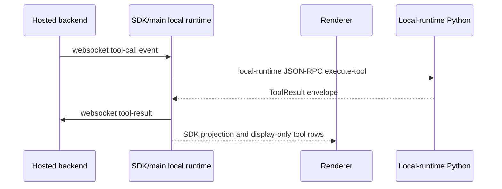

# Desktop and Local Runtime Node

The desktop node is not one process. It is a small local runtime cluster:

- Electron main process
- one or more renderer processes
- preload bridge injected into renderer windows
- local-runtime Python subprocess
- optional wakeword subprocess

Keep these nodes separate when developing. They run on the user's machine, but each owns a different trust boundary.

## Process Ownership

| Local process | Owns | Does not own |
| --- | --- | --- |
| Electron main | native windows, overlay visibility, SDK-runtime adaptation, config persistence, install-token storage/transport, IPC handlers, local-runtime host/status context | React component state, backend route implementation, hosted backend websocket policy, local-runtime tool implementation internals |
| Renderer | dashboard/chat/overlay UI, stream projection, transcript state, settings forms, voice UI, display-only tool state | direct filesystem/shell access, backend auth enforcement, native window authority, backend tool-result delivery |
| Preload | narrow `window.ipc` bridge and channel allowlist | feature policy, backend schemas, broad Node.js access |
| Local-runtime Python implementation | concrete implementation for local executable tools, local memory, browser runtime, system state, and shell/filesystem/computer actions behind SDK/main local runtime | reusable local-runtime authority, model-facing tool schemas, websocket route validation, renderer UI |
| Wakeword service | model bootstrap and audio-frame detection | voice dictation transcription, generic local-runtime tools, backend TTS |

## Main Process Code Roots

Start with these files when local orchestration changes:

- `frontend/src/main/index.cjs`: composition root for app bootstrap.
- `frontend/src/main/app/main_process_bootstrap_runtime.cjs`: bootstrap/runtime setup.
- `frontend/src/main/app/main_process_lifecycle_runtime.cjs`: Electron lifecycle policy.
- `frontend/src/main/surfaces/surface_runtime.cjs`: shared window/surface owner.
- `frontend/src/main/ipc.cjs`: SDK-runtime adaptation, query dispatch, renderer fanout, session/config state.
- `packages/windie-sdk-js/src/runtime/Agent.ts` and `packages/windie-sdk-js/src/runtime/AgentClient.ts`: start the Agent SDK runtime and supply Electron's SDK local-runtime client.
- `frontend/src/main/ipc/**`: narrower IPC modules.
- `frontend/src/main/sidecar/local_runtime_bridge.cjs`: SDK local-runtime host/status bridge.
- `frontend/src/main/sidecar/local_runtime_*`: local-runtime request mapping, timeout, screenshot, bounds, and tool-argument helpers.
- `frontend/src/main/app/backend_endpoints.cjs`: hosted backend endpoint selection.
- `frontend/src/main/permission_*`: OS permission probes and grant effects.
- `frontend/src/main/wakeword/wakeword_bridge*.cjs`: wakeword subprocess bridge.

## Renderer Code Roots

Start with these folders when UI or stream projection changes:

- `frontend/src/renderer/app/**`: app roots, providers, overlay entrypoints, wakeword controller.
- `frontend/src/renderer/features/chat/**`: chat dashboard, minimal pill, response overlay, stream hooks, display-only tool state, transcript projection.
- `frontend/src/renderer/features/dashboard/**`: dashboard shell, sidebar, settings, model/API-key/memory sections.
- `frontend/src/renderer/features/voice/**`: voice mode UI, capture hooks, wakeword bridge events.
- `frontend/src/renderer/features/permissions/**`: permission center state and presentation.
- `frontend/src/renderer/infrastructure/**`: IPC, API, transcript, artifact, and service helpers.

## Sidecar Code Roots

Start with these files when local execution changes:

- `frontend/src/main/python/local_backend.py`: JSON-RPC entrypoint and request dispatch.
- `frontend/src/main/python/tools/registry.py`: tool registration and exposed tool lookup.
- `frontend/src/main/python/tools/manifest.py`: direct-tool exposure contract used for parity.
- `frontend/src/main/python/tools/computer/**`: mouse, keyboard, screenshot, scroll.
- `frontend/src/main/python/tools/browser/**`: dedicated browser automation runtime.
- `frontend/src/main/python/tools/filesystem/**`: file read/replace helpers.
- `frontend/src/main/python/tools/system/**`: shell/process/window/stats/open-app/wait actions.
- `frontend/src/main/python/memory/**`: local transcript, episodic, semantic, title, and FAISS behavior.
- `frontend/src/main/python/core/**`: backend URL helpers, env flags, remote API clients, runtime shutdown, executors.

## Local Tool Lifecycle

Ownership rules:

- The backend decides which model-facing tool is visible.
- The SDK/main local runtime claims local tool calls, preserves correlation IDs, and returns exactly one result or failure to the backend.
- Electron main hosts the local-runtime bridge and enforces request timeouts/window guards.
- The local-runtime Python implementation performs the local action and returns a normalized result.
- The renderer displays SDK projections and does not initiate local execution.
- The result must re-enter backend history through the websocket tool-result path.

## Wakeword Lifecycle

Wakeword uses a separate subprocess path:

1. renderer wakeword controller decides whether capture should run.
2. renderer sends audio chunks over wakeword IPC.
3. Electron main forwards framed chunks through `wakeword_bridge*.cjs`.
4. `frontend/src/main/python/wakeword_service.py` loads the model and emits status/detection messages.
5. main rebroadcasts wakeword status/detected events to renderer.
6. optional backend activation uses the normal `/ws` wakeword message path.

Do not route dictation audio through the wakeword service. Dictation uses `/ws/transcription`.

## Debug Checklist

For a desktop/local-runtime bug, identify the last successful boundary:

- UI action happened: renderer event handler fired.
- IPC bridge accepted the channel: preload and main handler are registered.
- main/SDK local runtime mapped the request: payload shape matches bridge mapper.
- local-runtime request was sent: local-runtime Python JSON-RPC stdout/stderr framing is clean.
- local-runtime tool ran: registry has the tool and returns a result or structured error.
- result came back: renderer persisted/displayed it and sent backend tool-result if needed.

## Focused Validation

| Change | Validate |
| --- | --- |
| renderer stream/tool state | renderer chat hook/store and SDK/local-runtime projection tests |
| IPC or preload channel | preload allowlist parity and main IPC tests |
| main-process window/overlay behavior | main overlay/window tests |
| local-runtime JSON-RPC mapping | local-runtime Python JSON-RPC protocol tests and main bridge mapper tests |
| local-runtime tool implementation | focused local-runtime Python pytest for the tool |
| backend-visible local tool contract | backend remote-tool/schema tests plus local-runtime executable parity tests |
| wakeword service or bridge | wakeword bridge/service tests and voice hook tests |

## Related Docs

- [Runtime Node Matrix](runtime_node_matrix.md)
- [Channels Hub](../channels/README.md)
- [Local Tool Channels](../channels/sidecar_and_tool_channels.md)
- [Frontend Runtime Surface](../frontend/runtime/frontend_runtime_surface_main_renderer_sidecar_and_vm_worker_reference.md)
- [Frontend IPC Channel Reference](../frontend/contracts/ipc_channel_and_handler_reference.md)
- [Local Runtime Python Implementation Docs Hub](../frontend/sidecar/README.md)
- [Voice and Audio Channels](../channels/voice_and_audio_channels.md)
