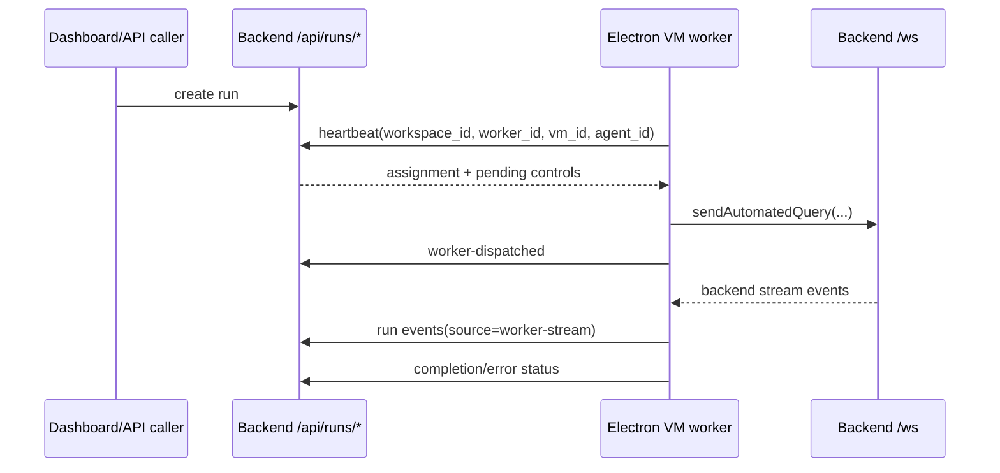

# VM Worker Node

The VM worker node is an Electron main-process runtime configured to poll the hosted backend for work. It is not a separate agent loop and it is not a durable scheduler.

The worker uses `/api/runs/*` for control-plane state, then dispatches assigned work through the normal backend websocket query path.

For code-owner routing across route models, assignment helpers, event logs, controls, auth, and Electron worker dispatch, use [VM Run Control Change Workflow](../automation/vm_run_control_change_workflow.md).

## Current Runtime

Code roots:

- `frontend/src/main/app/vm_worker_runtime.cjs`
- `frontend/src/main/app/runtime_mode.cjs`
- `frontend/src/main/index.cjs`
- `backend/src/api/routes/runs/**`
- `backend/src/services/vm_run_control.py`
- `backend/src/services/vm_run_control_support/**`

Mode flags:

| Variable | Owner | Meaning |
| --- | --- | --- |
| `WINDIE_VM_MODE` | Electron main | boots the app in hosted VM/dashboard-oriented mode |
| `WINDIE_VM_WORKER_MODE` | Electron main | explicitly enables worker polling; when unset, worker mode inherits VM mode |
| `WINDIE_VM_WORKSPACE_ID` | worker | workspace routing key for heartbeat/assignment |
| `WINDIE_VM_WORKER_ID` | worker | optional fixed worker id; otherwise derived from user id |
| `WINDIE_VM_ID` | worker | optional fixed VM id; otherwise derived from worker id |
| `WINDIE_VM_AGENT_ID` | worker | optional agent identity attached to heartbeat payloads |
| `WINDIE_VM_WORKER_HEARTBEAT_MS` | worker | heartbeat interval as a strict integer with a minimum of 1000ms |
| `WINDIE_VM_RUNS_API_KEY` | worker | worker-specific runs API key override |
| `WINDIE_RUNS_API_KEY` | backend and worker | shared runs key accepted as `x-windie-runs-key` |

## Lifecycle

The worker loop:

1. resolves backend HTTP/WebSocket URLs from main-process endpoint configuration.
2. builds worker identity from env and backend user/session state.
3. posts heartbeat to `/api/runs/workers/heartbeat`.
4. receives an assignment when a run is available.
5. dispatches the run query through `sendAutomatedQuery(...)`.
6. marks the run as worker-dispatched through `/api/runs/{run_id}/worker-dispatched`.
7. relays backend stream events into run timeline events with source `worker-stream`.
8. applies queued controls, including stop commands, through the websocket control path.

## Backend Run-Control Ownership

The backend run-control service owns:

- in-memory run registry
- worker registry and heartbeat freshness
- per-workspace active-run caps
- status transitions
- event log payloads
- pending controls for assigned workers
- stop-all behavior

The worker owns:

- polling cadence
- assignment dispatch into the desktop query path
- stream event relay
- worker identity payloads
- applying queued controls to the live websocket session

Do not move scheduler or persistence semantics into `vm_worker_runtime.cjs`. If runs need persistence, durable retries, or cron/webhook scheduling, design that as a backend control-plane feature first.

## Failure Routing

| Symptom | Likely node | First checks |
| --- | --- | --- |
| run stays `awaiting_worker` | backend run service or worker heartbeat | `WINDIE_VM_WORKER_MODE`, `WINDIE_VM_WORKSPACE_ID`, heartbeat logs, runs key |
| heartbeat returns `401` | gateway/runs auth | `x-windie-runs-key`, `WINDIE_VM_RUNS_API_KEY`, install auth bearer token |
| heartbeat works but assignment does not dispatch | worker node | `sendAutomatedQuery(...)` path, backend websocket readiness, run payload shape |
| dispatched run has no timeline events | worker event relay | `worker-stream` post path, stream observer registration |
| stop button does not stop live run | backend pending controls or worker control application | pending-control response from heartbeat, websocket stop message |
| public dashboard gets `502` | Cloudflare/origin node | tunnel service, backend origin process, endpoint DNS |

## Focused Validation

Use the smallest test set that covers the changed node:

- backend run route tests for HTTP models, auth, caps, assignment, and control endpoints.
- backend VM control service tests for state transitions, worker assignment, pending controls, and stop-all.
- frontend `VmWorkerRuntime` tests for heartbeat, assignment dispatch, event relay, and stop controls.
- frontend `RuntimeMode` tests for env flag semantics.
- endpoint/auth tests when backend URL or runs key handling changes.

Docs to update with behavior changes:

- [Automation Hub](../automation/README.md)
- [VM Run Control Change Workflow](../automation/vm_run_control_change_workflow.md)
- [VM Runs and Workers](../automation/vm_runs_and_workers.md)
- [Runs API Runbook](../automation/runs_api_runbook.md)
- [Runtime Configuration Matrix](../operations/runtime_configuration_matrix.md)
- [Runtime Node Matrix](runtime_node_matrix.md)

## Related Docs

- [Automation Hub](../automation/README.md)
- [VM Runs and Workers](../automation/vm_runs_and_workers.md)
- [Runs API Runbook](../automation/runs_api_runbook.md)
- [Gateway Auth and Health Runbook](../gateway/gateway_auth_and_health_runbook.md)
- [Current vs Future Nodes](current_vs_future_nodes.md)
- [VM Multi-Agent Plan](../planning/windieos_vm_multi_agent_plan.md)
