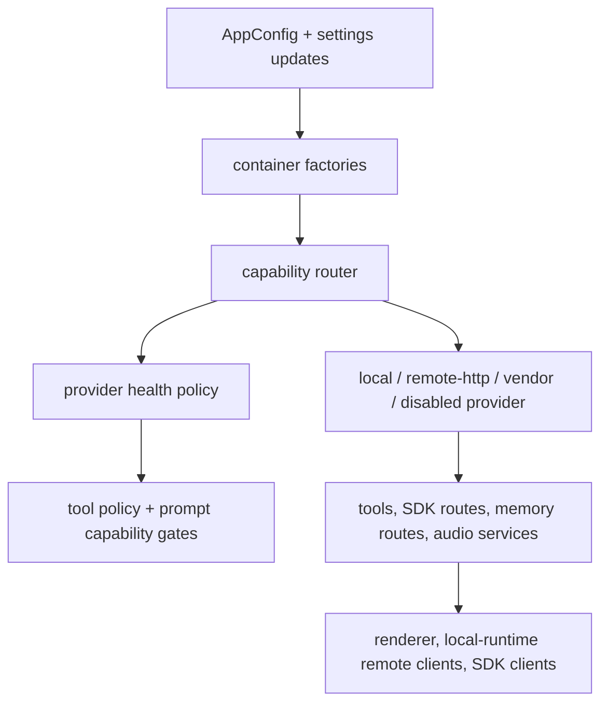

# Inference Capability Change Workflow

Use this workflow when a change touches non-chat inference: OCR, vision
grounding, embeddings, speech-to-text, text-to-speech, or the health policy
that exposes those capabilities to the agent. This is different from an LLM
provider change. LLM providers own chat, reasoning, streaming, and model-visible
tool transport; inference providers own supporting capabilities used by tools,
memory, SDK routes, and audio flows.

The current backend is still one hosted FastAPI process, but inference behavior
is routed through capability-specific provider factories and routers. Keep that
boundary intact so local, remote HTTP, vendor, and disabled modes remain
deployment choices instead of cross-runtime rewrites.

## Boundary Rules

- Backend config owns inference mode selection and timeout/circuit-breaker
  values.
- Provider factories select local, remote HTTP, vendor, or disabled
  implementations.
- Capability routers own provider readiness, request error normalization,
  circuit-breaker state, and stable provider/model identity.
- Provider health policy owns whether OCR, vision, embeddings, or web search
  are hidden from model-visible capabilities before prompt construction.
- SDK routes expose OCR/vision developer APIs, but do not own provider
  selection.
- SDK clients consume hosted embedding/title services for memory and naming.
  Local-runtime remote clients may consume hosted helper services such as
  semantic summarization, but must not import backend provider or router code.
- Renderer-managed settings can update allowed config fields, but must not duplicate
  provider factory rules.

## Fast Owner Map

| Change or symptom | Primary owner files | Tests/docs to inspect |
| --- | --- | --- |
| Add or change an inference backend mode | private backend implementation | private backend tests, Backend Config and Container Change Workflow (private backend docs) |
| OCR local/remote/disabled behavior changes | private backend implementation | private backend tests, OCR Service and Screenshot State Machine (private backend docs) |
| Vision locate/describe/provider loading changes | private backend implementation | private backend tests, Vision Provider Runtime (private backend docs) |
| Embedding local/remote/vendor/disabled behavior changes | private backend implementation | private backend tests, Embedding and Semantic Memory Runtime (private backend docs) |
| Provider health hides tools unexpectedly | private backend implementation, capability routers | private backend tests, [Tool Policy Profiles and Capabilities](../tools/tool_policy_profiles_and_capabilities.md) |
| Circuit breaker opens too eagerly or never opens | private backend implementation, capability routers | private backend tests, provider-specific failure tests |
| Runtime config update does not rebind providers | private backend config propagation | private backend tests |
| SDK OCR/vision behavior changes | private backend implementation, OCR/vision routers and service helpers, private backend implementation, hosted clients | private backend tests, `tests/frontend/AgentSdkClient.test.ts`, [SDK Route Change Workflow](../sdk/sdk_route_change_workflow.md) |
| SDK memory embedding behavior changes | `packages/windie-sdk-js/src/runtime/ContextEnrichmentPipeline.ts`, `packages/windie-sdk-js/src/runtime/Agent.ts`, local-runtime memory store/search pipeline | SDK memory tests, `tests/sidecar/test_local_store_*.py`, [Local-Runtime Core Docs Hub](../frontend/sidecar/core/README.md) |
| STT provider or transcription websocket changes | private backend implementation, backend transcription services, renderer voice capture | private backend tests, frontend voice tests, [Voice Audio Change Workflow](../channels/voice_audio_change_workflow.md) |
| TTS provider, chunking, suppression, or cleanup changes | private backend implementation, speech service factory/config | private backend tests, TTS and Wakeword Audio Runtime (private backend docs) |

## Runtime Flow

## Change Sequence

### 1. Classify the capability

Pick exactly one primary capability first:

- OCR: text extraction, OCR box normalization, `find_coordinates_by="ocr"`,
  OCR SDK routes, OCR remote service health.
- Vision: coordinate prediction, image description, model loading/fallback,
  vision SDK routes, remote vision service health.
- Embeddings: memory vector generation, embedding-space identity, embedding
  route health, and SDK embedding client behavior.
- STT: voice dictation websocket, transcription provider, transcript region
  updates.
- TTS: response speech chunks, suppression of code/tool JSON, provider cleanup,
  wakeword greeting audio.
- Provider health: capability hidden from the model before prompt construction.
- Circuit breaker successes clear accumulated failures only while the circuit is
  closed; an already-open circuit stays open until cooldown/reconfiguration
  because late successes can belong to older in-flight requests.

If the change is chat completion, model picker metadata, tool-calling transport,
or reasoning behavior, use [Provider Change Workflow](provider_change_workflow.md)
instead.

### 2. Inspect config and allowed update paths

Read:

- private backend implementation
- private backend implementation
- private backend implementation
- private backend implementation

Config rules:

- Keep backend modes explicit. Do not infer remote mode from URL presence alone.
- Keep remote service URLs, health URLs, timeouts, and circuit-breaker knobs in
  config.
- If a setting can be changed at runtime, update settings validation and
  container rebinding together.
- If changing embedding provider/model identity, audit memory metadata and
  `embedding_space_version` behavior before changing defaults.

### 3. Inspect provider factory selection

Read private backend implementation.

Factory rules:

- `local` mode may construct heavyweight local services.
- `remote-http` mode should not construct local model services.
- `vendor` mode requires explicit credential loading and normalized provider
  identity.
- `disabled` mode should return no provider and let health/policy hide or fail
  capability calls predictably.
- Missing remote URLs should fail closed by returning no provider and logging a
  clear configuration error.

### 4. Inspect router behavior before provider internals

Read:

- private backend implementation
- private backend implementation
- private backend implementation
- private backend implementation
- private backend implementation

Router rules:

- Routers normalize provider unavailability and provider request failures.
- Routers own circuit-breaker reset/reconfigure behavior when providers change.
- Routers expose stable `provider_id`, `model_id`, readiness, and error
  surfaces that policy and callers can inspect.
- Request methods should record success only after valid provider output.
- A provider returning `None` for a required result should become a structured
  provider error, not a silent fallback.

### 5. Inspect the provider adapter

For OCR/vision:

- local adapters wrap existing services under private backend implementation and
  private backend implementation.
- remote adapters live in `remote_provider.py` modules and normalize HTTP
  errors, health responses, and payload shape.

For embeddings:

- local SentenceTransformer behavior lives in private backend implementation.
- remote HTTP and vendor OpenAI providers live under private backend implementation.
- concurrency limiting is wrapped by `CapacityLimitedEmbeddingProvider`.

Adapter rules:

- Normalize provider-specific payloads before returning to routers.
- Keep health probes cheap and bounded by timeout config.
- Do not leak raw credential values, full provider payloads, or huge exception
  strings into client-visible errors.
- Preserve provider/model identity metadata across wrappers.

### 6. Inspect caller contracts

Different callers need different follow-up docs:

- Tool grounding calls: inspect backend tool-preparation docs and tool policy.
- SDK OCR/vision calls: inspect SDK route workflow and hosted client tests.
- Memory routes: inspect memory route docs and sidecar remote client docs.
- Voice/audio: inspect voice channel workflow and renderer voice docs.
- Renderer-managed settings: inspect model settings workflow and config sync docs.

Do not update only the provider adapter when a public route payload, tool
visibility rule, or frontend status surface also changes.

### 7. Align capability health with prompt/tool visibility

Read private backend implementation.

Health rules:

- OCR unavailable should hide OCR capability when no provider is configured,
  provider readiness is false, or the circuit is open.
- Vision unavailable should hide prediction capability when initialization
  fails or the provider is not initialized.
- Embeddings unavailable should follow memory and provider availability; sidecar
  memory may degrade by storing rows without vectors.
- Web search capability has its own provider/native routing and should not be
  tied to OCR/vision/embedding health.

If a capability becomes unavailable but remains visible to the model, update
provider health and tool policy together.

## Capability Checklists

### OCR

- Factory handles `local`, `remote-http`, and `disabled`.
- Remote provider validates `/ocr/analyze` and health response shapes, and
  refuses analysis while the last health probe leaves the provider not ready.
- OCR row normalization still works for mixed provider fields.
- Coordinate resolver behavior stays deterministic for ambiguous or missing
  text matches.
- Tool policy and SDK routes agree about availability.

### Vision

- Factory handles `local`, `remote-http`, and `disabled`.
- Local model selection still normalizes model names and Venus/InternVL family
  routing.
- Remote provider validates `/vision/locate` and `/vision/describe` response
  shapes.
- Coordinate extraction/scaling behavior remains bounded and tested.
- Initialization failures are visible through router health and capability
  gating.

### Embeddings

- Factory handles `local`, `remote-http`, `vendor`, and `disabled`.
- Vendor mode loads credentials from configured env vars.
- Provider wrappers preserve `provider_id`, `model_id`, `dimension`, and
  embedding-space metadata.
- Memory routes and local-runtime remote clients handle provider unavailability
  without corrupting local memory state.
- Config/default changes do not silently mix incompatible embedding spaces.

### STT

- Transcription route, provider session lifecycle, renderer capture framing,
  and voice status UI remain aligned.
- Provider-specific websocket or HTTP errors are sanitized before client
  display.
- Dictation session reset and utterance-end behavior stay deterministic.

### TTS

- Speech provider selection, TTS enablement, and model path defaults remain in
  backend config/runtime normalization.
- TTS processor still suppresses tool JSON/code output where intended.
- Audio chunk tasks clean up on disconnect, cancellation, and provider errors.
- Wakeword greeting TTS shares session cleanup semantics with query-time TTS.

## Validation Matrix

| Changed surface | Focused validation |
| --- | --- |
| Config fields or runtime settings updates | private backend test runner |
| Provider factory selection | private backend test runner |
| Router/circuit-breaker behavior | private backend test runner |
| Capability health and tool visibility | private backend test runner |
| OCR provider behavior | private backend test runner |
| Vision provider behavior | private backend test runner |
| Embedding provider behavior | private backend test runner |
| SDK OCR/vision exposure | private backend test runner and `cd frontend && npm run test -- AgentSdkClient` |
| SDK memory embedding behavior | `cd frontend && npm run test -- --runTestsByPath ../tests/frontend/AgentSdkContextEnrichment.test.ts ../tests/frontend/AgentSdkClient.test.ts --runInBand -t memory` and sidecar local-store tests |
| STT/TTS audio behavior | private backend test runner |
| Docs-only inference workflow updates | `<windie> docs list`, `git diff --check`, focused Markdown link checks |

## Docs to Sync

Update these docs when inference capability behavior changes:

- [Inference Providers](inference.md)
- Backend Service Change Workflow (private backend docs)
- Backend Screen-Grounding Docs Hub (private backend docs)
- [Tool Policy Profiles and Capabilities](../tools/tool_policy_profiles_and_capabilities.md)
- [SDK OCR and Vision](../sdk/ocr_and_vision.md) when SDK-facing behavior changes
- [Voice Audio Change Workflow](../channels/voice_audio_change_workflow.md) when STT/TTS behavior changes
- Runtime Configuration Matrix (private backend docs) when config/env fields change
- [CHANGELOG](../../CHANGELOG.md)
