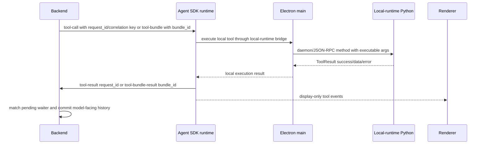

# Session and Transcript Reference

This page is a compact identifier lookup. For the conceptual explanation, read [Sessions and Conversations](../concepts/sessions_and_conversations.md). For a development workflow, read [Session and Conversation Identity Change Workflow](../memory/session_conversation_identity_change_workflow.md).

Use this page with [Agent-Visible Data Pipeline](../architecture/agent_visible_data_pipeline.md) when a bug depends on proving which runtime lost, renamed, or invented an identifier.

## Identifier Rules

- Keep external JS surfaces camelCase when that is the established renderer contract, but normalize to snake_case at the backend websocket and local-runtime JSON-RPC boundaries.
- Normalize aliases once at the boundary. Do not let every renderer component, main-process handler, or local-runtime RPC method accept its own field variants.
- Treat `conversation_ref`, `turn_ref`, `request_id`, `tool_call_id`, `correlation_id`, and `bundle_id` as pipeline keys, not display metadata.
- Keep visible transcript identifiers separate from backend provider-history identifiers. A transcript row can be user-facing; backend history must remain provider-replay-safe.
- Preserve IDs through failure paths. A failed local tool still needs the original request or bundle key so backend waiters can unblock and history can record the failure.
- In SDK-owned clients, persist normalized conversation events first and derive
  display transcript and backend rehydrate payloads from SDK projections.

## Identifier Map

| Identifier | Shape | First producer | Canonical owner | Used by | If missing or wrong |
| --- | --- | --- | --- | --- | --- |
| `user_id` / `userId` | string | install auth and Electron main session snapshot | backend connection/session context | backend sessions, local-runtime memory rows, settings, transcript search | memory and conversations can cross users, backend session lookup fails, or local-runtime memory calls store under fallback users |
| `session_id` / `sessionId` | string | hosted backend websocket/session runtime | hosted backend session manager | stream events, live runtime diagnostics | events can be impossible to join to a hosted backend runtime, but `conversation_ref` routes user-visible state |
| `conversation_ref` / `conversationRef` | string | SDK conversation runtime, renderer send path, or VM run metadata | SDK conversation runtime plus backend session registry | active conversation filtering, backend history, transcript persistence, rehydrate, VM run metadata | wrong chat resumes, stale events land in the visible thread, or backend history is created under a new conversation |
| `turn_ref` | string | SDK conversation runtime for chat turns; backend compaction control path for compaction operations | SDK runtime and backend stream event correlation | stale-turn filtering, SDK user row, overlay intent traces; compaction operation diagnostics | late turn-stream events can update the wrong active turn or leave the UI awaiting forever; treating compaction operation ids as active chat turns can drop durable checkpoints |
| `request_id` | string | backend tool-call dispatch | backend session pending-tool registry | SDK result relay, `tool-result` ingress, backend waiter cleanup | local runtime may execute, but backend never resumes the agent loop |
| `bundle_id` | string | backend bundled-tool dispatch | backend session pending-bundle registry | SDK bundle execution, `tool-bundle-result` ingress, bundle history | partial bundle results cannot be matched and backend may keep waiting |
| `tool_call_id` | string | provider/tool parser or backend history staging | backend provider-history builder | provider replay, tool-output linkage, rehydrate repair | provider history can reject replay or attach output to the wrong assistant call |
| `correlation_id` | string | SDK runtime, Electron bridge, or transcript writer | renderer transcript/tool UI projection | UI/tool execution correlation across live and stored rows | visible tool-call and tool-output rows become orphaned even if backend history is correct |
| `message_index` | integer | SDK local-runtime conversation store | local-runtime transcript store backed by local-runtime Python modules | ordered replay, dashboard pagination, semantic candidate windows | replay order, dashboard paging, and semantic windows become unstable |
| `run_id` | string | `/api/runs/*` control plane | backend VM run control service | VM run status, assignment, event timeline, controls | hosted run state cannot be controlled or audited |

## Alias Policy

Renderer/main boundaries accept camelCase on JS-facing APIs and snake_case at backend/local-runtime boundaries. Normalize names at the boundary and write one canonical internal shape afterward. `sessionId` is hosted backend runtime identity, not a durable chat identity alias.

Examples:

- `conversationRef` -> `conversation_ref`
- `userId` -> `user_id`

Do not let every consumer implement its own alias parser.

Current boundary examples:

- Renderer transcript and settings calls use camelCase values such as `userId`, `conversationRef`, `messageIndex`, and `structuredPayload`.
- SDK local-runtime store code maps those values into local-runtime JSON-RPC params such as `user_id`, `conversation_ref`, `message_index`, and `structured_payload`.
- Query websocket payloads are validated by `backend/src/api/schemas/incoming.py` as snake_case payload fields, including required `conversation_ref`.
- Tool-result websocket payloads are validated as `request_id`, `success`, `data`, and `error`; bundle results use `bundle_id`, `status`, `step_results`, and optional capture fields.
- Backend outgoing events may carry tool call payloads without the same names the local-runtime executable action uses. The renderer must preserve backend correlation keys instead of manufacturing replacement IDs.

## Query Identity Path

```mermaid
sequenceDiagram
  participant Renderer
  participant Main as Electron main
  participant Backend
  participant Session as Backend session
  Renderer->>Renderer: create or reuse conversationRef
  Renderer->>Renderer: create SDK turn id for local optimistic state
  Renderer->>Main: send query command with conversation_ref, query_message_id, screenshot refs, workspace path
  Main->>Main: normalize payload and enrich content/system state
  Main->>Backend: websocket query envelope id is the turn_ref; query.payload excludes turn_ref
  Backend->>Backend: validate QueryPayload and resolve inputs
  Backend->>Session: route by user_id + conversation_ref
  Session-->>Renderer: stream events with conversation/turn context where available
```

| Step | Shape to preserve | Owner files | Check when debugging |
| --- | --- | --- | --- |
| Renderer send | `conversationRef`, SDK `query_message_id`, attachment refs, workspace binding | `frontend/src/renderer/features/chat/hooks/useChatMessageSender.ts`, `frontend/src/renderer/features/chat/session`, `frontend/src/renderer/app/runtime/desktopRuntimeTransport.ts` | The user row should be recorded with the same conversation and websocket envelope id used by backend stream events. |
| Main query prep | `conversation_ref`, `content`, `system_state_internal`, attachment filenames | `frontend/src/main/ipc/ipc_query_runtime.cjs`, `frontend/src/main/ipc/ipc_query_runtime.cjs` | Main should not create a second conversation if renderer already provided one. |
| Backend validation | required `conversation_ref`, optional screenshots, workspace, repo instructions | `backend/src/api/schemas/incoming.py`, `backend/src/api/services/query_execution_support/query_execution_inputs.py` | Reject empty refs at the boundary instead of allowing a fallback session. |
| Session routing | `user_id` plus `conversation_ref` | `backend/src/agent/session`, `backend/src/api/services/query_execution.py` | Wrong-user and wrong-conversation bugs usually start here or in the renderer active-conversation gate. |

## Tool Correlation Path



| Field | Live transport | Stored or replay shape | Owner files | Failure signal |
| --- | --- | --- | --- | --- |
| `request_id` | backend `tool-call` to SDK conversation/tool runtime, then SDK `tool-result` back to backend | may appear as transcript `correlation_id` or structured payload linkage | `backend/src/api/schemas/incoming.py`, `packages/windie-sdk-js/src/runtime/ConversationRuntime.ts`, `packages/windie-sdk-js/src/tools/ToolExecutionCoordinator.ts`, `backend/src/api/handlers/tool_result.py` | local result appears in UI but backend loop does not continue |
| `bundle_id` | backend `tool-bundle`, SDK bundle execution, backend `tool-bundle-result` | transcript bundle row plus step results | `backend/src/api/schemas/outgoing.py`, `packages/windie-sdk-js/src/runtime/ConversationRuntime.ts`, `packages/windie-sdk-js/src/tools/ToolExecutionCoordinator.ts`, `backend/src/api/handlers/tool_result.py` | bundle hangs, partial results are lost, or failure is not model-visible |
| `tool_call_id` | provider-native assistant/tool history | backend history and rehydrate entries | `backend/src/agent/history`, `backend/src/llm/parser_types.py` | provider rejects replay or tool output is detached from assistant tool call |
| `correlation_id` | SDK/display projection local key | transcript rows and tool output display | `packages/windie-sdk-js/src/index.ts`, SDK local-runtime store code | visible transcript has orphan tool rows even when backend request IDs are valid |

Do not replace a missing backend `request_id` with a newly generated renderer `correlation_id`. That makes the UI look consistent while guaranteeing the backend waiter cannot match the result.

## Transcript Row Types

Common stored row families:

- normalized SDK conversation events
- user message
- assistant text
- tool-call
- tool-output
- error/assistant terminal state
- hidden replay-state rows
- episodic/semantic memory rows

Tool-call and tool-output rows must preserve enough structured metadata to rebuild strict provider history after rehydrate.
The SDK rehydrate projection sends only complete tool-call/tool-output pairs:
dangling tool calls, orphan tool outputs, and incomplete bundle pairs remain
debug/display state rather than provider replay input.

Minimum fields for tool-related transcript rows:

| Row family | Required preservation | Why |
| --- | --- | --- |
| tool-call display row | tool name, args or summarized args, `correlation_id`, backend request/bundle key when available | lets the UI pair live output and replayed output with the original call |
| tool-output display row | tool name, success/error, formatted text, artifact refs, `correlation_id` | keeps replay useful without re-executing local tools |
| backend rehydrate entry | role, content, `tool_call_id`, `tool_name`, `tool_calls`, structured payload, screenshot/image refs when relevant | rebuilds provider-safe history instead of a lossy chat transcript |
| local-runtime transcript row | `user_id`, conversation id, role, message type, message index, structured payload | supports dashboard replay, search, semantic windows, and delete cleanup |

Backend rehydrate entries are not display rows. Bundle metadata such as
`bundle_id`, `tools`, and per-step results stays under `structured_payload`;
complete bundle outputs are replayed as individual `role: "tool"` rows keyed by
the provider-safe `tool_call_id` for each step.

## Active Conversation Flow

1. Renderer chooses or creates `conversationRef`.
2. Renderer transcript state emits `transcript-session-sync`.
3. Electron main stores active fallback identity and rebroadcasts to other windows.
4. Query payload includes `conversation_ref`.
5. Backend resolves `(user_id, conversation_ref)` session.
6. Backend stream events return with conversation/session fields.
7. Renderer drops stale or wrong-conversation events.

## Debug Checklist

1. Pick the failed join: query routing, event filtering, tool result, transcript replay, backend history, or VM run.
2. Identify the canonical ID for that join. Use `conversation_ref` for chat ownership, `turn_ref` for active-turn UI, `request_id` or `bundle_id` for tool waiters, and `tool_call_id` for provider history.
3. Find the first producer of the ID before reading consumers.
4. Confirm the boundary mapper normalizes aliases once.
5. Confirm failure paths preserve the same ID.
6. If two IDs appear to mean the same thing, decide whether they join different domains. If not, collapse the duplicate or document the compatibility reason.

## Validation Targets

| Change touches | Validate |
| --- | --- |
| backend session creation/routing | backend session manager and query/rehydrate tests |
| renderer transcript identity | renderer transcript/session tests and dashboard resume tests |
| main-process identity sync | IPC transcript-session-sync tests |
| tool-call/tool-output linkage | backend conversation history and rehydrate repair tests |
| VM run conversation routing | runs route/service tests and VM worker tests |

## Deep Docs

- [Session and Conversation Identity Change Workflow](../memory/session_conversation_identity_change_workflow.md)
- [Sessions and Conversations](../concepts/sessions_and_conversations.md)
- [Transcript and Replay](../memory/transcript_and_replay.md)
- Backend Session Runtime and Config Rewire Reference (private backend docs)
- [Frontend Transcript Session and Rehydrate Reference](../frontend/renderer/transcript_session_and_rehydrate_reference.md)
- [IPC Event Replay and Transcript Session Sync Reference](../frontend/main/ipc_event_replay_and_transcript_session_sync_reference.md)
- Backend History Tool-Call ID Staging Reference (private backend docs)
