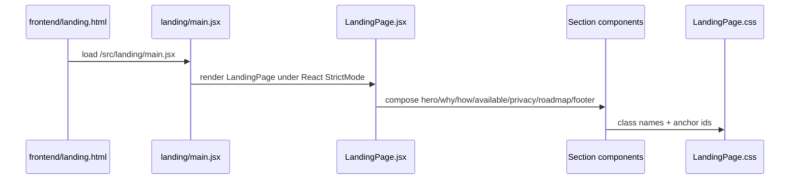

# Landing Page Change Workflow

Use this workflow before changing the public WindieOS landing page. The landing
page is a standalone browser-facing Vite entrypoint. It is not the Electron
desktop dashboard, does not use Electron IPC, and should not depend on local
local-runtime state, user credentials, or backend websocket sessions.

## Boundary Rules

- Landing page product, copy, and layout changes belong under
  `frontend/src/landing` and `frontend/landing.html`.
- Desktop app UX changes belong under `frontend/src/renderer`, not the landing
  page.
- Hosted backend API and SDK integration docs belong under `docs/web`,
  `docs/sdk`, and backend API docs, not only landing copy.
- Product claims must match current implementation docs. Planned capabilities
  must be labeled as planned instead of presented as available.
- Landing anchors are public navigation contracts. If a section `id` changes,
  update every CTA/footer link that targets it.
- Placeholder links (`href="#"`) are allowed only when intentionally documented
  as not yet wired.

## Fast Owner Map

| Change or symptom | Primary owner files | Tests/docs to inspect |
| --- | --- | --- |
| Page does not load or wrong entrypoint is bundled | `frontend/landing.html`, `frontend/src/landing/main.jsx`, `frontend/vite.config.js` | `tests/frontend/landing/LandingPage.test.jsx`, Vite build |
| Section order or page narrative changes | `frontend/src/landing/LandingPage.jsx`, section components under `frontend/src/landing/components` | landing runtime/content reference, landing tests |
| Hero, how-it-works, available-today, or roadmap copy changes | `HeroSection.jsx`, `HowItWorksSection.jsx`, `AvailableTodaySection.jsx`, `RoadmapSection.jsx` | [Hero, How, Available, and Roadmap Section Content Contract Reference](../frontend/landing/sections/hero_how_available_and_roadmap_section_content_contract_reference.md) |
| Why, privacy, CTA footer, or shared intro changes | `WhySection.jsx`, `PrivacySection.jsx`, `CTAFooter.jsx`, `SectionIntro.jsx`, `ProviderStackIcon.jsx` | [Why, Privacy, CTA Footer, and Shared Intro Component Contract Reference](../frontend/landing/sections/why_privacy_cta_footer_and_shared_intro_component_contract_reference.md) |
| Anchor link scrolls nowhere | section `id` props plus CTA/footer `href` values | landing tests and focused anchor search |
| Landing layout breaks on mobile | `frontend/src/landing/styles/LandingPage.css`, `variables.css` | visual/browser check plus landing tests |
| Claim contradicts current implementation | landing copy plus matching docs in `docs/desktop`, `docs/tools`, `docs/memory`, `docs/providers`, `docs/automation`, `docs/web`, or `docs/sdk` | product/runtime docs and changelog |
| Hosted API or SDK link/copy changes | `docs/web/*`, `docs/sdk/*`, backend route docs, `CTAFooter.jsx` links | SDK route workflow and hosted API docs |

## Runtime Flow

## Change Sequence

### 1. Classify the landing change

Start by identifying the contract:

- Entry/build: HTML mount, Vite input, root render, metadata, fonts.
- Content: static arrays, copy, badges, roadmap status, feature claims.
- Navigation: anchor `id` and `href` relationships.
- Visual system: CSS tokens, breakpoints, animations, spacing, typography.
- External links: GitHub, docs, install, changelog, legal, hosted API, SDK.
- Product positioning: what is available today versus planned.

If the change is actually a desktop dashboard, chat, or settings behavior, route
it to renderer docs instead of editing landing copy.

### 2. Inspect entrypoint and page composition

Read:

- `frontend/landing.html`
- `frontend/src/landing/main.jsx`
- `frontend/src/landing/LandingPage.jsx`
- `frontend/vite.config.js`

Entrypoint rules:

- `landing.html` mounts the landing root and loads `/src/landing/main.jsx`.
- `LandingPage.jsx` defines section order.
- Vite config is shared with other frontend entries; avoid landing-only config
  branches unless the build requirement is real.
- Landing must remain browser-safe and should not import Electron renderer
  modules that expect `window.ipc`.

### 3. Inspect section content owners

Current section order:

1. `HeroSection`
2. `WhySection`
3. `HowItWorksSection`
4. `AvailableTodaySection`
5. `PrivacySection`
6. `RoadmapSection`
7. `CTAFooter`

Rules:

- Static feature, roadmap, and privacy arrays live inside section components.
- `SectionIntro` owns shared badge, heading, and description structure.
- `ProviderStackIcon` is shared by multiple sections; changing it has broader
  brand impact than a single card.
- Use stable text and status labels that tests can assert without relying only
  on layout classes.

### 4. Inspect anchor and CTA contracts

Landing anchors currently include:

- `#how-it-works`
- `#available-today`
- `#privacy`
- `#roadmap`
- `#download`
- `#why-windieos`

Before renaming an anchor:

1. search every landing component for the old anchor.
2. update section `id` and every CTA/footer `href` together.
3. add or update a landing test for the changed navigation text or link target.
4. update docs that mention the anchor.

### 5. Inspect product claims against runtime docs

For available/planned capability claims, cross-check:

- desktop surfaces: `docs/desktop`
- tools: `docs/tools`
- memory/transcript: `docs/memory`
- providers/model support: `docs/providers`
- automation/VM runs: `docs/automation`
- hosted APIs/SDK: `docs/web`, `docs/sdk`

Rules:

- "Available today" should mean implemented and supported enough to document.
- Planned roadmap items should stay in roadmap/planning language.
- If landing copy mentions a new current capability, update the owning runtime
  docs in the same docs batch.
- If implementation is uncertain, route through planning docs instead of
  presenting it as shipped.

### 6. Inspect styles and responsive behavior

Read:

- `frontend/src/landing/styles/variables.css`
- `frontend/src/landing/styles/LandingPage.css`

Style rules:

- Keep landing tokens in `variables.css`.
- Keep section styles in the landing stylesheet; do not borrow Electron
  dashboard CSS classes.
- Review breakpoints at `1024px`, `768px`, and `640px` when adding layout.
- Anchor/footer controls should remain reachable on mobile.
- Avoid changing product copy and broad visual system tokens in the same patch
  unless the request is explicitly a redesign.

## Debug Routes

| Symptom | First checks | Likely owner |
| --- | --- | --- |
| Landing page renders blank | HTML script path, root id, `main.jsx`, build console. | Landing entrypoint |
| CTA scrolls to wrong place | section id and every `href="#..."` emitter. | Anchor contract |
| Feature claim is stale | compare landing copy with runtime docs and changelog. | Product docs plus landing section |
| Footer link is dead | `CTAFooter.jsx` placeholder links and docs/install targets. | CTA/footer links |
| Mobile layout overflows | landing CSS breakpoints and fixed-width card/button styles. | Landing styles |
| Desktop app behavior changed from landing edit | accidental import or shared style/config drift into renderer code. | Wrong owner boundary |

## Validation Matrix

Docs-only change:

- `<windie> docs list`
- `git diff --check`
- focused Markdown link check for touched docs

Landing content/component change:

- `cd frontend && npm run test -- landing/LandingPage`
- `cd frontend && npm run lint`

Landing build/entrypoint/style change:

- `<windie> build frontend`
- visual/browser check for desktop and mobile viewports when layout changes

Product-claim change:

- update/check matching runtime docs
- update `CHANGELOG.md`
- include tests only if rendered copy, anchors, or links are asserted

## Docs to Sync

Update these docs when landing behavior changes:

- [Landing Page](landing_page.md)
- [Frontend Landing Docs Hub](../frontend/landing/README.md)
- [Landing Page Runtime and Content Reference](../frontend/landing/landing_page_runtime_and_content_reference.md)
- [Web Surface Matrix](web_surface_matrix.md)
- [Product Overview](../getting-started/product_overview.md)
- the runtime doc for any capability newly claimed as available
